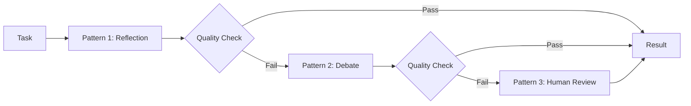

# Composition Guide

Combine multiple patterns with escalation triggers using `CompositePattern`.

## Architecture



## Basic Composition

```python
import asyncio
from pyagent_patterns.base import Agent, MockLLM
from pyagent_patterns.composite import CompositePattern, min_length_check
from pyagent_patterns.resolution import SelfReflection, Voting

# Pattern 1: Quick self-reflection
reflection = SelfReflection(
    agent=Agent("coder", MockLLM(responses=["Quick answer", "APPROVED"])),
    max_rounds=1,
)

# Pattern 2: Voting for consensus (used if reflection output too short)
voting = Voting(
    voters=[
        Agent("voter_a", MockLLM(responses=["Detailed comprehensive analysis of the topic..."])),
        Agent("voter_b", MockLLM(responses=["Detailed comprehensive analysis of the topic..."])),
    ],
)

composite = CompositePattern(
    patterns=[reflection, voting],
    quality_check=min_length_check(50),  # Must be >= 50 chars
)

result = asyncio.run(composite.run("Analyze this topic in detail"))
print(f"Escalation level: {result.metadata['escalation_level']}")
print(f"Patterns tried: {result.metadata['total_patterns_tried']}")
```

## Custom Quality Checks

```python
from pyagent_patterns.composite import CompositePattern

# Check for specific content
def contains_data(result):
    return any(c.isdigit() for c in result.output)

# Check metadata
def high_confidence(result):
    return result.metadata.get("final_score", 0) >= 8

composite = CompositePattern(
    patterns=[cheap_pattern, expensive_pattern],
    quality_check=contains_data,
)
```

## EscalationChain Preset

A common escalation: Reflection → Debate → Voting → Human

```python
from pyagent_patterns.composite import CompositePattern, min_length_check
from pyagent_patterns.resolution import SelfReflection, Debate, Voting
from pyagent_patterns.advanced import HumanInTheLoop

escalation = CompositePattern(
    patterns=[
        SelfReflection(agent=coder, max_rounds=2),        # Level 0: cheap
        Debate(debaters=[pro, con], judge=judge, rounds=1), # Level 1: moderate
        Voting(voters=[v1, v2, v3]),                        # Level 2: redundant
        HumanInTheLoop(agent=writer, review_fn=human_review), # Level 3: human
    ],
    quality_check=min_length_check(100),
)
```

## Combining with Recovery

```python
from pyagent_patterns.recovery import BoundedExecution

bounded = BoundedExecution(
    pattern=escalation_chain,
    fallback=simple_pipeline,
    timeout_seconds=30.0,
    max_retries=2,
)
```
