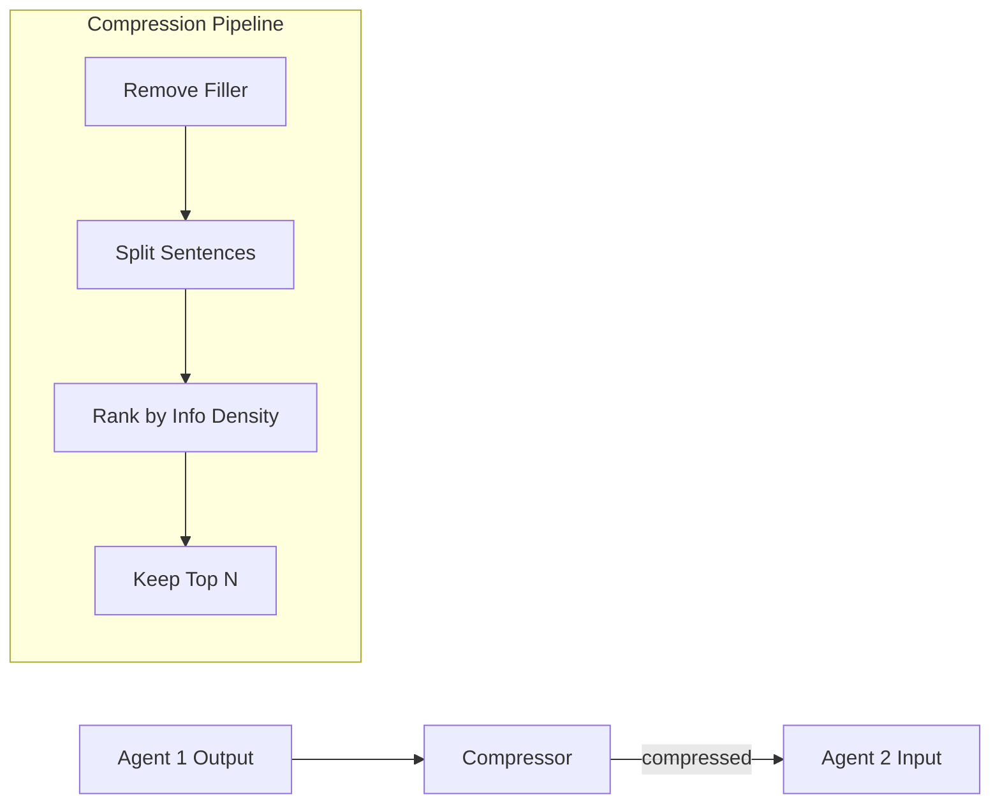

# Compression Guide

**pyagent-compress** reduces inter-agent token transfer, saving cost without losing key information.

## Architecture



## Quick Start

```python
from pyagent_compress import MessageCompressor, TokenBudget

# Compress verbose LLM output
compressor = MessageCompressor(target_ratio=0.5)
result = compressor.compress(
    "Let me think about this carefully. Basically, the analysis shows "
    "revenue increased 15% year-over-year. It's worth noting that the "
    "profit margin expanded to 23%, which is significant."
)
print(f"Savings: {result.savings_pct:.0%} ({result.original_tokens} → {result.compressed_tokens} tokens)")

# Track token budgets
budget = TokenBudget(workflow_limit=50_000, per_agent_limit=10_000)
budget.consume("agent_a", 3000)
print(budget.summary())
```

## Agent Pruning

Detect non-contributing agents and remove them mid-workflow:

```python
from pyagent_compress import AgentPruner

pruner = AgentPruner(min_contribution=0.3)
scores = pruner.score_agents(message_history, task="Analyze the market")
to_remove = pruner.should_prune(scores)
print(f"Prune: {to_remove}")
```

## Middleware Integration

```python
from pyagent_compress import CompressMiddleware, TokenBudget

budget = TokenBudget(workflow_limit=50_000)
middleware = CompressMiddleware(target_ratio=0.5, budget=budget)

compressed_agents = middleware.wrap_all([agent1, agent2, agent3])
# Each agent's output is now auto-compressed before reaching the next
```

## Cost Savings Example

| Scenario | Without Compression | With Compression (50%) |
|----------|-------------------|----------------------|
| 5-agent pipeline | 25,000 tokens | 12,500 tokens |
| 3-round debate | 18,000 tokens | 9,000 tokens |
| Estimated cost (gpt-4o) | $0.125 | $0.063 |
