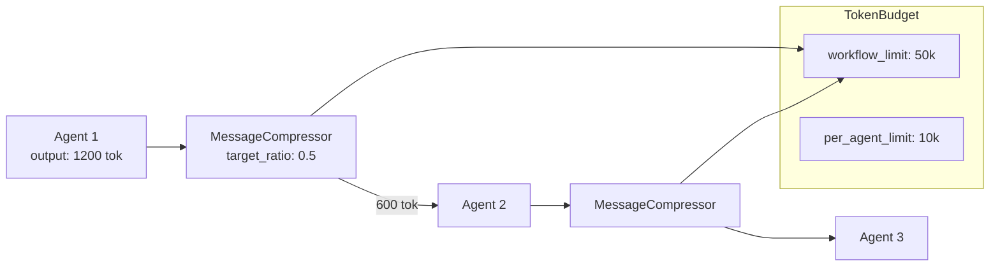

# Compression Guide

Reduce the tokens passed between agents in pipelines and fan-outs. `pyagent-compress` intercepts inter-agent messages, extracts the highest-density content, and passes a compressed version to the next stage — saving cost without losing the signal.

```bash
pip install pyagent-compress
```

---

## The Problem

In a 5-agent pipeline, each stage's verbose output becomes the next stage's full input. LLMs tend to produce filler:

```
"Let me think about this carefully. Based on my analysis, I believe that 
revenue increased by approximately 15% on a year-over-year basis. It's 
worth noting, and I think this is quite significant, that the profit 
margin also expanded to around 23%..."
```

The signal here is: **revenue +15% YoY, margin 23%**. The rest is padding — and you're paying for every token of it at every stage.

Without compression:
```
Stage 1 output:  1,200 tokens  → passes 1,200 to Stage 2
Stage 2 output:  1,800 tokens  → passes 1,800 to Stage 3
Stage 3 output:  2,100 tokens  → passes 2,100 to Stage 4
                                  ─────────────────────
Total input tokens (stages 2-4):  7,100 tokens
```

With `CompressMiddleware(target_ratio=0.5)`: ~3,550 input tokens across stages 2-4.

---

## Architecture



---

## Quick Start

### Compress a single message

```python
from pyagent_compress import MessageCompressor

compressor = MessageCompressor(target_ratio=0.5)
result = compressor.compress(
    "Let me think carefully. Revenue increased 15% YoY. "
    "It's worth noting that margins expanded to 23%, which is significant."
)
print(result.compressed_text)
# "Revenue increased 15% YoY. Margins expanded to 23%."
print(f"{result.original_tokens} → {result.compressed_tokens} tokens ({result.savings_pct:.0%} saved)")
```

### Wrap a Pipeline

```python
import asyncio
from pyagent_compress import CompressMiddleware, TokenBudget
from pyagent_patterns.base import Agent
from pyagent_patterns.orchestration import Pipeline
from pyagent_providers import AnthropicLLM, OpenAILLM

budget = TokenBudget(workflow_limit=30_000, per_agent_limit=8_000)
middleware = CompressMiddleware(target_ratio=0.5, budget=budget)

pipeline = Pipeline(stages=[
    middleware.wrap(Agent(
        "extractor", AnthropicLLM("claude-haiku-3-5-20241022"),
        system_prompt="Extract all facts, figures, and entities.",
    )),
    middleware.wrap(Agent(
        "analyst", OpenAILLM("gpt-4o-mini"),
        system_prompt="Analyse the extracted data.",
    )),
    # Last stage — output goes to the user, no compression needed
    Agent(
        "writer", AnthropicLLM("claude-sonnet-4-20250514"),
        system_prompt="Write the final brief.",
    ),
])

result = asyncio.run(pipeline.run(open("earnings.txt").read()))
print(budget.summary())
```

---

## Compression Strategies

Three strategies, each with different quality/speed trade-offs:

```python
from pyagent_compress import MessageCompressor

# Extractive (default for long text): keeps highest information-density sentences
extractive = MessageCompressor(target_ratio=0.5, strategy="extractive")

# Truncate: keeps the first N tokens — fastest, works well for structured data
truncate = MessageCompressor(target_ratio=0.5, strategy="truncate")

# Auto: extractive for inputs > 200 tokens, truncate for shorter ones
auto = MessageCompressor(target_ratio=0.5)  # default
```

| Strategy | Speed | Quality | Best for |
|----------|-------|---------|---------|
| `extractive` | medium | high | Narrative LLM outputs |
| `truncate` | fast | medium | JSON, code, lists |
| `auto` | fast | high | General use |

---

## TokenBudget

Track total token consumption across the workflow and enforce limits per agent.

```python
from pyagent_compress import TokenBudget, BudgetExceededError

budget = TokenBudget(
    workflow_limit=50_000,    # total tokens for the whole workflow
    per_agent_limit=10_000,   # max tokens any single agent can consume
)

# Manual tracking
budget.consume("extractor", 3_200)
budget.consume("analyst",   4_100)

print(budget.summary())
# Total consumed: 7,300 / 50,000 (14.6%)
# Remaining: 42,700
# By agent: {extractor: 3200, analyst: 4100}

# Check before a call
if budget.remaining("writer") < 2_000:
    print("Skipping writer — budget tight")

# Strict mode raises on exceed
strict = TokenBudget(workflow_limit=5_000, strict=True)
try:
    strict.consume("big_agent", 6_000)
except BudgetExceededError as e:
    print(f"Budget exceeded: {e}")
```

---

## CompressMiddleware

`CompressMiddleware` wraps agents so output compression is automatic — no changes to the agent or the caller.

```python
from pyagent_compress import CompressMiddleware, TokenBudget

budget = TokenBudget(workflow_limit=40_000, per_agent_limit=8_000)
middleware = CompressMiddleware(target_ratio=0.6, budget=budget)

# Wrap individually
agent = middleware.wrap(my_agent)

# Wrap a list at once
compressed_agents = middleware.wrap_all([stage1, stage2, stage3])
```

### Different ratios per agent

High-verbosity agents (analysts, researchers) benefit from more aggressive compression. Output agents (writers) should never be compressed — their output goes to the user.

```python
tight   = CompressMiddleware(target_ratio=0.3, budget=budget)   # aggressive
moderate = CompressMiddleware(target_ratio=0.6, budget=budget)  # light

pipeline = Pipeline(stages=[
    tight.wrap(verbose_researcher),
    tight.wrap(data_extractor),
    moderate.wrap(analyst),
    writer_agent,   # no compression — output goes to user
])
```

---

## Fan-Out Integration

Fan-outs produce N independent verbose outputs. Compress each before the aggregator to stay within its context window.

```python
import asyncio
from pyagent_compress import CompressMiddleware, TokenBudget
from pyagent_patterns.orchestration import FanOutFanIn
from pyagent_patterns.base import Agent
from pyagent_providers import GeminiLLM, AnthropicLLM

budget = TokenBudget(workflow_limit=60_000, per_agent_limit=8_000)
middleware = CompressMiddleware(target_ratio=0.4, budget=budget)

fanout = FanOutFanIn(
    agents=[
        middleware.wrap(Agent("bull",  GeminiLLM("gemini-2.5-flash"),
                              system_prompt="Strongest bullish case.")),
        middleware.wrap(Agent("bear",  GeminiLLM("gemini-2.5-flash"),
                              system_prompt="Strongest bearish case.")),
        middleware.wrap(Agent("macro", GeminiLLM("gemini-2.5-flash"),
                              system_prompt="Macroeconomic risk factors.")),
    ],
    aggregator=Agent(
        "synthesis", AnthropicLLM("claude-sonnet-4-20250514"),
        system_prompt="Synthesise all three perspectives into an investment memo.",
    ),
)

result = asyncio.run(fanout.run("Nvidia at $3.2T — buy or pass?"))
print(f"Budget used: {budget.summary()}")
```

---

## Agent Hook Integration

Instead of wrapping with middleware, you can attach a compressor directly to an agent via the hook system. The agent compresses its own output automatically.

```python
from pyagent_compress import MessageCompressor
from pyagent_trace.events import TraceEventBus
from pyagent_trace.exporters import ConsoleExporter
from pyagent_patterns.base import Agent
from pyagent_providers import AnthropicLLM

bus = TraceEventBus()
bus.subscribe(ConsoleExporter().export_event)

agent = (
    Agent("analyst", AnthropicLLM("claude-sonnet-4-20250514"))
    .set_compressor(MessageCompressor(target_ratio=0.5))
    .set_trace_bus(bus)   # compression event is emitted to the bus
)
```

When both `set_compressor()` and `set_trace_bus()` are wired, every compression emits a trace event with `original_tokens`, `compressed_tokens`, and `savings_pct`.

**Hook vs. middleware:**

| | `set_compressor()` hook | `CompressMiddleware.wrap()` |
|--|------------------------|----------------------------|
| API | fluent, per-agent | wraps agent externally |
| Trace integration | automatic via bus | manual |
| Best for | single agent, new code | existing pipelines, wrap_all |

---

## AgentPruner

Detect and remove agents that add no unique information — useful for optimizing fan-outs after a few runs.

```python
from pyagent_compress import AgentPruner

pruner = AgentPruner(min_contribution=0.3)

message_history = [
    {"agent": "bull",    "content": "Strong earnings justify premium valuation."},
    {"agent": "bear",    "content": "Strong earnings justify premium valuation."},  # duplicate
    {"agent": "neutral", "content": "Key risk: AMD competition, $40B TAM affected."},
]

scores = pruner.score_agents(message_history, task="Evaluate Nvidia investment")
# {"bull": 0.82, "bear": 0.18, "neutral": 0.91}

to_prune = pruner.should_prune(scores)
# ["bear"]  — score 0.18 is below threshold 0.3
```

---

## Cost Savings Reference

| Workflow | Without Compression | With 50% Compression | Monthly saving (1k runs/day) |
|----------|--------------------|-----------------------|------------------------------|
| 5-stage Pipeline (gpt-4o) | ~25k tokens | ~13k tokens | ~$900/mo |
| 5-agent Fan-Out (gpt-4o) | ~30k tokens | ~16k tokens | ~$1,100/mo |
| 3-round Debate (gpt-4o) | ~18k tokens | ~10k tokens | ~$600/mo |

---

## See Also

- [Compress Package](../packages/compress.md) — full API reference with all classes
- [Tracing Guide](tracing.md) — viewing compression events in trace spans
- [Hooks Guide](hooks.md) — `set_compressor()` and the other three hooks
- [API Reference](../api/compress.md)
