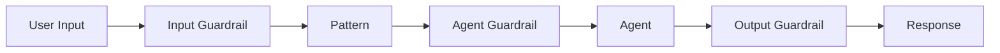

# Guardrails Guide

Validate input, output, and inter-agent messages with configurable guardrails.

## Guardrail Types

| Guardrail | Purpose | Mode |
|-----------|---------|------|
| `LengthGuard` | Enforce max message length | Reject or truncate |
| `PIIGuard` | Detect/redact PII (email, phone, SSN, CC) | Reject or redact |
| `ContentGuard` | Block deny-listed words/patterns | Reject |
| `GuardrailChain` | Compose multiple guardrails | Sequential |

## Quick Start

```python
from pyagent_patterns.guardrails import GuardrailChain, LengthGuard, PIIGuard, ContentGuard

chain = GuardrailChain([
    LengthGuard(max_chars=5000, truncate=True),
    PIIGuard(redact=True),
    ContentGuard(deny_words=["password", "secret_key"]),
])

# Check user input
result = chain.check("Contact me at user@example.com about the project")
if result.passed:
    safe_input = result.sanitized_content or "Contact me at user@example.com about the project"
    print(safe_input)  # "Contact me at [REDACTED-EMAIL] about the project"
else:
    print(f"Blocked: {result.message}")
```

## Integration Points



1. **Input guardrail** — before pattern receives user input
2. **Inter-agent guardrail** — between agent communications
3. **Output guardrail** — before returning final result

```python
# Input validation
input_check = chain.check(user_input)
if not input_check.passed:
    raise ValueError(input_check.message)

safe_input = input_check.sanitized_content or user_input
result = await pattern.run(safe_input)

# Output validation
output_check = chain.check(result.output)
if output_check.sanitized_content:
    result.output = output_check.sanitized_content
```
