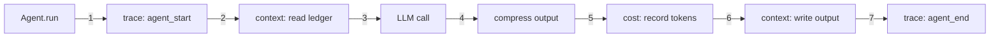

# Hooks Guide

**Opt-in, zero-overhead integration points** for tracing, context memory, compression, and cost tracking on every Agent and Pattern.

---

## Overview

PyAgent's hook system lets you wire cross-cutting concerns into agents and patterns without modifying their core logic. Hooks are:

- **Opt-in** — no constructor changes, no breaking API changes
- **Zero-overhead** — `None`-checked; when not wired, hooks add zero cost
- **Fault-tolerant** — all hook calls are wrapped in `try/except`; a broken exporter never crashes your agent
- **Chainable** — setter methods return `self` for fluent wiring



## Available Hooks

### On Agent

| Hook | Setter | What It Does |
|------|--------|-------------|
| `_trace_bus` | `set_trace_bus(bus)` | Emits `agent_start` and `agent_end` trace events |
| `_context_ledger` | `set_context(ledger)` | Prepends context messages before LLM call; appends output after |
| `_compressor` | `set_compressor(compressor)` | Compresses agent output; emits `compression` trace event |
| `_cost_tracker` | `set_cost_tracker(tracker)` | Records input/output token counts and estimated cost |

### On Pattern

| Hook | Setter | What It Does |
|------|--------|-------------|
| `_trace_bus` | `set_trace_bus(bus)` | Emits `pattern_start` and `pattern_end` trace events |

### On Provider (TracedProvider)

| Hook | What It Does |
|------|-------------|
| `TracedProvider(provider, bus)` | Wraps any `ProviderProtocol`; emits `provider_call_start`, `provider_call_end`, `provider_call_error` |

## Wiring Hooks Manually

### Single Agent

```python
from pyagent_patterns.base import Agent, MockLLM
from pyagent_trace.events import TraceEventBus
from pyagent_trace import CostTracker
from pyagent_context import ContextLedger
from pyagent_compress import MessageCompressor

bus = TraceEventBus()
ledger = ContextLedger()
compressor = MessageCompressor(target_ratio=0.5)
tracker = CostTracker(event_bus=bus)

# Fluent chaining
agent = (
    Agent("analyst", MockLLM(responses=["Revenue grew 25%"]), system_prompt="Analyse data.")
    .set_trace_bus(bus)
    .set_context(ledger)
    .set_compressor(compressor)
    .set_cost_tracker(tracker)
)

result = await agent.run("What are the revenue trends?")
```

### Single Pattern

```python
from pyagent_patterns.orchestration import Pipeline

pipeline = Pipeline(stages=[agent_a, agent_b])
pipeline.set_trace_bus(bus)  # emits pattern_start / pattern_end
```

### TracedProvider

```python
from pyagent_providers import TracedProvider

# Wrap any provider to emit trace events on every LLM call
traced = TracedProvider(original_provider, event_bus=bus)
agent = Agent("analyst", llm=traced)
```

## Wiring via RuntimeGraph

When working with blueprints, `RuntimeGraph` provides convenience methods that wire hooks to **all** compiled patterns and agents at once:

```python
from pyagent_blueprint import load_blueprint, BlueprintCompiler
from pyagent_trace.events import TraceEventBus
from pyagent_trace import CostTracker
from pyagent_context import ContextLedger
from pyagent_compress import MessageCompressor

spec = load_blueprint("blueprint.yaml")
graph = BlueprintCompiler().compile(spec)

bus = TraceEventBus()
graph.wire_trace(bus)                                # all patterns + agents
graph.wire_context(ContextLedger())                  # all agents
graph.wire_compressor(MessageCompressor(0.5))        # all agents
graph.wire_cost_tracker(CostTracker(event_bus=bus))  # all agents

result = await graph.run("support", "I need help with billing")
```

### RuntimeGraph.wire_* Methods

| Method | Targets | Hook Attribute |
|--------|---------|----------------|
| `wire_trace(bus)` | All patterns + all agents | `_trace_bus` |
| `wire_context(ledger)` | All agents | `_context_ledger` |
| `wire_compressor(compressor)` | All agents | `_compressor` |
| `wire_cost_tracker(tracker)` | All agents | `_cost_tracker` |

## Blueprint Compiler Warnings

When your blueprint YAML declares features that require hooks, the compiler emits warnings reminding you to wire them:

```yaml
observability:
  tracing:
    enabled: true        # ⚠ warns: "call graph.wire_trace(bus)"
  cost_budget:
    daily_usd: 100.0     # ⚠ warns: "call graph.wire_cost_tracker(tracker)"

context:
  compression:
    policy: semantic_lossless  # ⚠ warns: "call graph.wire_compressor(compressor)"
  memory:
    semantic_enabled: true     # ⚠ warns: "call graph.wire_context(ledger)"
```

These are **warnings only** — the graph compiles and runs without hooks, but the declared features won't be active until wired.

## Agent.run() Hook Lifecycle

When all four hooks are wired, `Agent.run()` executes this sequence:

```
1. TRACE   → emit agent_start (agent_name, input)
2. CONTEXT → read ledger → prepend context messages
3. LLM     → call self._llm(messages) → raw output
4. COMPRESS→ compress output → emit compression trace event
5. COST    → record input_tokens, output_tokens, cost
6. CONTEXT → append output to ledger (source=agent_name, trust=INFERRED)
7. TRACE   → emit agent_end (agent_name, output, duration, tokens)
```

Each step is `None`-guarded and `try/except`-wrapped — if any hook is missing or throws, the remaining steps proceed normally.

## Pattern.run() Hook Lifecycle

```
1. TRACE → emit pattern_start (pattern_type, input)
2. EXECUTE → call self._execute(input, context)  # core pattern logic
3. TRACE → emit pattern_end (pattern_type, output, duration, tokens)
```

## Trace Event Types

| Event Type | Emitter | Payload Keys |
|------------|---------|-------------|
| `agent_start` | Agent | `agent_name`, `input` |
| `agent_end` | Agent | `agent_name`, `output`, `duration_seconds`, `output_tokens` |
| `pattern_start` | Pattern | `pattern_type`, `input` |
| `pattern_end` | Pattern | `pattern_type`, `output_length`, `duration_seconds`, `token_estimate` |
| `compression` | Agent (compressor hook) | `agent_name`, `original_tokens`, `compressed_tokens`, `savings_pct` |
| `provider_call_start` | TracedProvider | `provider_name`, `model`, `message_count` |
| `provider_call_end` | TracedProvider | `provider_name`, `model`, `duration_seconds`, `output_length` |
| `provider_call_error` | TracedProvider | `provider_name`, `model`, `error` |

## Subscribing to Trace Events

```python
from pyagent_trace.events import TraceEventBus
from pyagent_trace.exporters.console import ConsoleExporter
from pyagent_trace.exporters.jsonl import JsonlExporter

bus = TraceEventBus()

# Fan-out to multiple backends
bus.subscribe(ConsoleExporter().export_event)
bus.subscribe(JsonlExporter("traces/run.jsonl").export_event)

# Filter by event type
bus.subscribe_filter({"agent_end", "compression"}, lambda e: print(e))

# Custom handler
bus.subscribe(lambda event: my_metrics.record(event))
```

## Design Principles

1. **No auto-wiring** — hooks must be explicitly set. Blueprint config declares intent; you wire the runtime.
2. **No persistence changes** — `ContextLedger` is in-memory only; persistence is your concern.
3. **No ProviderProtocol changes** — `TracedProvider` wraps existing providers; the interface is unchanged.
4. **No pattern logic changes** — `_execute()` implementations are untouched; hooks wrap around them.
5. **Backward compatible** — all hooks default to `None`; existing code works identically.

## Full Example

See [`examples/25_full_stack.py`](https://github.com/pyagent-core/pyagent/blob/main/examples/25_full_stack.py) for a complete blueprint → compile → wire → run → observe workflow.
