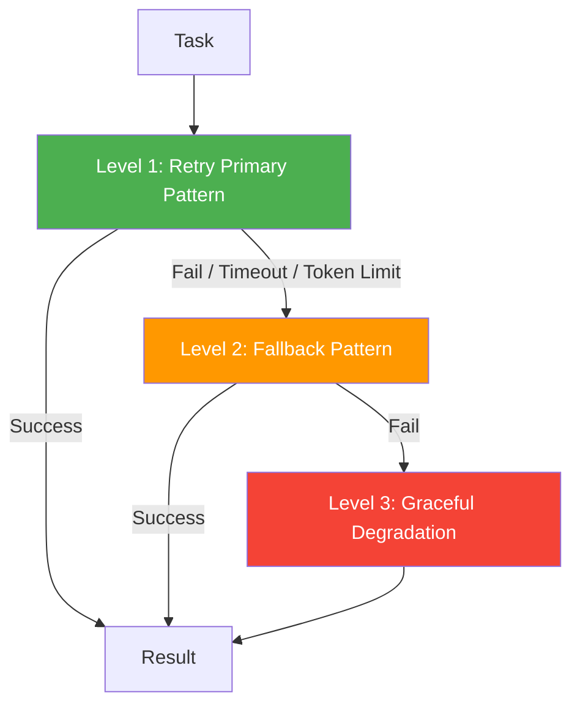

# Recovery Guide

Protect multi-agent workflows from cascading failures with bounded execution and circuit breakers.

## Three-Level Recovery



## BoundedExecution

```python
import asyncio
from pyagent_patterns.base import Agent, MockLLM
from pyagent_patterns.orchestration import Pipeline
from pyagent_patterns.recovery import BoundedExecution

primary = Pipeline(stages=[Agent("analyst", expensive_llm)])
fallback = Pipeline(stages=[Agent("analyst", cheap_llm)])

bounded = BoundedExecution(
    pattern=primary,
    fallback=fallback,
    max_retries=2,
    timeout_seconds=30.0,
    max_tokens=50_000,
)

result = asyncio.run(bounded.run("Analyze market trends"))
print(f"Recovery level: {result.metadata.get('recovery_level', 0)}")
# 0 = primary succeeded, 1 = fallback used, 2 = degraded
```

## CircuitBreaker

Prevent repeated calls to a failing pattern:

```python
from pyagent_patterns.recovery import CircuitBreaker

cb = CircuitBreaker(
    failure_threshold=3,       # Open after 3 consecutive failures
    reset_timeout_seconds=60,  # Try again after 60s
)

result = asyncio.run(cb.execute(pattern, "Do something"))
print(f"Circuit state: {result.metadata.get('circuit_state')}")
# closed → normal, open → rejecting, half_open → testing
```

## Combining Recovery + Composition

```python
from pyagent_patterns.composite import CompositePattern, min_length_check
from pyagent_patterns.recovery import BoundedExecution

# Escalation chain with recovery wrapper
escalation = CompositePattern(
    patterns=[cheap_reflection, expensive_debate, voting],
    quality_check=min_length_check(100),
)

# Wrap entire escalation with timeout and fallback
safe_workflow = BoundedExecution(
    pattern=escalation,
    fallback=simple_pipeline,
    timeout_seconds=60.0,
)
```
