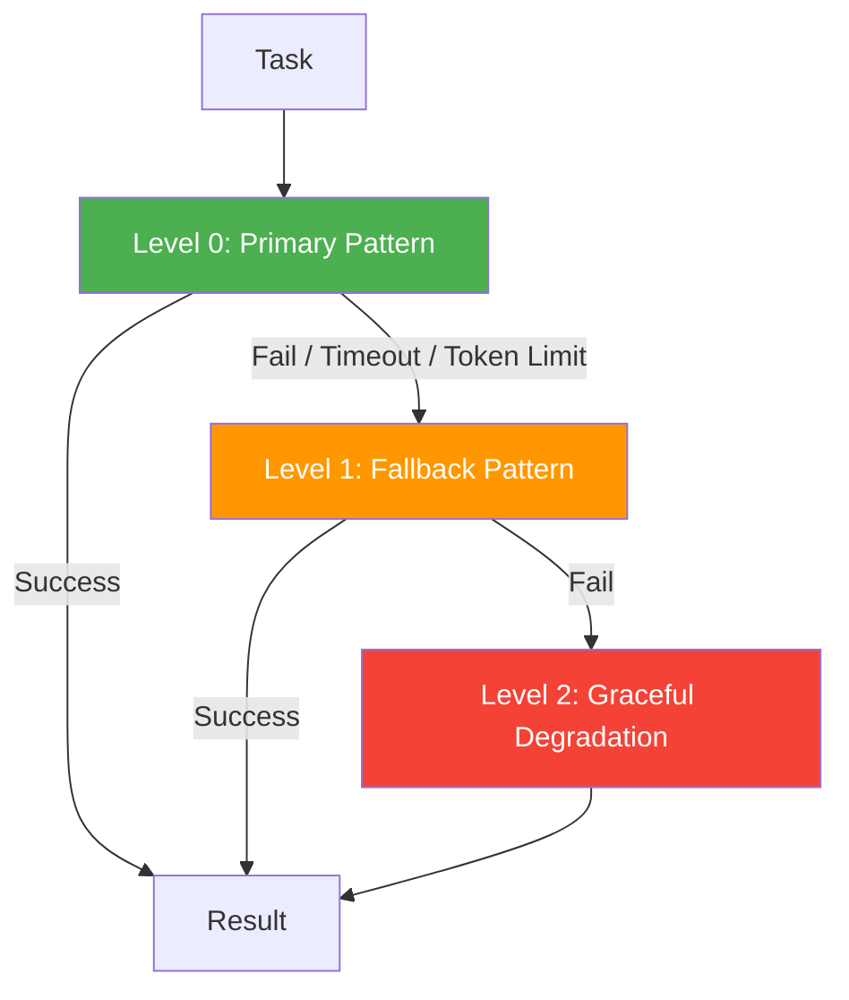

# Recovery Guide

Protect multi-agent workflows from cascading failures with bounded execution, circuit breakers, and graceful degradation. `pyagent-patterns` ships recovery primitives that compose with every orchestration pattern.

---

## The Problem

LLM calls fail. Models time out, exceed context limits, return empty responses, or throw rate-limit errors. In a single-agent setup that's manageable. In a 5-agent pipeline it's not — one failure propagates forward and the whole workflow produces garbage or crashes.

Recovery gives you bounded behaviour: retry with the same pattern, fall back to a simpler one, or degrade gracefully to a cached or static response.

---

## Three-Level Recovery



---

## BoundedExecution

The core recovery primitive. Wraps any pattern with:
- **Retry** — re-runs the primary up to `max_retries` times on failure
- **Timeout** — aborts if the pattern takes longer than `timeout_seconds`
- **Token limit** — stops if the workflow consumes more than `max_tokens`
- **Fallback** — switches to a simpler pattern if all retries fail

```python
import asyncio
from pyagent_patterns.base import Agent
from pyagent_patterns.orchestration import Pipeline
from pyagent_patterns.recovery import BoundedExecution
from pyagent_providers import AnthropicLLM, OpenAILLM

# Primary: thorough multi-stage pipeline
primary = Pipeline(stages=[
    Agent("extractor", AnthropicLLM("claude-sonnet-4-20250514"),
          system_prompt="Extract all facts, figures, and entities."),
    Agent("analyst",   OpenAILLM("gpt-4o"),
          system_prompt="Deep analysis of the extracted data."),
    Agent("writer",    AnthropicLLM("claude-sonnet-4-20250514"),
          system_prompt="Write a detailed investment brief."),
])

# Fallback: single cheap agent
fallback = Pipeline(stages=[
    Agent("quick_analyst", OpenAILLM("gpt-4o-mini"),
          system_prompt="Give a concise summary of the key points."),
])

bounded = BoundedExecution(
    pattern=primary,
    fallback=fallback,
    max_retries=2,
    timeout_seconds=30.0,
    max_tokens=50_000,
)

result = asyncio.run(bounded.run("Analyse Tesla Q3 2025 earnings"))
print(f"Recovery level: {result.metadata.get('recovery_level', 0)}")
# 0 = primary succeeded
# 1 = fallback used (primary failed or timed out)
# 2 = degraded (both failed)
print(result.output)
```

### Recovery metadata

Every result from `BoundedExecution` carries recovery metadata you can inspect or log:

```python
meta = result.metadata
print(meta.get("recovery_level"))     # 0, 1, or 2
print(meta.get("retries_used"))       # 0–max_retries
print(meta.get("timeout_hit"))        # True if timeout caused fallback
print(meta.get("token_limit_hit"))    # True if token budget caused fallback
print(meta.get("primary_error"))      # Exception message if primary failed
```

---

## CircuitBreaker

Prevent repeated calls to a pattern that's consistently failing. After `failure_threshold` consecutive failures, the circuit opens and rejects all requests for `reset_timeout_seconds`. After the timeout, it allows one test request through.

```python
from pyagent_patterns.recovery import CircuitBreaker

cb = CircuitBreaker(
    failure_threshold=3,        # open after 3 consecutive failures
    reset_timeout_seconds=60,   # try again after 60s
)

result = asyncio.run(cb.execute(expensive_pattern, "Do something"))
state = result.metadata.get("circuit_state")
# "closed"    — normal operation
# "open"      — circuit tripped, request rejected immediately
# "half_open" — one test request allowed through
```

### Combining BoundedExecution and CircuitBreaker

```python
from pyagent_patterns.recovery import BoundedExecution, CircuitBreaker

# Primary wrapped with a circuit breaker
primary_with_breaker = CircuitBreaker(failure_threshold=3, reset_timeout_seconds=120)

bounded = BoundedExecution(
    pattern=primary_pipeline,
    fallback=cheap_fallback,
    max_retries=1,
    timeout_seconds=20.0,
)

async def run_safe(task: str):
    # Check circuit state first
    cb_result = await primary_with_breaker.execute(bounded, task)
    return cb_result.output
```

---

## Recovery with CompositePattern

`CompositePattern` escalates through a series of patterns when quality checks fail. Wrap it with `BoundedExecution` to also handle hard failures (timeouts, API errors).

```python
import asyncio
from pyagent_patterns.composite import CompositePattern, min_length_check
from pyagent_patterns.resolution import SelfReflection, Debate, Voting
from pyagent_patterns.recovery import BoundedExecution
from pyagent_providers import AnthropicLLM, OpenAILLM

cheap_llm     = OpenAILLM("gpt-4o-mini")
expensive_llm = AnthropicLLM("claude-sonnet-4-20250514")

# Escalation: quality-based escalation (cheap → moderate → expensive)
escalation = CompositePattern(
    patterns=[
        SelfReflection(
            agent=Agent("coder", cheap_llm),
            max_rounds=2,
        ),
        Debate(
            debaters=[Agent("pro", cheap_llm), Agent("con", cheap_llm)],
            judge=Agent("judge", expensive_llm),
            rounds=1,
        ),
        Voting(
            voters=[Agent(f"voter_{i}", cheap_llm) for i in range(3)]
        ),
    ],
    quality_check=min_length_check(200),
)

# Recovery: failure-based fallback (API down, timeout, token limit)
safe_workflow = BoundedExecution(
    pattern=escalation,
    fallback=Pipeline(stages=[Agent("last_resort", cheap_llm)]),
    max_retries=1,
    timeout_seconds=60.0,
)

result = asyncio.run(safe_workflow.run("Design a rate-limiting system"))
print(f"Escalation level: {result.metadata.get('escalation_level', 0)}")
print(f"Recovery level:   {result.metadata.get('recovery_level', 0)}")
```

---

## Recovery Patterns by Failure Mode

### API rate limits

```python
import asyncio
from pyagent_patterns.recovery import BoundedExecution

# Generous retry with backoff for rate-limited APIs
bounded = BoundedExecution(
    pattern=primary,
    fallback=fallback,
    max_retries=3,
    retry_delay_seconds=5.0,   # wait 5s between retries
    timeout_seconds=120.0,
)
```

### Context window exceeded

```python
from pyagent_compress import CompressMiddleware, TokenBudget
from pyagent_patterns.recovery import BoundedExecution

# Compress first, recover if compression isn't enough
budget = TokenBudget(workflow_limit=100_000)
middleware = CompressMiddleware(target_ratio=0.5, budget=budget)

bounded = BoundedExecution(
    pattern=middleware.wrap_all(primary_stages),
    fallback=Pipeline(stages=[Agent("summariser", cheap_llm,
                                    system_prompt="Give a 3-sentence summary.")]),
    max_tokens=90_000,
)
```

### Model unavailability

```python
from pyagent_providers.router import ProviderRouter, RoutingStrategy
from pyagent_patterns.recovery import BoundedExecution

# Provider-level fallback (OpenAI → Anthropic → Gemini)
provider_router = ProviderRouter(registry, strategy=RoutingStrategy.FALLBACK_CHAIN)

# Pattern-level fallback (expensive → cheap)
bounded = BoundedExecution(
    pattern=Pipeline(stages=expensive_agents),
    fallback=Pipeline(stages=cheap_agents),
    max_retries=2,
    timeout_seconds=30.0,
)
```

---

## Monitoring and Alerting

Track recovery events to know when your system is under stress:

```python
import logging
from pyagent_patterns.recovery import BoundedExecution

logger = logging.getLogger(__name__)

bounded = BoundedExecution(
    pattern=primary,
    fallback=fallback,
    max_retries=2,
    timeout_seconds=30.0,
)

async def monitored_run(task: str):
    result = await bounded.run(task)
    level = result.metadata.get("recovery_level", 0)

    if level == 1:
        logger.warning("primary_failed", extra={
            "error": result.metadata.get("primary_error"),
            "retries": result.metadata.get("retries_used"),
        })
    elif level == 2:
        logger.error("full_degradation", extra={
            "task_preview": task[:100],
        })

    return result
```

---

## See Also

- [Composition Guide](composition.md) — quality-based escalation with `CompositePattern`
- [Compression Guide](compression.md) — prevent token-limit failures before they happen
- [Providers Package](../packages/providers.md) — `FallbackChain` for provider-level resilience
- [API Reference](../api/patterns.md)
