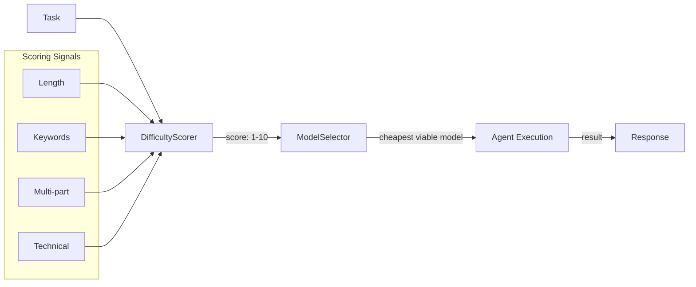

# Routing Guide

**pyagent-router** selects the cheapest LLM model that can handle each task's difficulty.

## Architecture



## Quick Start

```python
from pyagent_router import DifficultyScorer, CostEstimator, ModelSelector

# Score difficulty
scorer = DifficultyScorer()
score = scorer.score("Explain quantum entanglement in simple terms")
print(f"Difficulty: {score.score}/10 ({score.category})")

# Estimate cost
estimator = CostEstimator()
estimates = estimator.compare("Explain quantum entanglement", models=["gpt-4o", "gpt-4o-mini"])
for e in estimates:
    print(f"  {e.model}: ${e.total_cost:.6f}")

# Auto-select model
selector = ModelSelector()
result = selector.select("Explain quantum entanglement in simple terms")
print(f"Selected: {result.model} — {result.reason}")
```

## Middleware Integration

```python
from pyagent_patterns.base import Agent, MockLLM
from pyagent_patterns.orchestration import Pipeline
from pyagent_router import RouterMiddleware

# Create model registry (map names to LLM instances)
registry = {"gpt-4o": expensive_llm, "gpt-4o-mini": cheap_llm}

middleware = RouterMiddleware(model_registry=registry)

# Wrap agents — each call auto-routes to optimal model
agents = [Agent("stage1", cheap_llm), Agent("stage2", cheap_llm)]
routed = middleware.wrap_all(agents)

pipeline = Pipeline(stages=routed)
```

## Model Pricing Table (Built-in)

| Model | Input ($/1M) | Output ($/1M) |
|-------|-------------|---------------|
| gpt-4.1-nano | $0.10 | $0.40 |
| gpt-4o-mini | $0.15 | $0.60 |
| gpt-4.1-mini | $0.40 | $1.60 |
| gpt-4o | $2.50 | $10.00 |
| gpt-4.1 | $2.00 | $8.00 |
| claude-sonnet-4 | $3.00 | $15.00 |
| o3-mini | $1.10 | $4.40 |
| o3 | $10.00 | $40.00 |
