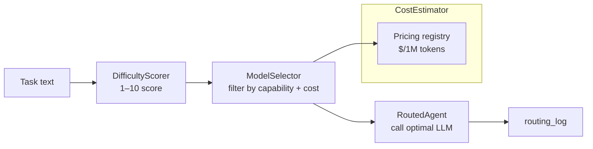

# Routing Guide

Automatically route each agent call to the cheapest LLM model that can handle the task. `pyagent-router` scores task difficulty 1-10, filters by capability, and picks the lowest-cost model that meets both requirements — transparently, without changing your agent code.

```bash
pip install pyagent-router
```

---

## The Problem

Running every agent call through `gpt-4o` or `claude-sonnet` is the path of least resistance. It's also the most expensive one.

In a real workflow, most tasks are easy:

```
"What is 2+2?"                 → difficulty 1 → gpt-4.1-nano  ($0.000001)
"Summarise this paragraph"     → difficulty 3 → gpt-4o-mini   ($0.000015)
"Design a consensus protocol"  → difficulty 9 → claude-sonnet ($0.000180)
```

Routing the first two to cheaper models saves 90-99% on those calls. At 10,000 calls per day that's a significant monthly saving.

---

## Architecture



---

## Quick Start

```python
from pyagent_router.scorer import DifficultyScorer
from pyagent_router.selector import ModelSelector, Capability

# Score task difficulty
scorer = DifficultyScorer()
score = scorer.score("What is the capital of France?")
print(f"{score.score}/10 — {score.category}")   # 2/10 — easy

# Auto-select cheapest viable model
selector = ModelSelector()
result = selector.select("What is the capital of France?")
print(result.model)    # "gpt-4.1-nano"

# Require a capability
result = selector.select(
    "Write a Python async HTTP client",
    required_capability=Capability.CODE,
)
print(result.model)    # "gpt-4o-mini" (cheapest model with CODE capability)
```

---

## DifficultyScorer

Scores any text 1-10 using heuristics — no LLM call required, sub-millisecond.

```python
from pyagent_router.scorer import DifficultyScorer

scorer = DifficultyScorer()

# Easy
e = scorer.score("What year was Python created?")
print(e.score, e.is_easy)   # 2, True

# Medium
m = scorer.score("Explain the difference between TCP and UDP with examples")
print(m.score, m.is_medium) # 5, True

# Hard
h = scorer.score(
    "Design a Byzantine fault-tolerant consensus protocol achieving "
    "sub-second finality under 33% adversarial nodes. Prove safety "
    "and liveness properties formally."
)
print(h.score, h.is_hard)   # 9, True
print(h.signals)
# {"length": 0.4, "complexity_keywords": 0.9, "multi_part": 0.7, "technical": 0.95}
```

### Score ranges

| Range | Category | Typical tasks |
|-------|----------|--------------|
| 1–3 | easy | Factual lookups, arithmetic, translations, single-sentence rewrites |
| 4–6 | medium | Summaries, code explanations, comparisons, multi-paragraph drafts |
| 7–10 | hard | System design, formal proofs, multi-step reasoning, synthesis across sources |

---

## CostEstimator

Compare costs across models before committing to one.

```python
from pyagent_router.estimator import CostEstimator

estimator = CostEstimator()

# Single estimate
e = estimator.estimate("gpt-4o-mini", input_tokens=1_000, output_tokens=500)
print(f"${e.total_cost:.6f}")   # $0.000225

# Compare across models — sorted cheapest first
estimates = estimator.compare(
    "Explain async/await in Python",
    models=["gpt-4.1-nano", "gpt-4o-mini", "gpt-4.1-mini", "gpt-4o"],
)
for e in estimates:
    print(f"{e.model:22} ${e.total_cost:.6f}")
# gpt-4.1-nano           $0.000003
# gpt-4o-mini            $0.000023
# gpt-4.1-mini           $0.000089
# gpt-4o                 $0.000187
```

### Built-in pricing table

| Model | Input ($/1M) | Output ($/1M) |
|-------|-------------|---------------|
| gpt-4.1-nano | $0.10 | $0.40 |
| gpt-4o-mini | $0.15 | $0.60 |
| gpt-4.1-mini | $0.40 | $1.60 |
| gpt-4.1 | $2.00 | $8.00 |
| gpt-4o | $2.50 | $10.00 |
| claude-haiku-3-5 | $0.80 | $4.00 |
| claude-sonnet-4 | $3.00 | $15.00 |
| o3-mini | $1.10 | $4.40 |
| o3 | $10.00 | $40.00 |

---

## ModelSelector

Combines `DifficultyScorer` and `CostEstimator` — selects the cheapest model that meets both difficulty and capability requirements.

```python
from pyagent_router.selector import ModelSelector, Capability

selector = ModelSelector()

# Basic — cheapest model for the difficulty
result = selector.select("Translate 'hello' to French")
print(result.model)       # "gpt-4.1-nano"
print(result.difficulty)  # DifficultyScore(score=1, ...)
print(result.estimate)    # CostEstimate(total_cost=0.0000003...)

# Capability filter — must support CODE
result = selector.select(
    "Implement Dijkstra's algorithm in Python",
    required_capability=Capability.CODE,
)
print(result.model)   # "gpt-4o-mini" — cheapest with CODE

# Vision task — must support image understanding
result = selector.select(
    "Describe what's in this chart",
    required_capability=Capability.VISION,
)
print(result.model)   # "gpt-4o" — only model with VISION in default specs
```

### Capabilities

```python
from pyagent_router.selector import Capability

Capability.GENERAL    # all models — factual, summaries, rewrites
Capability.CODE       # code generation, review, debugging
Capability.MATH       # numerical reasoning, calculations
Capability.REASONING  # multi-step logical reasoning, planning
Capability.CREATIVE   # creative writing, brainstorming, storytelling
Capability.VISION     # image understanding (multimodal models only)
```

### Custom model specs

Override the default registry with your own models and pricing.

```python
from pyagent_router.selector import ModelSelector, ModelSpec, Capability

selector = ModelSelector(specs=[
    ModelSpec(
        "my-fast-model",
        min_difficulty=1, max_difficulty=4,
        capabilities={Capability.GENERAL},
        max_context=32_000,
    ),
    ModelSpec(
        "my-smart-model",
        min_difficulty=3, max_difficulty=10,
        capabilities={Capability.GENERAL, Capability.CODE, Capability.REASONING},
        max_context=200_000,
    ),
])
```

---

## RouterMiddleware

Wrap any agent to auto-route each call — zero changes to your patterns or callers.

```python
import asyncio
from pyagent_patterns.base import Agent, Message
from pyagent_patterns.orchestration import Pipeline
from pyagent_providers import AnthropicLLM, OpenAILLM
from pyagent_router.middleware import RouterMiddleware
from pyagent_router.selector import Capability

# Map model names to LLM callables
model_registry = {
    "gpt-4.1-nano":              OpenAILLM("gpt-4.1-nano"),
    "gpt-4o-mini":               OpenAILLM("gpt-4o-mini"),
    "gpt-4o":                    OpenAILLM("gpt-4o"),
    "claude-sonnet-4-20250514":  AnthropicLLM("claude-sonnet-4-20250514"),
}

middleware = RouterMiddleware(model_registry=model_registry)

# Wrap a single agent
routed = middleware.wrap(
    Agent("analyst", OpenAILLM("gpt-4o"), system_prompt="Analyse the data."),
)

result = asyncio.run(routed.run([Message.user("What is 2+2?")]))
print(result.metadata["routed_model"])   # "gpt-4.1-nano"
print(routed.routing_log[-1].difficulty.score)   # 1
```

### Wrap with required capability

```python
# This agent always gets a CODE-capable model
code_agent = middleware.wrap(
    Agent("coder", OpenAILLM("gpt-4o"), system_prompt="Write production Python."),
    required_capability=Capability.CODE,
)

# This agent always gets a VISION-capable model
vision_agent = middleware.wrap(
    Agent("vision", OpenAILLM("gpt-4o"), system_prompt="Describe images."),
    required_capability=Capability.VISION,
)
```

### Wrap an entire pipeline

```python
pipeline = Pipeline(stages=[
    middleware.wrap(extractor_agent),
    middleware.wrap(analyst_agent),
    middleware.wrap(writer_agent),
])

result = asyncio.run(pipeline.run(document))
# Each stage independently routes to the cheapest model for its task
```

---

## Routing Log and Cost Analysis

Every routing decision is recorded — use it to analyse cost savings and tune thresholds.

```python
import asyncio
from pyagent_router.estimator import CostEstimator

routed = middleware.wrap(agent)
estimator = CostEstimator()

tasks = [
    "What is 1+1?",
    "Summarise the French Revolution in 3 bullet points.",
    "Design a distributed rate-limiting system. Cover CAP theorem trade-offs.",
]
for task in tasks:
    asyncio.run(routed.run([Message.user(task)]))

# Inspect decisions
print(f"{'Task':50} {'Model':22} {'Diff':5} {'Cost':>10}")
print("-" * 92)
for entry in routed.routing_log:
    print(f"{entry.task_text[:48]:50} {entry.model:22} {entry.difficulty.score:5} ${entry.estimate.total_cost:.6f}")

# Calculate savings vs always using gpt-4o
routed_cost = sum(e.estimate.total_cost for e in routed.routing_log)
premium_cost = sum(
    estimator.estimate("gpt-4o", e.estimate.input_tokens, e.estimate.output_tokens).total_cost
    for e in routed.routing_log
)
print(f"\nRouted cost: ${routed_cost:.6f}")
print(f"Premium cost: ${premium_cost:.6f}")
print(f"Saved: ${premium_cost - routed_cost:.6f} ({(1 - routed_cost/premium_cost):.0%} reduction)")
```

---

## Integrating with ProviderRouter

`pyagent-router` selects **which model** to use. `pyagent-providers`' `ProviderRouter` selects **which API provider** to use. They compose naturally:

```python
from pyagent_providers.router import ProviderRouter, RoutingStrategy
from pyagent_providers.registry import ProviderRegistry
from pyagent_router.middleware import RouterMiddleware

# Provider routing: pick cheapest healthy provider
provider_router = ProviderRouter(registry, strategy=RoutingStrategy.COST_FIRST)

# Model routing: pick cheapest viable model
model_middleware = RouterMiddleware(model_registry=registry_from_provider(provider_router))

# Combined: cheapest provider AND cheapest model for each call
agent = model_middleware.wrap(
    Agent("analyst", llm_from_provider(provider_router))
)
```

---

## See Also

- [Router Package](../packages/router.md) — `DifficultyScorer`, `CostEstimator`, `ModelSelector` API
- [Providers Package](../packages/providers.md) — `ProviderRouter` for provider-level routing
- [Hooks Guide](hooks.md) — wiring routing via `set_trace_bus()` for cost tracking
- [API Reference](../api/router.md)
