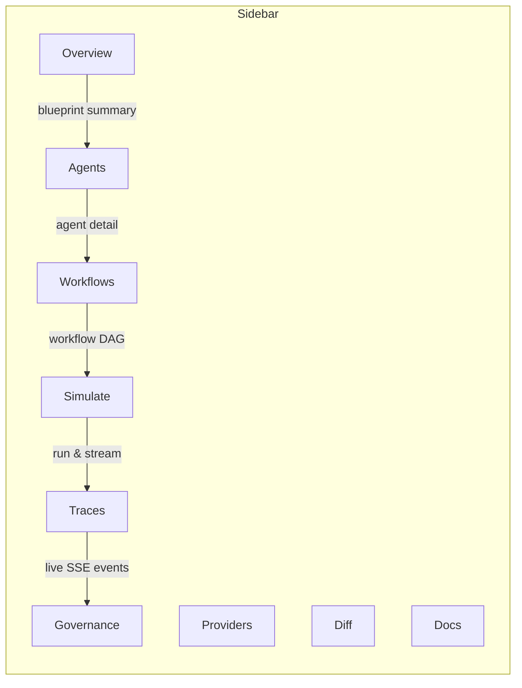

# Studio Guide

`pyagent-studio` is a web dashboard and CLI for designing, simulating, debugging, and governing multi-agent blueprints. Run it locally during development or deploy it as an internal tool for your team.

```bash
pip install pyagent-studio
pyagent dashboard                        # start the web UI on http://localhost:8000
pyagent apply blueprint.yaml             # load a blueprint via CLI
```

---

## Dashboard

The dashboard is a FastAPI web app with nine sections accessible from the sidebar.



| Section | What it shows |
|---------|--------------|
| **Overview** | Blueprint name, version, agent/workflow/provider counts, validation status |
| **Agents** | All agents, their models, system prompts, and hook wiring |
| **Workflows** | Workflow list and per-workflow step-by-step detail |
| **Simulate** | Run any workflow with MockLLM or live LLMs, stream output |
| **Traces** | Live SSE trace events + historical JSONL viewer |
| **Governance** | Compliance score, validation issues, contract conformance |
| **Providers** | Registered providers, model lists, health check results |
| **Diff** | Semantic diff between two blueprint versions |
| **Docs** | Auto-rendered blueprint documentation with Mermaid DAGs |

---

## Starting the Dashboard

```bash
# Default: port 8000, localhost only
pyagent dashboard

# Custom port
pyagent dashboard --port 9000

# Bind to all interfaces (for team access)
pyagent dashboard --host 0.0.0.0 --port 8000
```

Once running, open `http://localhost:8000` in your browser.

---

## CLI Reference

`pyagent-studio` ships a full CLI for all blueprint operations. You can run everything headlessly in scripts and CI.

### apply

Load and validate a blueprint, then print a summary.

```bash
pyagent apply blueprint.yaml
# customer-support v1.0 — 3 agents, 2 workflows, 4 contracts
```

### get

List resources from a blueprint.

```bash
pyagent get agents blueprint.yaml
pyagent get workflows blueprint.yaml
pyagent get providers blueprint.yaml
pyagent get contracts blueprint.yaml
```

### validate

Check a blueprint against its schema and contracts.

```bash
pyagent validate blueprint.yaml
# ✓ Schema valid
# ✓ All contracts pass
# ⚠ observability.exporters: no exporters configured
```

### test

Run full contract conformance checks.

```bash
pyagent test blueprint.yaml
# Testing customer-support...
# ✓ classifier: input/output schema
# ✓ billing_bot: response_time < 2s
# ✗ escalation: missing required metadata field
```

### simulate

Run a workflow with MockLLM (no API cost) or live LLMs.

```bash
# MockLLM (default — free, deterministic)
pyagent simulate blueprint.yaml support "I can't login"

# Live LLMs (uses real API keys)
pyagent simulate blueprint.yaml support "I can't login" --live
```

### render

Render a blueprint as Markdown documentation or a Mermaid DAG.

```bash
pyagent render blueprint.yaml                    # Markdown
pyagent render blueprint.yaml --format mermaid   # Mermaid diagram
```

### diff

Show semantic differences between two blueprints.

```bash
pyagent diff blueprint-v1.yaml blueprint-v2.yaml
# + agents.escalation_bot (new)
# ~ agents.classifier.model: gpt-4o-mini → gpt-4o
# - providers.backup (removed)
```

### generate

Scaffold a new blueprint YAML from a pattern template.

```bash
pyagent generate --pattern pipeline --agents extractor,analyst,writer
pyagent generate --pattern fan-out  --agents bull,bear,macro --aggregator synthesis
```

### describe

Print a plain-English summary of a blueprint.

```bash
pyagent describe blueprint.yaml
# name: customer-support
# version: 1.0.0
# agents: 3 (classifier, billing_bot, escalation)
# workflows: 2 (support, billing)
# providers: openai (primary), anthropic (fallback)
```

### providers

Inspect and health-check LLM providers.

```bash
pyagent providers list           # list available models
pyagent providers health         # ping each model with a test call
```

---

## Trace Streaming

The Traces page streams live events from the `TraceEventBus` via SSE. Wire your agents to the dashboard's bus so every call appears in the UI in real-time.

```python
from pyagent_studio.web.routes.traces import get_trace_bus
from pyagent_patterns.base import Agent
from pyagent_providers import AnthropicLLM

# Get the dashboard's global trace bus
bus = get_trace_bus()

agent = (
    Agent("analyst", AnthropicLLM("claude-sonnet-4-20250514"))
    .set_trace_bus(bus)
)

# Now every agent call emits events to the Traces page
```

The SSE endpoint is at `/traces/live` — any client can subscribe:

```javascript
const es = new EventSource("/traces/live");
es.onmessage = (e) => {
    const event = JSON.parse(e.data);
    console.log(event.event_type, event.agent_name, event.elapsed_ms);
};
```

---

## Service Layer

Every dashboard feature is backed by a headless service you can use directly from Python or CI scripts.

### BlueprintService

```python
from pyagent_studio.services.blueprint_service import BlueprintService

svc = BlueprintService()
spec = svc.load("blueprint.yaml")
issues = svc.validate(spec)
compiled = svc.compile(spec)           # resolves agent references
markdown = svc.render_markdown(spec)
mermaid  = svc.render_mermaid(spec)
```

### SimulationService

```python
from pyagent_studio.services.simulation_service import SimulationService
from pyagent_trace.events import TraceEventBus

bus = TraceEventBus()
sim = SimulationService(event_bus=bus, use_live=False)

result = await sim.run(spec, workflow="support", message="I need help")
print(result.output)
print(f"Elapsed: {result.elapsed_ms:.0f}ms")
print(f"Success: {result.success}")
```

### GovernanceService

```python
from pyagent_studio.services.governance_service import GovernanceService

gov = GovernanceService()
report = gov.check_compliance(spec)
print(f"Score: {report['score']}%")
for issue in report['issues']:
    print(f"  {issue['severity']}: {issue['message']}")
```

### ProviderService

```python
from pyagent_studio.services.provider_service import ProviderService

provider = ProviderService(default_model="gpt-4o")
models   = provider.list_models()
health   = await provider.health_check("gpt-4o")
cost     = provider.model_cost("gpt-4o")
response = await provider.complete(
    model="gpt-4o",
    messages=[{"role": "user", "content": "Hello"}],
)
```

### TraceService

```python
from pyagent_studio.services.trace_service import TraceService

traces = TraceService()
spans = traces.load("traces.jsonl")
llm_calls = traces.query(event_type="llm_call")
print(traces.summary())
```

---

## Embedding in FastAPI

The dashboard is a standard FastAPI app. Embed it into an existing app or add custom routes.

```python
from fastapi import FastAPI
from pyagent_studio.web.app import create_app

# Standalone
app = create_app()

# Mount into existing app
main_app = FastAPI()
studio = create_app()
main_app.mount("/studio", studio)
```

---

## See Also

- [Blueprint Package](../packages/blueprint/index.md) — spec format and compilation
- [Trace Package](../packages/trace.md) — `TraceEventBus` and exporters
- [Blueprint Guide](blueprint.md) — writing and validating blueprints
- [Tracing Guide](tracing.md) — wiring exporters and reading spans
- [API Reference](../api/studio.md)
