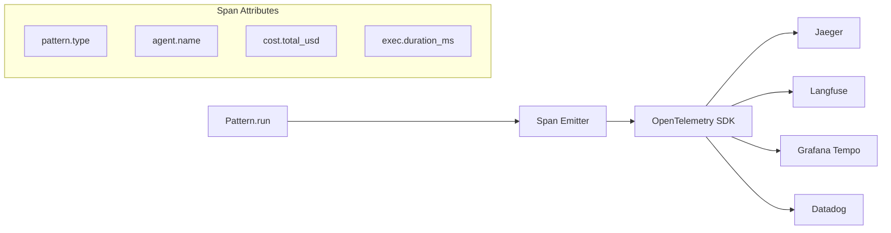

# Tracing Guide

**pyagent-trace** provides pattern-aware OpenTelemetry spans for full observability.

## Architecture



## Quick Start

### Decorators (Simplest)

```python
from pyagent_trace import traced_pattern, traced_agent
from pyagent_patterns.base import Agent, MockLLM
from pyagent_patterns.orchestration import Pipeline

# Auto-emit spans for every pattern.run()
@traced_pattern
class TracedPipeline(Pipeline):
    pass

# Or wrap individual agents
agent = traced_agent(Agent("my_agent", my_llm))
```

### Manual Span Control

```python
from pyagent_trace import PatternSpanEmitter

emitter = PatternSpanEmitter()
span = emitter.pattern_span("debate", {"rounds": 3})
try:
    result = await pattern.run(task)
    emitter.set_pattern_result(span, len(result.output), rounds=3, cost_estimate=0.012)
finally:
    span.end()
```

## Cost Tracking

```python
from pyagent_trace import CostTracker

tracker = CostTracker()
tracker.record("debate", "bull_agent", "gpt-4o", input_tokens=500, output_tokens=200, cost_usd=0.003)
tracker.record("debate", "bear_agent", "gpt-4o-mini", input_tokens=500, output_tokens=200, cost_usd=0.0004)
tracker.record("debate", "judge", "gpt-4o", input_tokens=1000, output_tokens=300, cost_usd=0.0055)

print(f"Total: ${tracker.total_cost:.4f}")
print(f"By pattern: {tracker.by_pattern()}")
print(f"By model: {tracker.by_model()}")
```

## Record & Replay

```python
from pyagent_trace.recorder import Recorder

# Record
recorder = Recorder()
recorder.start("debate")
recorder.record_llm_call("bull", messages, response_text)
recorder.end(result.output)
recorder.save("traces/debate_run_001.jsonl")

# Replay / Debug
entries = Recorder.load("traces/debate_run_001.jsonl")
for entry in entries:
    print(f"[{entry.event_type}] {entry.agent_name}: {entry.response[:80]}...")
```

## Trace Event Bus & Exporters

`pyagent-trace` provides a portal-agnostic `TraceExporter` protocol and a pub/sub `TraceEventBus` for streaming trace events to multiple backends simultaneously.

### TraceEventBus

```python
from pyagent_trace.events import TraceEvent, TraceEventBus

bus = TraceEventBus()

# Subscribe to all events
bus.subscribe(lambda e: print(e.event_type))

# Subscribe to specific event types
bus.subscribe_filter({"llm_call", "error"}, lambda e: handle_error(e))
```

### Built-in Exporters

| Exporter | Backend | Install |
|----------|---------|---------|
| `ConsoleExporter` | stdout | built-in |
| `JsonlExporter` | JSONL file | built-in |
| `OTelExporter` | Jaeger, Tempo, Datadog, Honeycomb | `pip install opentelemetry-api opentelemetry-sdk` |
| `LangfuseExporter` | Langfuse | `pip install langfuse` |

```python
from pyagent_trace.events import TraceEventBus
from pyagent_trace.exporters.console import ConsoleExporter
from pyagent_trace.exporters.jsonl import JsonlExporter
from pyagent_trace.exporters.langfuse import LangfuseExporter

bus = TraceEventBus()

# Fan-out to multiple backends simultaneously
bus.subscribe(ConsoleExporter().export_event)
bus.subscribe(JsonlExporter("traces/run.jsonl").export_event)
bus.subscribe(LangfuseExporter().export_event)  # uses LANGFUSE_* env vars
```

### Custom Exporters

Implement the `TraceExporter` protocol:

```python
from pyagent_trace.exporters.base import TraceExporter
from pyagent_trace.events import TraceEvent

class MyExporter(TraceExporter):
    def export_event(self, event: TraceEvent) -> None:
        # Send to your backend
        ...

    def flush(self) -> None: ...
    def shutdown(self) -> None: ...
```

### Wiring Producers

`Recorder` and `CostTracker` accept an optional `event_bus` parameter:

```python
from pyagent_trace.events import TraceEventBus
from pyagent_trace.recorder import Recorder
from pyagent_trace.cost import CostTracker

bus = TraceEventBus()
recorder = Recorder(event_bus=bus)
tracker = CostTracker(event_bus=bus)
```

## Custom Attributes

All attributes are namespaced under `pyagent.*`:

| Attribute | Type | Description |
|-----------|------|-------------|
| `pyagent.pattern.type` | string | Pattern name (e.g., "debate") |
| `pyagent.pattern.rounds` | int | Number of rounds executed |
| `pyagent.agent.name` | string | Agent name |
| `pyagent.router.difficulty` | int | Task difficulty 1-10 |
| `pyagent.router.selected_model` | string | Routed model name |
| `pyagent.compress.savings_pct` | float | Compression savings 0-1 |
| `pyagent.cost.total_usd` | float | Total cost in USD |
| `pyagent.exec.duration_ms` | float | Execution time in ms |
