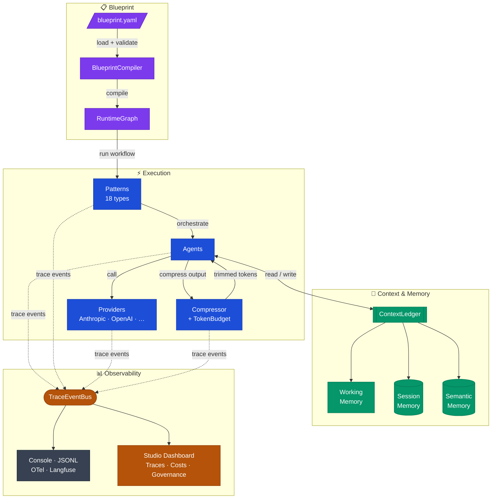

---
hide:
  - toc
---

# PyAgent

**Production-ready patterns for multi-agent LLM systems** — 18 composable orchestration patterns, declarative YAML blueprints, intelligent model routing, inter-agent compression, and a full observability stack.

<div style="margin: 1.5rem 0" markdown>

[:fontawesome-solid-bolt: Get Started](getting-started.md){ .md-button .md-button--primary }
&nbsp;&nbsp;
[:fontawesome-brands-github: GitHub](https://github.com/pyagent-core/pyagent){ .md-button }
&nbsp;&nbsp;&nbsp;
`pip install pyagent-all`

</div>

---

## Four Architecture Pillars

<div class="grid cards" markdown>

-   :material-file-code:{ .lg .middle } **📋 Blueprint**

    ---

    Declare your entire agent system in a single YAML file. Validate, compile, test, diff, and render without writing Python.

    `pyagent-blueprint`

    [:octicons-arrow-right-24: Blueprint docs](packages/blueprint/index.md)

-   :material-lightning-bolt:{ .lg .middle } **⚡ Execution**

    ---

    18 orchestration patterns running typed agents against real providers, with difficulty-based routing and inter-agent compression.

    `pyagent-patterns` · `pyagent-providers` · `pyagent-router` · `pyagent-compress`

    [:octicons-arrow-right-24: Patterns docs](packages/patterns/index.md)

-   :material-brain:{ .lg .middle } **🧠 Context & Memory**

    ---

    Three-tier memory (working / session / semantic) with trust metadata, compression policies, and PII redaction — shared across all agents in a run.

    `pyagent-context`

    [:octicons-arrow-right-24: Context docs](packages/context.md)

-   :material-chart-timeline-variant:{ .lg .middle } **📊 Observability**

    ---

    OTel spans, Langfuse export, cost tracking, record/replay, and a web dashboard with trace explorer, governance, and provider health.

    `pyagent-trace` · `pyagent-studio`

    [:octicons-arrow-right-24: Trace docs](packages/trace.md)

</div>

| | LangGraph | CrewAI | AutoGen | **PyAgent** |
|--|:---------:|:------:|:-------:|:-----------:|
| Named pattern library | ❌ | ❌ | ❌ | ✅ 18 patterns |
| Pattern composition | ❌ | ❌ | ❌ | ✅ |
| Difficulty-aware routing | ❌ | ❌ | ❌ | ✅ |
| Inter-agent compression | ❌ | ❌ | ❌ | ✅ |
| Pattern-aware OTel tracing | ❌ | ❌ | ❌ | ✅ |
| Zero mandatory deps | ❌ | ❌ | ❌ | ✅ |

---

## Quick Start

=== "Patterns"

    ```bash
    pip install pyagent-patterns
    ```

    ```python
    import asyncio
    from pyagent_patterns.base import Agent, MockLLM
    from pyagent_patterns.orchestration import Pipeline

    llm = MockLLM(responses=["Extracted: key facts", "Summary: concise version"])
    pipeline = Pipeline(stages=[
        Agent("extractor",  llm),
        Agent("summarizer", llm),
    ])
    result = asyncio.run(pipeline.run("Process this document"))
    print(result.output)  # "Summary: concise version"
    ```

=== "Blueprint"

    ```bash
    pip install pyagent-blueprint
    ```

    ```yaml
    # pipeline.yaml
    api_version: pyagent/v1
    metadata: { name: doc-pipeline, version: "1.0.0" }
    agents:
      extractor:  { prompt: "Extract the key facts as bullet points." }
      summarizer: { prompt: "Summarise the input in 3 sentences." }
    workflows:
      main:
        pattern: pipeline
        agents: { stages: [extractor, summarizer] }
    ```

    ```python
    import asyncio
    from pyagent_blueprint import load_blueprint, BlueprintCompiler

    graph  = BlueprintCompiler().compile(load_blueprint("pipeline.yaml"))
    result = asyncio.run(graph.run("main", "Process this document"))
    print(result.output)
    ```

=== "Full stack"

    ```bash
    pip install pyagent-all
    ```

    ```python
    import asyncio
    from pyagent_blueprint import load_blueprint, BlueprintCompiler
    from pyagent_trace.events import TraceEventBus

    bus   = TraceEventBus()
    graph = BlueprintCompiler().compile(load_blueprint("blueprint.yaml"))
    graph.wire_trace(bus)

    result = asyncio.run(graph.run("main", "Analyse Q3 revenue trends"))
    # Then explore: pyagent dashboard --trace traces/runs.jsonl
    ```

---

## Architecture



**The intended flow:**

1. **Specify** — Declare agents, workflows, providers, and contracts in a YAML blueprint
2. **Compile** — `BlueprintCompiler` transforms the spec into a runnable `RuntimeGraph`
3. **Orchestrate** — Patterns coordinate agent collaboration (Pipeline, Supervisor, Debate …)
4. **Provide** — Provider registry handles fallback chains, cost routing, and capability negotiation
5. **Remember** — `ContextLedger` maintains three-tier memory across agents and turns
6. **Compress** — `CompressMiddleware` trims inter-agent token transfer and enforces budgets
7. **Trace** — `TraceEventBus` collects events from agents, patterns, and providers
8. **Observe** — Studio visualises traces, costs, compliance, and provider health in real time

---

## Packages by Pillar

=== "📋 Blueprint"

    <div class="grid cards" markdown>

    -   :material-file-code:{ .lg .middle } **pyagent-blueprint**

        ---

        YAML spec → `BlueprintCompiler` → `RuntimeGraph`. Validate, compile, test, render, diff, and generate from the CLI.

        [:octicons-arrow-right-24: Docs](packages/blueprint/index.md)

    </div>

=== "⚡ Execution"

    <div class="grid cards" markdown>

    -   :material-puzzle:{ .lg .middle } **pyagent-patterns**

        ---

        18 orchestration patterns: Pipeline, Supervisor, Fan-Out, Debate, Voting, Swarm, ReAct and more.

        [:octicons-arrow-right-24: Docs](packages/patterns/index.md)

    -   :material-server-network:{ .lg .middle } **pyagent-providers**

        ---

        Multi-provider registry, routing strategies, fallback chains, capability negotiation, cost optimizer.

        [:octicons-arrow-right-24: Docs](packages/providers.md)

    -   :material-call-split:{ .lg .middle } **pyagent-router**

        ---

        Difficulty scoring, cost estimation, model selection middleware — route cheap tasks to cheap models.

        [:octicons-arrow-right-24: Docs](packages/router.md)

    -   :material-arrow-collapse-all:{ .lg .middle } **pyagent-compress**

        ---

        Inter-agent message compression, agent pruning, interaction pruning, and token budgets.

        [:octicons-arrow-right-24: Docs](packages/compress.md)

    </div>

=== "🧠 Context & Memory"

    <div class="grid cards" markdown>

    -   :material-brain:{ .lg .middle } **pyagent-context**

        ---

        Three-tier memory (working / session / semantic), trust and sensitivity metadata, compression policies, and PII redaction.

        [:octicons-arrow-right-24: Docs](packages/context.md)

    </div>

=== "📊 Observability"

    <div class="grid cards" markdown>

    -   :material-chart-timeline-variant:{ .lg .middle } **pyagent-trace**

        ---

        `TraceEventBus` pub/sub, OTel spans, Langfuse export, cost tracking, record/replay.

        [:octicons-arrow-right-24: Docs](packages/trace.md)

    -   :material-monitor-dashboard:{ .lg .middle } **pyagent-studio**

        ---

        `kubectl`-style CLI + FastAPI web dashboard. Simulate, diff, explore traces, govern.

        [:octicons-arrow-right-24: Docs](packages/studio/index.md)

    </div>

---

## 18 Patterns

=== ":material-sitemap: Orchestration"

    | Pattern | What it does |
    |---------|-------------|
    | [Supervisor](packages/patterns/orchestration/supervisor.md) | Classify input → route to specialist → collect result |
    | [Pipeline](packages/patterns/orchestration/pipeline.md) | Sequential stage chain — each agent processes the previous output |
    | [Fan-Out / Fan-In](packages/patterns/orchestration/fan-out-fan-in.md) | Run agents in parallel, aggregate into one result |
    | [Hierarchical](packages/patterns/orchestration/hierarchical.md) | Manager delegates to team leads who delegate to workers |
    | [Orchestrator-Workers](packages/patterns/orchestration/orchestrator-workers.md) | Dynamic task delegation based on capability |

=== ":material-scale-balance: Resolution"

    | Pattern | What it does |
    |---------|-------------|
    | [Self-Reflection](packages/patterns/resolution/self-reflection.md) | Agent critiques and refines its own output iteratively |
    | [Cross-Reflection](packages/patterns/resolution/cross-reflection.md) | Second agent reviews the first agent's output |
    | [Debate](packages/patterns/resolution/debate.md) | Agents argue opposing positions, a judge decides |
    | [Voting](packages/patterns/resolution/voting.md) | Multiple agents vote, majority or consensus wins |
    | [Evaluator-Optimizer](packages/patterns/resolution/evaluator-optimizer.md) | Score against criteria, iterate until threshold is met |

=== ":material-view-grid: Structural"

    | Pattern | What it does |
    |---------|-------------|
    | [Role-Based](packages/patterns/structural/role-based.md) | Assign specialist roles — analyst, writer, reviewer … |
    | [Layered](packages/patterns/structural/layered.md) | Abstraction layers — each processes at a different granularity |
    | [Topology](packages/patterns/structural/topology.md) | Fixed topology: chain, star, or full mesh |
    | [Blackboard](packages/patterns/structural/blackboard.md) | Shared mutable state; agents read/write asynchronously |

=== ":material-atom: Advanced"

    | Pattern | What it does |
    |---------|-------------|
    | [Talker-Reasoner](packages/patterns/advanced/talker-reasoner.md) | Fast System 1 responds, slow System 2 verifies |
    | [Swarm](packages/patterns/advanced/swarm.md) | Agents self-organise; emergent behaviour from local rules |
    | [Human-in-the-Loop](packages/patterns/advanced/human-in-the-loop.md) | Pause workflow for human approval at defined checkpoints |
    | [ReAct](packages/patterns/advanced/react.md) | Reason → act → observe loop with tool calls |

---

## Where to start

<div class="grid cards" markdown>

-   :material-school-outline:{ .lg .middle } **New to multi-agent systems?**

    ---

    Start with the tutorial, then explore the pattern library one pattern at a time.

    1. [Getting Started](getting-started.md)
    2. [Pipeline pattern](packages/patterns/orchestration/pipeline.md)
    3. [Supervisor pattern](packages/patterns/orchestration/supervisor.md)
    4. [Composition guide](guides/composition.md)

-   :material-code-braces:{ .lg .middle } **Adding to an existing codebase?**

    ---

    Drop patterns in alongside your existing LLM setup, then layer in routing and context.

    1. [Hooks guide](guides/hooks.md)
    2. [Providers guide](guides/providers.md)
    3. [Router guide](guides/router.md)
    4. [Context guide](guides/context.md)

-   :material-rocket-launch-outline:{ .lg .middle } **Building for production?**

    ---

    Use all four pillars: Blueprint for versioning and CI, then Observability for monitoring.

    1. [Blueprint guide](guides/blueprint.md) — pillar 1
    2. [Tracing guide](guides/tracing.md) — pillar 4
    3. [Studio guide](guides/studio.md) — pillar 4
    4. [Recovery guide](guides/recovery.md)

</div>
