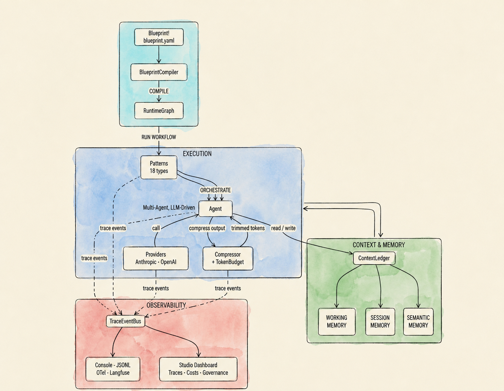

<div class="home-hero" markdown>

# PyAgent

**Production-ready patterns for multi-agent LLM systems**

<div class="hero-pills" markdown>
<span class="hero-pill">18 patterns</span>
<span class="hero-pill">4 pillars</span>
<span class="hero-pill">Python 3.11+</span>
<span class="hero-pill">0 mandatory deps</span>
</div>

[:fontawesome-solid-bolt: Get Started](getting-started.md){ .md-button .md-button--primary }
&nbsp;&nbsp;
[:fontawesome-brands-github: GitHub](https://github.com/pyagent-core/pyagent){ .md-button }
&nbsp;&nbsp;&nbsp;
`pip install pyagent-all`

</div>

---

<div class="pillar-stripe stripe-blueprint" markdown>
<div class="stripe-inner" markdown>
<div class="stripe-text" markdown>

### Pillar 1 — Blueprint

**Declare your entire agent system in a single YAML file.** No boilerplate Python to wire up agents, workflows, or providers. The `BlueprintCompiler` validates, compiles, diffs, and generates from the spec.

`pyagent-blueprint`

[:octicons-arrow-right-24: Blueprint docs](packages/blueprint/index.md){ .md-button .md-button--primary }

</div>
<div class="stripe-code" markdown>

```yaml
# customer-support.yaml
api_version: pyagent/v1
metadata: { name: customer-support, version: "1.0.0" }
providers:
  fast:   { provider: anthropic, model: claude-haiku-3-5-20241022 }
  expert: { provider: anthropic, model: claude-sonnet-4-20250514 }
agents:
  classifier: { provider: fast,   prompt: "Classify into billing, technical, general." }
  specialist: { provider: expert, prompt: "Handle the request professionally." }
workflows:
  main:
    pattern: supervisor
    agents: { classifier: classifier, routes: { billing: specialist } }
```

```bash
blueprint validate customer-support.yaml
blueprint test     customer-support.yaml
blueprint diff     v1.yaml v2.yaml
```

</div>
</div>
</div>

<div class="pillar-stripe stripe-execution" markdown>
<div class="stripe-inner" markdown>
<div class="stripe-code" markdown>

```python
from pyagent_patterns.orchestration import Pipeline
from pyagent_patterns.base import Agent
from pyagent_providers import ProviderRegistry, AnthropicLLM
from pyagent_router.middleware import RouterMiddleware

router = RouterMiddleware(model_registry={
    "claude-haiku":  AnthropicLLM("claude-haiku-3-5-20241022"),
    "claude-sonnet": AnthropicLLM("claude-sonnet-4-20250514"),
})
pipeline = Pipeline(stages=[
    router.wrap(Agent("extractor",  AnthropicLLM("claude-sonnet-4-20250514"))),
    router.wrap(Agent("summarizer", AnthropicLLM("claude-sonnet-4-20250514"))),
])
result = asyncio.run(pipeline.run("Summarise the quarterly report..."))
```

</div>
<div class="stripe-text" markdown>

### Pillar 2 — Execution

**18 named patterns orchestrate real agents against real providers.** Difficulty-based routing automatically selects the right model for each task. Inter-agent compression enforces token budgets across the pipeline.

`pyagent-patterns` · `pyagent-providers` · `pyagent-router` · `pyagent-compress`

[:octicons-arrow-right-24: Patterns docs](packages/patterns/index.md){ .md-button .md-button--primary }

</div>
</div>
</div>

<div class="pillar-stripe stripe-context" markdown>
<div class="stripe-inner" markdown>
<div class="stripe-text" markdown>

### Pillar 3 — Context & Memory

**Three-tier memory shared across all agents in a run.** Working memory for the current task, session memory across turns, semantic memory for long-term retrieval — with trust levels and PII redaction built in.

`pyagent-context`

[:octicons-arrow-right-24: Context docs](packages/context.md){ .md-button .md-button--primary }

</div>
<div class="stripe-code" markdown>

```python
from pyagent_context import ContextLedger, ContextItem, TrustLevel, Sensitivity

ledger = ContextLedger()
ledger.append(ContextItem(
    content="Customer ID: C-10482, tier: premium, since 2022",
    source="crm",
    trust=TrustLevel.VERIFIED,
    sensitivity=Sensitivity.INTERNAL,
))

graph.wire_context(ledger)  # shared across all agents in the graph
```

</div>
</div>
</div>

<div class="pillar-stripe stripe-observability" markdown>
<div class="stripe-inner" markdown>
<div class="stripe-code" markdown>

```python
from pyagent_trace.events import TraceEventBus

bus = TraceEventBus()
graph.wire_trace(bus)  # attach to all agents in the compiled graph
```

```bash
pyagent apply     customer-support.yaml
pyagent simulate  customer-support.yaml main "I need a refund"
pyagent dashboard --blueprint customer-support.yaml
# → http://localhost:8080  (traces · costs · governance · provider health)
```

</div>
<div class="stripe-text" markdown>

### Pillar 4 — Observability

**Every LLM call traced, every cost tracked, every decision visible.** OTel spans, Langfuse export, record/replay for debugging, and a web dashboard with trace explorer, cost analytics, compliance governance, and provider health monitoring.

`pyagent-trace` · `pyagent-studio`

[:octicons-arrow-right-24: Trace docs](packages/trace.md){ .md-button .md-button--primary }

</div>
</div>
</div>

---

<div class="why-section" markdown>

## Why PyAgent?

| | LangGraph | CrewAI | AutoGen | **PyAgent** |
|--|:---------:|:------:|:-------:|:-----------:|
| Named pattern library | ❌ | ❌ | ❌ | ✅ 18 patterns |
| Pattern composition | ❌ | ❌ | ❌ | ✅ |
| Difficulty-aware routing | ❌ | ❌ | ❌ | ✅ |
| Inter-agent compression | ❌ | ❌ | ❌ | ✅ |
| Pattern-aware OTel tracing | ❌ | ❌ | ❌ | ✅ |
| Zero mandatory deps | ❌ | ❌ | ❌ | ✅ |

</div>

---

<div class="home-content-section" markdown>

## Quick Start

=== "📋 Blueprint"

    ```bash
    pip install pyagent-blueprint
    ```

    ```yaml
    # pipeline.yaml
    api_version: pyagent/v1
    metadata: { name: doc-pipeline, version: "1.0.0" }
    agents:
      extractor:  { prompt: "Extract the key facts as bullet points." }
      summarizer: { prompt: "Summarise the input in 3 sentences." }
    workflows:
      main:
        pattern: pipeline
        agents: { stages: [extractor, summarizer] }
    ```

    ```python
    import asyncio
    from pyagent_blueprint import load_blueprint, BlueprintCompiler

    graph  = BlueprintCompiler().compile(load_blueprint("pipeline.yaml"))
    result = asyncio.run(graph.run("main", "Process this document"))
    print(result.output)
    ```

=== "⚡ Execution (Patterns)"

    ```bash
    pip install pyagent-patterns
    ```

    ```python
    import asyncio
    from pyagent_patterns.base import Agent, MockLLM
    from pyagent_patterns.orchestration import Pipeline

    llm = MockLLM(responses=["Extracted: key facts", "Summary: concise version"])
    pipeline = Pipeline(stages=[
        Agent("extractor",  llm),
        Agent("summarizer", llm),
    ])
    result = asyncio.run(pipeline.run("Process this document"))
    print(result.output)  # "Summary: concise version"
    ```

=== "Full stack"

    ```bash
    pip install pyagent-all
    ```

    ```python
    import asyncio
    from pyagent_blueprint import load_blueprint, BlueprintCompiler
    from pyagent_trace.events import TraceEventBus

    bus   = TraceEventBus()
    graph = BlueprintCompiler().compile(load_blueprint("blueprint.yaml"))
    graph.wire_trace(bus)

    result = asyncio.run(graph.run("main", "Analyse Q3 revenue trends"))
    # Then explore: pyagent dashboard --trace traces/runs.jsonl
    ```

</div>

---

<div class="arch-stripe" markdown>

## Architecture

<div class="arch-image-wrap" markdown>



</div>

**The intended flow:**

1. **Specify** — Declare agents, workflows, providers, and contracts in a YAML blueprint
2. **Compile** — `BlueprintCompiler` transforms the spec into a runnable `RuntimeGraph`
3. **Orchestrate** — Patterns coordinate agent collaboration (Pipeline, Supervisor, Debate …)
4. **Provide** — Provider registry handles fallback chains, cost routing, and capability negotiation
5. **Remember** — `ContextLedger` maintains three-tier memory across agents and turns
6. **Compress** — `CompressMiddleware` trims inter-agent token transfer and enforces budgets
7. **Trace** — `TraceEventBus` collects events from agents, patterns, and providers
8. **Observe** — Studio visualises traces, costs, compliance, and provider health in real time

</div>

---

<div class="home-content-section" markdown>

## 18 Patterns

=== ":material-sitemap: Orchestration"

    | Pattern | What it does |
    |---------|-------------|
    | [Supervisor](packages/patterns/orchestration/supervisor.md) | Classify input → route to specialist → collect result |
    | [Pipeline](packages/patterns/orchestration/pipeline.md) | Sequential stage chain — each agent processes the previous output |
    | [Fan-Out / Fan-In](packages/patterns/orchestration/fan-out-fan-in.md) | Run agents in parallel, aggregate into one result |
    | [Hierarchical](packages/patterns/orchestration/hierarchical.md) | Manager delegates to team leads who delegate to workers |
    | [Orchestrator-Workers](packages/patterns/orchestration/orchestrator-workers.md) | Dynamic task delegation based on capability |

=== ":material-scale-balance: Resolution"

    | Pattern | What it does |
    |---------|-------------|
    | [Self-Reflection](packages/patterns/resolution/self-reflection.md) | Agent critiques and refines its own output iteratively |
    | [Cross-Reflection](packages/patterns/resolution/cross-reflection.md) | Second agent reviews the first agent's output |
    | [Debate](packages/patterns/resolution/debate.md) | Agents argue opposing positions, a judge decides |
    | [Voting](packages/patterns/resolution/voting.md) | Multiple agents vote, majority or consensus wins |
    | [Evaluator-Optimizer](packages/patterns/resolution/evaluator-optimizer.md) | Score against criteria, iterate until threshold is met |

=== ":material-view-grid: Structural"

    | Pattern | What it does |
    |---------|-------------|
    | [Role-Based](packages/patterns/structural/role-based.md) | Assign specialist roles — analyst, writer, reviewer … |
    | [Layered](packages/patterns/structural/layered.md) | Abstraction layers — each processes at a different granularity |
    | [Topology](packages/patterns/structural/topology.md) | Fixed topology: chain, star, or full mesh |
    | [Blackboard](packages/patterns/structural/blackboard.md) | Shared mutable state; agents read/write asynchronously |

=== ":material-atom: Advanced"

    | Pattern | What it does |
    |---------|-------------|
    | [Talker-Reasoner](packages/patterns/advanced/talker-reasoner.md) | Fast System 1 responds, slow System 2 verifies |
    | [Swarm](packages/patterns/advanced/swarm.md) | Agents self-organise; emergent behaviour from local rules |
    | [Human-in-the-Loop](packages/patterns/advanced/human-in-the-loop.md) | Pause workflow for human approval at defined checkpoints |
    | [ReAct](packages/patterns/advanced/react.md) | Reason → act → observe loop with tool calls |

</div>

---

<div class="home-content-section" markdown>

## Where to start

<div class="grid cards" markdown>

-   :material-school-outline:{ .lg .middle } **New to multi-agent systems?**

    ---

    Start with the tutorial, then explore the pattern library one pattern at a time.

    1. [Getting Started](getting-started.md)
    2. [Blueprint guide](guides/blueprint.md)
    3. [Pipeline pattern](packages/patterns/orchestration/pipeline.md)
    4. [Composition guide](guides/composition.md)

-   :material-code-braces:{ .lg .middle } **Adding to an existing codebase?**

    ---

    Drop patterns in alongside your existing LLM setup, then layer in routing and context.

    1. [Hooks guide](guides/hooks.md)
    2. [Providers guide](guides/providers.md)
    3. [Router guide](guides/router.md)
    4. [Context guide](guides/context.md)

-   :material-rocket-launch-outline:{ .lg .middle } **Building for production?**

    ---

    Use all four pillars: Blueprint for versioning and CI, then Observability for monitoring.

    1. [Blueprint guide](guides/blueprint.md) — pillar 1
    2. [Tracing guide](guides/tracing.md) — pillar 4
    3. [Studio guide](guides/studio.md) — pillar 4
    4. [Recovery guide](guides/recovery.md)

</div>

</div>

<script>
(function () {
  var observer = new IntersectionObserver(function (entries) {
    entries.forEach(function (entry) {
      if (entry.isIntersecting) {
        entry.target.classList.add('stripe-visible');
        observer.unobserve(entry.target);
      }
    });
  }, { threshold: 0.12 });

  document.querySelectorAll('.stripe-text, .stripe-code').forEach(function (el) {
    observer.observe(el);
  });
})();
</script>
