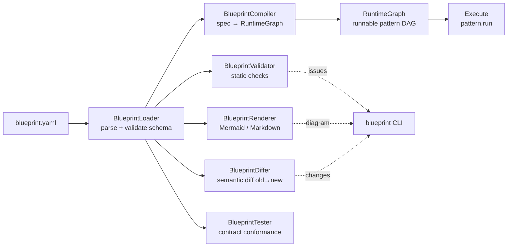
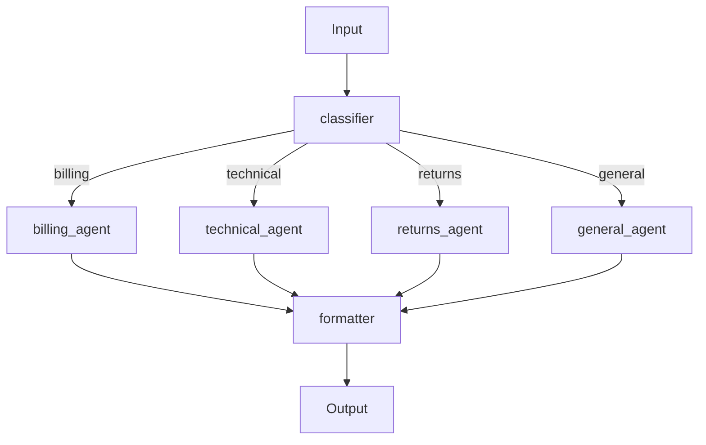

# pyagent-blueprint

**Spec-driven development for multi-agent systems** — declare your entire agent system in YAML, validate it statically, compile it to a live `RuntimeGraph`, diff versions semantically, and run it through Studio.

Like Kubernetes for agent systems: infrastructure as code, but for LLM workflows.

```bash
pip install pyagent-blueprint
pip install pyagent-blueprint[cli]   # + blueprint CLI commands
```

---

## Architecture



---

## The Blueprint YAML Format

A blueprint is a single YAML document that fully describes your agent system.

```yaml
# customer-support.yaml
api_version: pyagent/v1

metadata:
  name: customer-support-system
  version: "1.2.0"
  description: "Multi-tier customer support with billing, technical, and returns specialists"
  owner: platform-team
  tags: [support, production]

providers:
  fast:
    provider: anthropic
    model: claude-haiku-3-5-20241022
    max_tokens: 512
  balanced:
    provider: openai
    model: gpt-4o-mini
    max_tokens: 1024
  expert:
    provider: anthropic
    model: claude-sonnet-4-20250514
    max_tokens: 2048

context:
  working_memory_tokens: 20000
  session_backend: sqlite
  redaction: [email, phone, credit_card]

agents:
  classifier:
    provider: fast
    description: "Route to billing, technical, returns, or general"
    prompt: |
      Classify the customer message into exactly one of:
      billing, technical, returns, general.
      Respond with ONLY the category name.

  billing_agent:
    provider: expert
    description: "Handle billing disputes and subscription issues"
    prompt: |
      You are a billing specialist. Handle disputes, refunds, and 
      subscription questions. Always acknowledge frustration first,
      confirm charge details, then offer concrete next steps with timeline.

  technical_agent:
    provider: balanced
    description: "Handle technical and API issues"
    prompt: |
      You are a technical support engineer. Provide step-by-step
      debugging instructions with error codes and doc links.

  returns_agent:
    provider: expert
    description: "Handle returns and exchanges"
    prompt: |
      You are a returns specialist. Explain policy clearly,
      verify eligibility, and initiate the process where applicable.

  general_agent:
    provider: fast
    description: "Handle general inquiries"
    prompt: |
      Handle general inquiries helpfully. If out of scope,
      offer to escalate to a human agent.

  formatter:
    provider: fast
    description: "Polish and format the final response"
    prompt: |
      Format the response professionally. Remove internal notes.
      Keep under 200 words. Add a friendly closing line.

workflows:
  main:
    pattern: supervisor
    agents:
      classifier: classifier
      routes:
        billing: billing_agent
        technical: technical_agent
        returns: returns_agent
        general: general_agent
      formatter: formatter
    config:
      default_route: general

contracts:
  response_length:
    type: max_length
    value: 400
  no_pii_in_response:
    type: regex_absent
    pattern: "\\b\\d{4}[- ]?\\d{4}[- ]?\\d{4}[- ]?\\d{4}\\b"  # credit card

observability:
  trace: true
  record_to: traces/support_runs.jsonl
  cost_tracking: true
```

---

## Python API

### Load and validate

```python
from pyagent_blueprint import load_blueprint
from pyagent_blueprint.validator import BlueprintValidator

spec = load_blueprint("customer-support.yaml")

validator = BlueprintValidator()
issues = validator.validate(spec)

if issues:
    for issue in issues:
        print(f"[{issue.severity}] {issue.path}: {issue.message}")
else:
    print(f"✓ Valid — {len(spec.agents)} agents, {len(spec.workflows)} workflows")

# Inspect the spec
print(f"Name: {spec.metadata.name} v{spec.metadata.version}")
print(f"Providers: {list(spec.providers.keys())}")
print(f"Agents: {list(spec.agents.keys())}")
```

### Compile to a live RuntimeGraph

```python
from pyagent_blueprint import load_blueprint, BlueprintCompiler
from pyagent_providers import ProviderRegistry, AnthropicLLM, OpenAILLM
import asyncio

spec = load_blueprint("customer-support.yaml")

# Wire real providers (optional — uses MockLLM if omitted, great for testing)
registry = ProviderRegistry()
registry.register("anthropic", AnthropicLLM)
registry.register("openai", OpenAILLM)

compiler = BlueprintCompiler(provider_registry=registry)
graph = compiler.compile(spec)

# Run a workflow
result = asyncio.run(graph.run("main", "I was charged twice this month"))
print(result.output)
print(f"Route: {result.metadata.get('route_key')}")
print(f"Cost: ${result.cost_estimate:.4f}")
```

### Describe the compiled graph

```python
import json
print(json.dumps(graph.describe(), indent=2))
# {
#   "workflows": {
#     "main": {
#       "pattern": "supervisor",
#       "agents": ["classifier", "billing_agent", "technical_agent", ...],
#       "config": {"default_route": "general"}
#     }
#   },
#   "metadata": {"name": "customer-support-system", "version": "1.2.0"}
# }
```

---

## Blueprint CLI (`blueprint` command)

```bash
pip install pyagent-blueprint[cli]
```

### validate — catch errors before deployment

```bash
blueprint validate customer-support.yaml
# ✓ customer-support.yaml is valid — no issues found.

# With errors:
# [error] workflows.main.agents.routes.billing: Agent ref 'billing_agnt' not found.
#   Available: [billing_agent, technical_agent, ...]
```

### compile — inspect the compiled graph

```bash
blueprint compile customer-support.yaml
# {
#   "workflows": { "main": { "pattern": "supervisor", ... } },
#   "metadata": { "name": "customer-support-system" }
# }
```

### render — generate diagrams and docs

```bash
# Mermaid diagram (default)
blueprint render customer-support.yaml
blueprint render customer-support.yaml -o docs/architecture.md

# Markdown documentation
blueprint render customer-support.yaml --format markdown -o docs/system.md
```

Output (mermaid):


### test — contract conformance with MockLLM

```bash
blueprint test customer-support.yaml
# Testing 'customer-support-system'...
# All contract checks passed.

# Or with failures:
# [error] contracts.response_length: Output exceeded max_length 400 (got 612)
```

### diff — semantic diff between versions

```bash
blueprint diff customer-support-v1.yaml customer-support-v2.yaml
# + providers.premium: {provider: anthropic, model: claude-opus-4-20250514}
# ~ agents.billing_agent.provider: expert → premium
# ~ workflows.main.config.default_route: general → billing
# - agents.legacy_agent  (removed)
```

### generate — scaffold a new blueprint

```bash
blueprint generate --pattern pipeline --agents extractor,analyst,writer
# Generated pipeline.yaml with 3 agents

blueprint generate --pattern supervisor --agents classifier,billing,technical,general
# Generated supervisor.yaml with routing setup
```

---

## Validation Checks

The `BlueprintValidator` runs 6 categories of checks:

| Check | What it catches |
|-------|----------------|
| Agent refs | Workflow references non-existent agents |
| Provider refs | Agent uses undefined provider |
| Pattern names | Unknown pattern in workflow (typo) |
| Contract refs | Workflow references undefined contract |
| SLA values | Timeouts < 0, unrealistic retry counts |
| Security | Hardcoded API keys found in prompts |

```python
from pyagent_blueprint.validator import BlueprintValidator, IssueSeverity

validator = BlueprintValidator()
issues = validator.validate(spec)

errors   = [i for i in issues if i.severity == IssueSeverity.ERROR]
warnings = [i for i in issues if i.severity == IssueSeverity.WARNING]
infos    = [i for i in issues if i.severity == IssueSeverity.INFO]

print(f"Errors: {len(errors)}, Warnings: {len(warnings)}, Info: {len(infos)}")
```

---

## Multi-Workflow Blueprints

A single YAML file can contain multiple workflows — different entry points for different use cases.

```yaml
# analytics-platform.yaml
workflows:
  quick_analysis:
    pattern: pipeline
    agents:
      stages: [fast_extractor, fast_writer]
    config: {}

  deep_analysis:
    pattern: fan_out_fan_in
    agents:
      agents: [fundamentals_agent, technicals_agent, sentiment_agent]
      aggregator: synthesis_agent
    config: {}

  adversarial_review:
    pattern: debate
    agents:
      agents: [bull_agent, bear_agent]
      judge: judge_agent
    config:
      rounds: 2
      positions: [BUY, SELL]
```

```python
graph = compiler.compile(spec)

# Run different workflows against the same input
quick = asyncio.run(graph.run("quick_analysis", "Tesla Q3 earnings"))
deep  = asyncio.run(graph.run("deep_analysis", "Tesla Q3 earnings"))
adv   = asyncio.run(graph.run("adversarial_review", "Tesla Q3 earnings"))
```

---

## Context Config Block

Declare memory and context requirements directly in the blueprint.

```yaml
context:
  working_memory_tokens: 20000   # per-run in-memory budget
  session_backend: sqlite        # persist across turns: json | sqlite
  semantic_collection: kb        # ChromaDB collection name (requires [chromadb])
  redaction: [email, phone, ssn] # strip PII before LLM injection
  compress_ratio: 0.6            # compress inter-agent messages
```

The compiler wires these automatically — no extra Python code needed.

---

## Recovery Config Block

```yaml
workflows:
  main:
    pattern: supervisor
    agents: ...
    recovery:
      max_retries: 2
      timeout_seconds: 30.0
      fallback_provider: fast   # use cheap model if primary fails
```

---

## Integration with pyagent-studio

The full power of blueprints is in Studio — visual editor, simulation runner, governance dashboard.

```bash
# Install Studio
pip install pyagent-studio

# Launch the dashboard with your blueprint loaded
pyagent apply customer-support.yaml
pyagent dashboard

# Or simulate a workflow without hitting real APIs
pyagent simulate customer-support.yaml main "I need a refund"
```

See [Studio Package](studio.md) for the full walkthrough.

---

## See Also

- [Studio Package](studio.md) — visual blueprint editor, simulation, governance
- [Context Package](context.md) — `context:` block in YAML maps to ContextLedger
- [Providers Package](providers.md) — `providers:` block in YAML maps to ProviderRegistry
- [API Reference](../api/blueprint.md)

---

<!-- cookbook-backlinks:start -->

## Cookbook examples

Complete, runnable recipes that use this package — [browse the Cookbook](../cookbook/index.md):

- [Multi-agent marketing campaign planner](../cookbook/marketing-content/campaign-planner.md)

[Browse the full Cookbook →](../cookbook/index.md)

<!-- cookbook-backlinks:end -->
