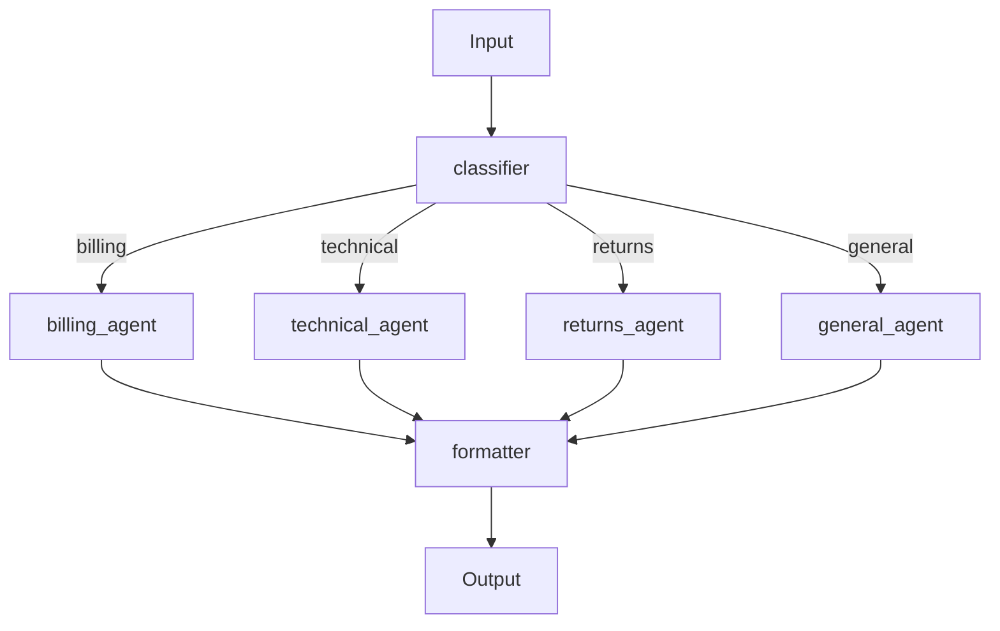

# Blueprint — CLI

```bash
pip install pyagent-blueprint[cli]
```

Installing with `[cli]` adds the `blueprint` command. All commands accept a path to a blueprint YAML file and exit with code `1` on errors.

---

## validate

Static analysis — catch errors before deployment.

```bash
blueprint validate customer-support.yaml
# ✓ customer-support.yaml is valid — no issues found.
```

With errors:
```
[error] workflows.main.agents.routes.billing: Agent ref 'billing_agnt' not found.
  Available: [billing_agent, technical_agent, returns_agent, general_agent, formatter]
[warning] agents.legacy_agent: Defined but not referenced in any workflow.
```

Exit code `0` = valid, `1` = errors found.  
Add to CI:
```yaml
- run: blueprint validate blueprints/production.yaml
```

---

## compile

Compile the spec and print the resulting graph description as JSON.

```bash
blueprint compile customer-support.yaml
```

```json
{
  "workflows": {
    "main": {
      "pattern": "supervisor",
      "agents": ["classifier", "billing_agent", "technical_agent", "returns_agent", "general_agent", "formatter"],
      "config": {"default_route": "general"}
    }
  },
  "metadata": {
    "name": "customer-support-system",
    "version": "1.2.0"
  }
}
```

Useful for debugging agent wiring without running any LLM calls.

---

## render

Generate a Mermaid diagram or full Markdown documentation.

```bash
# Mermaid diagram (default) — printed to stdout
blueprint render customer-support.yaml

# Save to file
blueprint render customer-support.yaml -o docs/architecture.md

# Full Markdown documentation
blueprint render customer-support.yaml --format markdown -o docs/system.md
```

Example Mermaid output:


---

## test

Run contract conformance checks with MockLLM — no API costs.

```bash
blueprint test customer-support.yaml
# Testing 'customer-support-system'...
# All contract checks passed.
```

With failures:
```
Results: 1 error(s), 1 warning(s)
  [error] contracts.response_length: Output exceeded max_length 400 (got 612)
  [warning] contracts.no_pii_in_response: Check skipped (no output generated)
```

---

## diff

Semantic diff between two blueprint versions — shows what changed and the severity of each change.

```bash
blueprint diff customer-support-v1.yaml customer-support-v2.yaml
```

```
+ providers.premium: {provider: anthropic, model: claude-opus-4-20250514, max_tokens: 4096}
~ agents.billing_agent.provider: expert → premium   [WARNING: model upgrade — cost increase]
~ workflows.main.config.default_route: general → billing   [WARNING: routing change]
- agents.legacy_agent   [INFO: agent removed]
```

Severity levels:

| Level | Examples |
|-------|----------|
| `BREAKING` | Pattern type changed, required field removed, workflow deleted |
| `WARNING` | Prompt changed, provider swapped, config value changed |
| `INFO` | Metadata update, description change, agent added/removed |

---

## generate

Scaffold a new blueprint YAML from a pattern and agent list.

```bash
blueprint generate --pattern pipeline --agents extractor,analyst,writer
# Generated pipeline.yaml

blueprint generate --pattern supervisor --agents classifier,billing,technical,general
# Generated supervisor.yaml
```

The generated file includes the correct `api_version`, a `metadata` stub, provider placeholders, agent stubs with empty prompts, and the workflow wired to the chosen pattern.

---

## All Commands

```
blueprint validate  <file>                           Static analysis
blueprint compile   <file>                           Compile and print graph JSON
blueprint render    <file> [--format mermaid|markdown] [-o <out>]
blueprint test      <file>                           Contract conformance
blueprint diff      <old-file> <new-file>            Semantic diff
blueprint generate  --pattern <name> --agents <a,b,c>
```

---

## See Also

- [Python API](compiler.md) — use the same tools from Python code
- [Studio CLI](../studio/cli.md) — `pyagent` commands for apply, simulate, diff, dashboard
