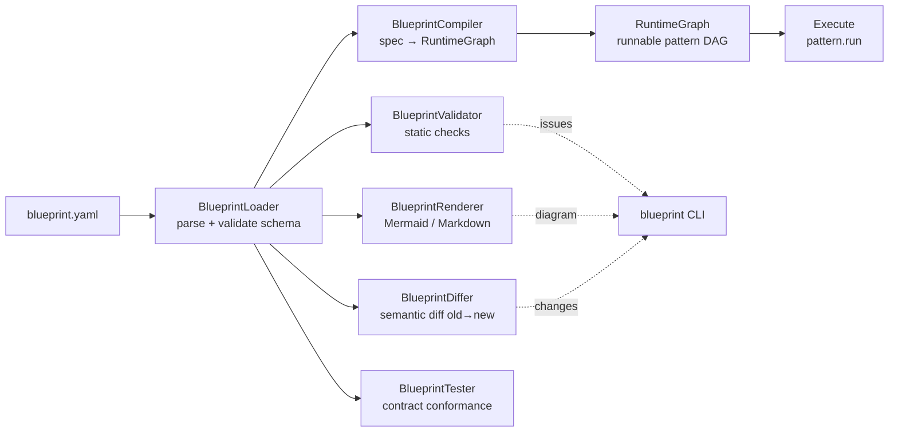

# pyagent-blueprint

**Spec-driven development for multi-agent systems** — declare your entire agent system in YAML, validate it statically, compile it to a live `RuntimeGraph`, diff versions semantically, and run it through Studio.

Like Kubernetes for agent systems: infrastructure as code, but for LLM workflows.

```bash
pip install pyagent-blueprint
pip install pyagent-blueprint[cli]   # + blueprint CLI commands
```

---

## Why Blueprint?

Writing multi-agent systems in pure Python works — until you need to version them, review them in a PR, test them without hitting real APIs, or hand them off to a team member who doesn't know where the agents are wired together.

Blueprint separates **what** your system does (the YAML spec) from **how** it runs (the compiler and runtime). The same file that deploys to production can be statically validated in CI, simulated with MockLLM in tests, and diffed against the previous version in a PR description.

---

## Architecture



---

## Quick Start

```yaml
# hello.yaml
api_version: pyagent/v1

metadata:
  name: hello-world
  version: "1.0.0"

providers:
  fast:
    provider: anthropic
    model: claude-haiku-3-5-20241022

agents:
  answerer:
    provider: fast
    prompt: "Answer questions concisely and helpfully."

workflows:
  main:
    pattern: pipeline
    agents:
      stages: [answerer]
```

```python
import asyncio
from pyagent_blueprint import load_blueprint, BlueprintCompiler

spec    = load_blueprint("hello.yaml")
graph   = BlueprintCompiler().compile(spec)
result  = asyncio.run(graph.run("main", "What is pyagent?"))
print(result.output)
```

---

## YAML Sections at a Glance

| Section | Purpose |
|---------|---------|
| [`metadata`](spec-format.md#metadata) | Name, version, owner, tags |
| [`providers`](providers.md) | LLM provider bindings (model, tokens, timeout) |
| [`agents`](agents.md) | Agent definitions (prompt, provider, tools, guardrails) |
| [`workflows`](workflows.md) | Orchestration patterns + agent wiring + recovery |
| [`context`](context.md) | Memory tiers, compression, redaction |
| [`contracts`](contracts.md) | Input/output schemas, SLA constraints |
| [`observability`](contracts.md#observability) | Tracing flags, cost budgets |

---

## Sub-pages

- [Spec Format](spec-format.md) — annotated full YAML reference
- [Agents](agents.md) — prompts, providers, tools, guardrails
- [Workflows](workflows.md) — patterns, agent mapping, recovery
- [Providers](providers.md) — model tiers, multi-provider setup
- [Context](context.md) — memory, compression, redaction
- [Contracts & Observability](contracts.md) — SLA, cost budgets, tracing
- [CLI](cli.md) — validate, compile, render, test, diff, generate
- [Python API](compiler.md) — compiler, validator, differ, renderer, tester

---

## See Also

- [Studio Package](../studio/index.md) — visual editor, simulation, governance dashboard
- [Blueprint Guide](../../guides/blueprint.md) — narrative walkthrough
- [API Reference](../../api/blueprint.md)
