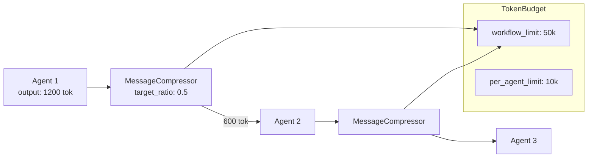

# pyagent-compress

**Token budget enforcement and inter-agent message compression** — reduce the tokens passed between agents in pipelines and fan-outs, saving cost without losing critical information.

```bash
pip install pyagent-compress
```

---

## Why Compression Matters

In a 5-agent pipeline, each stage's verbose LLM output becomes the next stage's input. Without compression, token costs compound linearly.

```
Stage 1 output:  1,200 tokens  → passes 1,200 to Stage 2
Stage 2 output:  1,800 tokens  → passes 1,800 to Stage 3
Stage 3 output:  2,100 tokens  → passes 2,100 to Stage 4
...
Total tokens consumed by stages 2-5: ~12,000 tokens (just on inputs)
```

With `CompressMiddleware(target_ratio=0.5)`, that becomes ~6,000 tokens — half the cost, same signal.

---

## Architecture



---

## MessageCompressor

Core compression primitive — reduce a single message or string to a target token ratio.

```python
from pyagent_compress import MessageCompressor

compressor = MessageCompressor(target_ratio=0.5)

verbose_output = """
Let me think about this carefully. The analysis I've conducted shows that
revenue increased by approximately 15% on a year-over-year basis. It's 
worth noting, and I think this is quite significant, that the profit margin
also expanded to around 23%, which is a meaningful improvement from the
prior period's 19% margin. Additionally, there are several other factors
to consider here...
"""

result = compressor.compress(verbose_output)
print(result.compressed_text)
print(f"Tokens: {result.original_tokens} → {result.compressed_tokens}")
print(f"Savings: {result.savings_pct:.0%}")
```

### Compression strategies

```python
from pyagent_compress import MessageCompressor

# Extractive: keep highest information-density sentences
extractive = MessageCompressor(target_ratio=0.5, strategy="extractive")

# Truncate: keep first N tokens (fastest, least intelligent)
truncate = MessageCompressor(target_ratio=0.5, strategy="truncate")

# Default (auto): extractive for long outputs, truncate for short
auto = MessageCompressor(target_ratio=0.5)
```

---

## TokenBudget

Track token consumption across a workflow and enforce per-agent and workflow-level limits.

```python
from pyagent_compress import TokenBudget

budget = TokenBudget(
    workflow_limit=50_000,    # total tokens for the whole workflow
    per_agent_limit=10_000,   # max tokens any single agent can consume
)

# Record usage per agent
budget.consume("extractor", 3_200)
budget.consume("fact_checker", 4_100)
budget.consume("writer", 2_800)

print(budget.summary())
# Total consumed: 10,100 / 50,000 (20.2%)
# Remaining: 39,900
# By agent: {extractor: 3200, fact_checker: 4100, writer: 2800}

# Check before a call
if budget.remaining("analyst") < 5000:
    print("Compressing input before calling analyst")

# Raise on budget exceeded (strict mode)
strict_budget = TokenBudget(workflow_limit=10_000, strict=True)
try:
    strict_budget.consume("agent_x", 11_000)
except BudgetExceededError:
    print("Budget exceeded — skipping this stage")
```

---

## CompressMiddleware

Wrap agents so their outputs are automatically compressed before reaching the next stage.

```python
import asyncio
from pyagent_compress import CompressMiddleware, TokenBudget
from pyagent_patterns.base import Agent
from pyagent_patterns.orchestration import Pipeline
from pyagent_providers import AnthropicLLM, OpenAILLM

budget = TokenBudget(workflow_limit=30_000, per_agent_limit=8_000)
middleware = CompressMiddleware(target_ratio=0.5, budget=budget)

pipeline = Pipeline(stages=[
    middleware.wrap(Agent(
        "extractor",
        AnthropicLLM("claude-haiku-3-5-20241022"),
        system_prompt="Extract all facts, figures, and entities.",
    )),
    middleware.wrap(Agent(
        "analyst",
        OpenAILLM("gpt-4o-mini"),
        system_prompt="Analyze the extracted data.",
    )),
    # Last stage doesn't need compression — its output goes to the user
    Agent(
        "writer",
        AnthropicLLM("claude-sonnet-4-20250514"),
        system_prompt="Write the final brief.",
    ),
])

result = asyncio.run(pipeline.run(open("earnings_transcript.txt").read()))
print(result.output)
print(f"Budget used: {budget.summary()}")
```

### Wrap all agents in one call

```python
agents = [extractor_agent, analyst_agent, risk_agent, writer_agent]
compressed_agents = middleware.wrap_all(agents)
pipeline = Pipeline(stages=compressed_agents)
```

---

## Hook Integration — Agent-Level Compression

The hook system lets you attach a compressor directly to an agent instead of wrapping it in middleware. The agent automatically compresses its output before returning, and emits a `compression` trace event when a `TraceEventBus` is also wired.

```python
import asyncio
from pyagent_compress import MessageCompressor
from pyagent_trace.events import TraceEventBus
from pyagent_trace.exporters import ConsoleExporter
from pyagent_patterns.base import Agent
from pyagent_providers import AnthropicLLM

bus = TraceEventBus()
bus.subscribe(ConsoleExporter().export_event)

compressor = MessageCompressor(target_ratio=0.5)

agent = (
    Agent("analyst", AnthropicLLM("claude-sonnet-4-20250514"),
          system_prompt="Provide a detailed financial analysis.")
    .set_compressor(compressor)
    .set_trace_bus(bus)          # optional: emits compression event to bus
)

result = asyncio.run(agent.run("Tesla Q3 2025 earnings — summarize key risks"))
# Output is compressed before being returned; trace event includes savings_pct
```

Hook vs. middleware — when to use each:

| Approach | When | API |
|----------|------|-----|
| `agent.set_compressor()` | Single agent, fluent wiring, hook pipeline | `Agent.set_compressor(compressor)` |
| `CompressMiddleware.wrap()` | Existing Pipeline/FanOut, wrap multiple agents at once | `middleware.wrap(agent)` |

Both are compatible — you can mix them in the same workflow.

→ See the full [Hooks Guide](../guides/hooks.md) for all four hook types.

---

## AgentPruner

Detect low-contribution agents in a multi-agent workflow and remove them to save cost in future runs.

```python
from pyagent_compress import AgentPruner

pruner = AgentPruner(min_contribution=0.3)   # agents below 30% contribution score

# Score agents based on how much unique information they added
message_history = [
    {"agent": "bull", "content": "Strong earnings growth justifies premium valuation"},
    {"agent": "bear", "content": "Strong earnings growth justifies premium valuation"},  # duplicate
    {"agent": "neutral", "content": "Key risk: competition from AMD custom silicon, $40B TAM"},
]

scores = pruner.score_agents(message_history, task="Evaluate Nvidia investment")
print(scores)
# {"bull": 0.82, "bear": 0.18, "neutral": 0.91}

to_prune = pruner.should_prune(scores)
print(f"Prune these agents: {to_prune}")
# → ["bear"]  (score 0.18 < threshold 0.3)
```

---

## InteractionPruner

Thin a long conversation history by removing low-value exchanges before injecting into an agent's context.

```python
from pyagent_compress import InteractionPruner

pruner = InteractionPruner(max_interactions=10, min_relevance=0.4)

long_history = [
    {"role": "user", "content": "Hi"},
    {"role": "assistant", "content": "Hello! How can I help?"},
    {"role": "user", "content": "I need help with my billing"},
    # ... 30 more turns ...
]

pruned = pruner.prune(long_history, current_query="I want to upgrade my plan")
print(f"Pruned: {len(long_history)} → {len(pruned)} interactions")
```

---

## Integration with Fan-Out / Fan-In

Parallel agents produce verbose independent analyses. Compress each before the aggregator to stay within the aggregator's context window.

```python
import asyncio
from pyagent_compress import CompressMiddleware, TokenBudget
from pyagent_patterns.base import Agent
from pyagent_patterns.orchestration import FanOutFanIn
from pyagent_providers import GeminiLLM, AnthropicLLM

budget = TokenBudget(workflow_limit=60_000, per_agent_limit=8_000)
middleware = CompressMiddleware(target_ratio=0.4, budget=budget)

fanout = FanOutFanIn(
    agents=[
        middleware.wrap(Agent("bull", GeminiLLM("gemini-2.5-flash"),
                              system_prompt="Argue the strongest bullish investment case.")),
        middleware.wrap(Agent("bear", GeminiLLM("gemini-2.5-flash"),
                              system_prompt="Argue the strongest bearish case.")),
        middleware.wrap(Agent("macro", GeminiLLM("gemini-2.5-flash"),
                              system_prompt="Provide macroeconomic context and risk factors.")),
    ],
    aggregator=Agent(
        "analyst",
        AnthropicLLM("claude-sonnet-4-20250514"),
        system_prompt="Synthesize all three perspectives into an investment memo.",
    ),
)

result = asyncio.run(fanout.run("Nvidia at $3.2T market cap — invest or pass?"))
print(f"Budget used: {budget.summary()}")
print(f"Cost savings vs uncompressed: ~{budget.savings_estimate()}")
```

---

## Cost Savings Reference

| Workflow | Without Compression | With 50% Compression | Saving |
|----------|--------------------|-----------------------|--------|
| 5-stage Pipeline (gpt-4o) | ~25k tokens | ~13k tokens | ~$0.06 |
| 5-agent Fan-Out (gemini-2.5-pro) | ~30k tokens | ~16k tokens | ~$0.05 |
| 3-round Debate (gpt-4o) | ~18k tokens | ~10k tokens | ~$0.04 |
| Typical monthly (1000 runs/day) | — | — | **$1,200–$1,800/mo** |

---

## See Also

- [Context Package](context.md) — `ContextLedger.to_messages(max_tokens=)` for token-budgeted injection
- [Tracing Guide](../guides/tracing.md) — `pyagent.compress.savings_pct` attribute in OTel spans
- [Compression Guide](../guides/compression.md) — full integration walkthrough
- [API Reference](../api/compress.md)

---

<!-- cookbook-backlinks:start -->

## Cookbook examples

Complete, runnable recipes that use this package — [all examples using this package](../cookbook/index.md):

- [Multi-agent research assistant](../cookbook/research-analysis/research-assistant.md)

[Browse the full Cookbook →](../cookbook/index.md)

<!-- cookbook-backlinks:end -->
