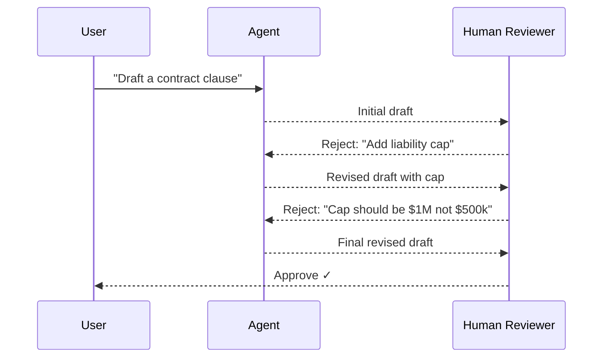

# Human-in-the-Loop Pattern

Agent generates output; a human review gate decides accept / reject / modify. Supports async approval workflows for production systems.

**Best for:** High-stakes content, compliance workflows, email/legal drafts, any irreversible action.  
**LLM calls:** 1 per generation attempt (N attempts if rejected).

---

## Sequence Diagram



---

## Use Case 1 — Executive Email Drafting (Anthropic)

```python
import asyncio
from pyagent_patterns.base import Agent
from pyagent_patterns.advanced import HumanInTheLoop
from pyagent_patterns.advanced.human_in_the_loop import HumanDecision
from pyagent_providers import AnthropicLLM

def executive_review(output: str, metadata: dict) -> HumanDecision:
    print("\n" + "="*60)
    print("DRAFT EMAIL FOR REVIEW:")
    print("="*60)
    print(output)
    print("="*60)
    print(f"Generation attempt: {metadata.get('revision', 0) + 1}")

    decision = input("Approve? (y/n): ").strip().lower()
    if decision == "y":
        return HumanDecision(approved=True)
    feedback = input("Feedback for revision: ").strip()
    return HumanDecision(approved=False, feedback=feedback)

pattern = HumanInTheLoop(
    agent=Agent(
        "email_drafter",
        AnthropicLLM("claude-sonnet-4-20250514"),
        system_prompt="Draft professional executive emails. "
                      "Match the tone to the context: formal for board communications, "
                      "warmer for team-facing messages. "
                      "Be direct, clear, and concise. Max 200 words. "
                      "If given revision feedback, incorporate it precisely.",
    ),
    review_fn=executive_review,
    max_revisions=3,
)

result = asyncio.run(pattern.run(
    "Draft an email to our enterprise customers announcing a 15% price increase "
    "effective in 90 days. Frame it around the significant new features we're adding: "
    "AI-powered analytics, 99.99% SLA, and 24/7 dedicated support."
))
print(f"\nApproved after {result.metadata['revisions']} revision(s)")
print("Final email:")
print(result.output)
```

---

## Use Case 2 — Legal Clause Generation with Compliance Gate (OpenAI)

Automated review for known patterns, human escalation for edge cases.

```python
from pyagent_providers import OpenAILLM
import re

REQUIRED_TERMS = ["liability cap", "limitation of liability", "indemnification"]
AUTO_REJECT_PATTERNS = ["unlimited liability", "sole discretion", "without notice"]

def compliance_review(output: str, metadata: dict) -> HumanDecision:
    output_lower = output.lower()

    for pattern_str in AUTO_REJECT_PATTERNS:
        if pattern_str in output_lower:
            return HumanDecision(
                approved=False,
                feedback=f"Auto-rejected: contains prohibited term '{pattern_str}'. Remove it.",
            )

    missing = [t for t in REQUIRED_TERMS if t not in output_lower]
    if missing:
        return HumanDecision(
            approved=False,
            feedback=f"Missing required terms: {', '.join(missing)}",
        )

    print("\nDRAFT CLAUSE:")
    print(output)
    decision = input("Legal team approval (y/n): ").strip().lower()
    if decision == "y":
        return HumanDecision(approved=True)
    feedback = input("Legal feedback: ").strip()
    return HumanDecision(approved=False, feedback=feedback)

pattern = HumanInTheLoop(
    agent=Agent(
        "legal_drafter",
        OpenAILLM("gpt-4o"),
        system_prompt="Draft precise legal clauses for B2B SaaS agreements. "
                      "Always include: liability caps, indemnification scope, "
                      "and governing law. Use standard commercial terms. "
                      "If given revision feedback, incorporate exactly.",
    ),
    review_fn=compliance_review,
    max_revisions=5,
)

result = asyncio.run(pattern.run(
    "Draft a limitation of liability clause: liability cap at 12 months of fees paid, "
    "mutual indemnification, exclusion of consequential damages, "
    "carve-out for data breach and IP infringement."
))
print(f"Approved: {result.metadata['approved']}, Revisions: {result.metadata['revisions']}")
```

---

## Use Case 3 — Content Moderation with Human Escalation (LangChain)

Auto-approve clear cases; escalate ambiguous ones.

```python
from langchain_anthropic import ChatAnthropic
from pyagent_providers import LangChainLLM

auto_decisions = {"CLEARLY_SAFE": True, "CLEARLY_VIOLATES": False}

def moderation_review(output: str, metadata: dict) -> HumanDecision:
    first_word = output.strip().split()[0].upper() if output.strip() else ""

    if first_word in auto_decisions:
        approved = auto_decisions[first_word]
        return HumanDecision(
            approved=approved,
            feedback=None if approved else "Automated rejection: clear policy violation.",
        )

    print(f"\nAMBIGUOUS CASE — Human review needed:")
    print(output)
    decision = input("Approve content? (y/n): ").strip().lower()
    feedback = None if decision == "y" else input("Rejection reason: ").strip()
    return HumanDecision(approved=(decision == "y"), feedback=feedback)

pattern = HumanInTheLoop(
    agent=Agent(
        "content_moderator",
        LangChainLLM(ChatAnthropic(model="claude-sonnet-4-20250514")),
        system_prompt="Evaluate user-submitted content against community guidelines. "
                      "Respond: CLEARLY_SAFE, CLEARLY_VIOLATES, or AMBIGUOUS — then explain why.",
    ),
    review_fn=moderation_review,
    max_revisions=2,
)
```

---

## OTel Trace Output

```
Trace: pyagent.pattern.human_in_the_loop (47.2s, $0.008)
├── Attempt 1: pyagent.agent.email_drafter (1.8s, claude-sonnet-4-20250514)
│   └── human_review: REJECTED (feedback: "too formal, soften the tone")
├── Attempt 2: pyagent.agent.email_drafter (1.6s)
│   └── human_review: REJECTED (feedback: "mention the 90-day notice explicitly")
└── Attempt 3: pyagent.agent.email_drafter (1.4s)
    └── human_review: APPROVED ✓
    total_revisions: 2, approved: true
```

---

## When to Use

| Condition | Recommendation |
|---|---|
| Outputs are irreversible or legally binding | ✅ Use Human-in-the-Loop |
| Compliance or regulatory review is required | ✅ Use Human-in-the-Loop |
| High-volume routine outputs | ❌ Use Evaluator-Optimizer (automated gate) |
| Speed is critical | ❌ Human review adds latency |
| Quality improvement without human judgment | ❌ Use Cross-Reflection |

---

## See Also

- [Evaluator-Optimizer](../resolution/evaluator-optimizer.md) — automated quality gate without human
- [Cross-Reflection](../resolution/cross-reflection.md) — AI peer review before human sees it
- [ReAct](react.md) — human-in-the-loop for tool approval rather than output approval

---

<!-- pattern-mesh:start -->

## Explore all design patterns

**Orchestration:** [Supervisor](../orchestration/supervisor.md) · [Pipeline](../orchestration/pipeline.md) · [Fan-Out / Fan-In](../orchestration/fan-out-fan-in.md) · [Hierarchical](../orchestration/hierarchical.md) · [Orchestrator-Workers](../orchestration/orchestrator-workers.md)  
**Resolution:** [Self-Reflection](../resolution/self-reflection.md) · [Cross-Reflection](../resolution/cross-reflection.md) · [Debate](../resolution/debate.md) · [Voting](../resolution/voting.md) · [Evaluator-Optimizer](../resolution/evaluator-optimizer.md)  
**Structural:** [Role-Based](../structural/role-based.md) · [Layered](../structural/layered.md) · [Topology](../structural/topology.md) · [Blackboard](../structural/blackboard.md)  
**Iterative & Advanced:** [ReAct](../advanced/react.md) · [Talker-Reasoner](../advanced/talker-reasoner.md) · [Swarm](../advanced/swarm.md) · **Human-in-the-Loop**  

[Browse the full pattern catalog →](../index.md)

<!-- pattern-mesh:end -->
