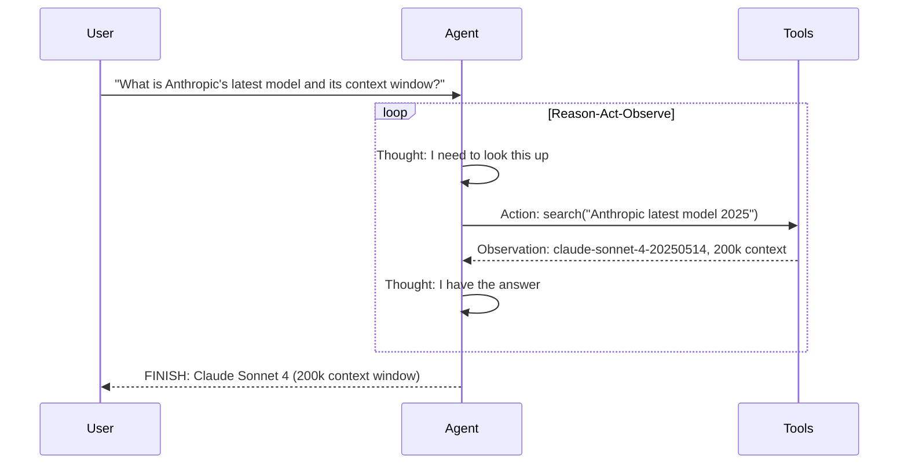

# ReAct Pattern

Iterative **Re**ason → **Act** → Observe cycle. The agent thinks, calls a tool, observes the result, and repeats until it has enough to answer.

Based on the 2022 Princeton/Google paper: *"ReAct: Synergizing Reasoning and Acting in Language Models."*

**Best for:** Research assistants, code execution, API orchestration, any task needing external data.  
**LLM calls:** 1 per Thought+Action step. Typically 2–5 steps.

---

## Sequence Diagram



---

## Use Case 1 — Financial Research Agent (OpenAI)

=== "Python"

    ```python
    import asyncio
    import httpx
    from pyagent_patterns.base import Agent
    from pyagent_patterns.advanced import ReAct
    from pyagent_providers import OpenAILLM

    def search(query: str) -> str:
        """Simulates web search — replace with Tavily, SerpAPI, or Exa in production."""
        results = {
            "nvidia revenue 2025": "Nvidia Q3 FY2025: Revenue $35.1B (+94% YoY), data center $30.8B",
            "nvidia p/e ratio": "Nvidia forward P/E: 45x (as of Dec 2024), vs AMD 28x, Intel 18x",
            "nvidia competition": "AMD MI300X closing gap in AI training; custom silicon from Google (TPU), Amazon (Trainium)",
        }
        for key, val in results.items():
            if key in query.lower():
                return val
        return f"Search results for '{query}': No specific data found, check financial data providers."

    def calculator(expression: str) -> str:
        """Safe arithmetic evaluator."""
        try:
            allowed = set("0123456789+-*/(). ")
            if not all(c in allowed for c in expression):
                return "Error: only arithmetic expressions allowed"
            return str(round(eval(expression), 4))
        except Exception as e:
            return f"Error: {e}"

    def get_price(ticker: str) -> str:
        return {"NVDA": "$875.40", "AMD": "$142.20", "INTC": "$42.10"}.get(
            ticker.upper(), f"Ticker {ticker} not found"
        )

    pattern = ReAct(
        agent=Agent(
            "financial_analyst",
            OpenAILLM("gpt-4o"),
            system_prompt="You are a financial research analyst. "
                          "Use tools to gather data before drawing conclusions. "
                          "Think step by step. Show your reasoning. "
                          "Format:\n"
                          "Thought: <your reasoning>\n"
                          "Action: tool_name(argument)\n"
                          "...repeat as needed...\n"
                          "FINISH: <final answer>",
        ),
        tools={
            "search": search,
            "calculator": calculator,
            "get_price": get_price,
        },
        max_steps=8,
    )

    result = asyncio.run(pattern.run(
        "Research Nvidia's current financial position: revenue growth, competitive threats, "
        "and whether the current P/E ratio is justified. Give a buy/hold/sell recommendation."
    ))
    print(result.output)
    print(f"Steps: {result.metadata['steps']}, Tools used: {result.metadata['tools_used']}")
    print(f"Cost: ${result.cost_estimate:.4f}")
    ```

=== "Blueprint YAML"

    Declare the same reasoning agent as a `pyagent-blueprint` manifest. Tool *names* are declarative
    (`agents.<name>.tools`); wiring the actual Python callables (`search`, `calculator`, `get_price`)
    is a runtime-adapter concern, done in the Python API after compiling:

    ```yaml
    api_version: pyagent/v1
    metadata:
      name: financial-research-agent
      version: 1.0.0
      description: ReAct agent reasons step by step and calls tools to research a question
    providers:
      primary: { model: gpt-4o }
    agents:
      financial_analyst:
        provider: primary
        prompt: "Reason step by step. Use tools to gather data. Respond FINISH: <answer> when done."
        tools: [search, calculator, get_price]
    workflows:
      research:
        pattern: react
        agents:
          agent: financial_analyst
        config:
          max_steps: 8
    ```

    ```bash
    pyagent-blueprint validate financial-research-agent.yaml
    pyagent-blueprint test financial-research-agent.yaml
    ```

---

## Use Case 2 — Code Execution Agent (Anthropic)

```python
import subprocess
import tempfile
import os
from pyagent_providers import AnthropicLLM

def run_python(code: str) -> str:
    """Execute Python code safely in a temporary file."""
    with tempfile.NamedTemporaryFile(mode="w", suffix=".py", delete=False) as f:
        f.write(code)
        tmp_path = f.name
    try:
        result = subprocess.run(
            ["python3", tmp_path],
            capture_output=True, text=True, timeout=10
        )
        output = result.stdout or result.stderr
        return output[:2000] if output else "(no output)"
    except subprocess.TimeoutExpired:
        return "Error: code execution timed out (10s limit)"
    finally:
        os.unlink(tmp_path)

def read_file(path: str) -> str:
    try:
        with open(path) as f:
            return f.read()[:3000]
    except Exception as e:
        return f"Error reading file: {e}"

code_agent = ReAct(
    agent=Agent(
        "code_debugger",
        AnthropicLLM("claude-sonnet-4-20250514"),
        system_prompt="You are an expert Python debugger. "
                      "Read the failing code, understand the error, write a fix, "
                      "and verify it works by running it. "
                      "Format:\n"
                      "Thought: <reasoning>\n"
                      "Action: tool_name(argument)\n"
                      "FINISH: <explanation of what was wrong and how you fixed it>",
    ),
    tools={
        "run_python": run_python,
        "read_file": read_file,
    },
    max_steps=10,
)

result = asyncio.run(code_agent.run(
    "The following function raises a RecursionError for large inputs. "
    "Debug it and provide a working iterative implementation:\n\n"
    "def fibonacci(n):\n    if n <= 1: return n\n    return fibonacci(n-1) + fibonacci(n-2)"
))
print(result.output)
```

---

## Use Case 3 — API Orchestration Agent (LiteLLM)

```python
import json
from pyagent_providers import LiteLLM

def get_weather(city: str) -> str:
    # Replace with real weather API
    weather_data = {
        "london": "12°C, overcast, 65% humidity",
        "new york": "8°C, partly cloudy, 45% humidity",
        "tokyo": "18°C, sunny, 55% humidity",
    }
    return weather_data.get(city.lower(), f"Weather data for {city} not available")

def convert_currency(amount_and_currencies: str) -> str:
    # Replace with real FX API
    parts = amount_and_currencies.split()
    try:
        amount = float(parts[0])
        from_ccy = parts[1].upper()
        to_ccy = parts[3].upper() if len(parts) > 3 else "USD"
        rates = {"USD_EUR": 0.92, "EUR_USD": 1.09, "USD_GBP": 0.79, "GBP_USD": 1.27}
        rate = rates.get(f"{from_ccy}_{to_ccy}", 1.0)
        return f"{amount * rate:.2f} {to_ccy}"
    except Exception:
        return "Error parsing currency conversion request"

api_agent = ReAct(
    agent=Agent(
        "travel_assistant",
        LiteLLM("gpt-4o-mini"),
        system_prompt="You are a travel assistant. Use tools to get real-time data. "
                      "Format: Thought: <reasoning>\nAction: tool_name(argument)\nFINISH: <answer>",
    ),
    tools={"get_weather": get_weather, "convert_currency": convert_currency},
    max_steps=6,
)

result = asyncio.run(api_agent.run(
    "I'm traveling from New York to London next week. "
    "What's the weather like there, and how much would £500 GBP be in USD?"
))
print(result.output)
```

---

## OTel Trace Output

```
Trace: pyagent.pattern.react (4.8s, $0.016)
├── Step 1: Thought + Action: search("nvidia revenue 2025") (1.2s, gpt-4o)
│   └── Observation: Revenue $35.1B (+94% YoY)
├── Step 2: Thought + Action: search("nvidia p/e ratio") (1.1s)
│   └── Observation: Forward P/E 45x
├── Step 3: Thought + Action: get_price("NVDA") (0.9s)
│   └── Observation: $875.40
├── Step 4: Thought + Action: calculator("35.1 / 30.0") (0.8s)
│   └── Observation: 1.17 (YoY revenue ratio)
└── Step 5: Thought + FINISH (0.8s) → recommendation
    steps: 5, tools_used: [search, get_price, calculator]
```

---

## When to Use

| Condition | Recommendation |
|---|---|
| Task requires real-time or external data | ✅ Use ReAct |
| Number of steps is unpredictable | ✅ Use ReAct |
| Tools are deterministic functions | ✅ Use ReAct |
| Task can be solved without external tools | ❌ Single-shot call |
| Tool calls are irreversible actions | ❌ Add Human-in-the-Loop gate before action |
| Parallel tool execution needed | ❌ Use Orchestrator-Workers |

---

<!-- gen:cookbooks:start (generated by scripts/gen_docs.py from docs/cookbook/ — do not edit by hand) -->
## Cookbook recipes

Complete, runnable examples that use the **ReAct** pattern:

| Recipe | Domain | What it does | Complexity |
|--------|--------|--------------|------------|
| [SQL Analyst](../../../cookbook/data-analytics/sql-analyst.md) | Data & Analytics | Reason-act loop that writes and runs SQL to answer questions | Intermediate |
| [Fraud Investigation Assistant](../../../cookbook/security/fraud-investigation.md) | Security & Threat Intel | A reason-act agent calls transaction, anomaly, and sanctions tools to build a case | Advanced |
| [Research Assistant](../../../cookbook/research-analysis/research-assistant.md) | Research & Analysis | Gather sources, debate, synthesize, and cite | Advanced |
<!-- gen:cookbooks:end -->

## See Also

- [Orchestrator-Workers](../orchestration/orchestrator-workers.md) — parallel tool/worker execution rather than sequential steps
- [Human-in-the-Loop](human-in-the-loop.md) — add human approval gate before executing real-world actions
- [Talker-Reasoner](talker-reasoner.md) — ReAct as the "reasoner" in a fast/slow routing system

---

<!-- pattern-mesh:start -->

## Explore all design patterns

**Orchestration:** [Supervisor](../orchestration/supervisor.md) · [Pipeline](../orchestration/pipeline.md) · [Fan-Out / Fan-In](../orchestration/fan-out-fan-in.md) · [Hierarchical](../orchestration/hierarchical.md) · [Orchestrator-Workers](../orchestration/orchestrator-workers.md)  
**Resolution:** [Self-Reflection](../resolution/self-reflection.md) · [Cross-Reflection](../resolution/cross-reflection.md) · [Debate](../resolution/debate.md) · [Voting](../resolution/voting.md) · [Evaluator-Optimizer](../resolution/evaluator-optimizer.md)  
**Structural:** [Role-Based](../structural/role-based.md) · [Layered](../structural/layered.md) · [Topology](../structural/topology.md) · [Blackboard](../structural/blackboard.md)  
**Iterative & Advanced:** **ReAct** · [Talker-Reasoner](../advanced/talker-reasoner.md) · [Swarm](../advanced/swarm.md) · [Human-in-the-Loop](../advanced/human-in-the-loop.md)  

[Browse the full pattern catalog →](../index.md)

<!-- pattern-mesh:end -->
