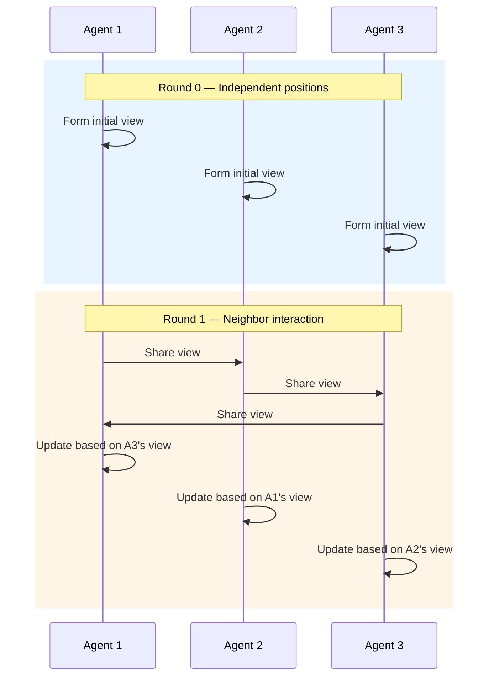

# Swarm Pattern

Decentralized multi-agent system: agents form local views, share with neighbors across rounds, and global consensus or diversity emerges from local interaction.

**Best for:** Collective intelligence, opinion diversity, technology scanning, distributed decision-making.  
**LLM calls:** N agents × R rounds.

---

## Sequence Diagram



---

## Use Case 1 — Technology Trend Forecasting (Gemini)

Five independent analysts form views, share with 2 neighbors each round, and refine through interaction.

=== "Python"

    ```python
    import asyncio
    from pyagent_patterns.base import Agent
    from pyagent_patterns.advanced import Swarm
    from pyagent_providers import GeminiLLM

    pattern = Swarm(
        agents=[
            Agent(
                "ml_researcher",
                GeminiLLM("gemini-2.5-flash"),
                system_prompt="You are an ML researcher. Form views based on ML/AI research trends: "
                              "what models, architectures, and capabilities will dominate in 2 years. "
                              "When you see a neighbor's view, update yours if their evidence is compelling.",
            ),
            Agent(
                "infra_engineer",
                GeminiLLM("gemini-2.5-flash"),
                system_prompt="You are a cloud infrastructure engineer. Form views based on platform "
                              "and infrastructure trends. Update your view when presented with "
                              "compelling evidence from colleagues.",
            ),
            Agent(
                "product_manager",
                GeminiLLM("gemini-2.5-flash"),
                system_prompt="You are a product manager tracking user adoption trends. "
                              "Focus on what users actually want vs what researchers build. "
                              "Update your view based on compelling market evidence.",
            ),
            Agent(
                "vc_analyst",
                GeminiLLM("gemini-2.5-flash"),
                system_prompt="You are a VC analyst tracking investment flows and startup activity. "
                              "Form views on where capital is flowing and why. "
                              "Update based on compelling evidence from colleagues.",
            ),
            Agent(
                "enterprise_architect",
                GeminiLLM("gemini-2.5-flash"),
                system_prompt="You are an enterprise architect tracking corporate adoption. "
                              "Focus on what enterprises are actually deploying vs piloting. "
                              "Update based on compelling evidence.",
            ),
        ],
        rounds=3,
        neighbor_count=2,
        aggregation="last",
    )

    result = asyncio.run(pattern.run(
        "What are the top 3 most important AI/ML technology trends for enterprise software in 2026?"
    ))
    print(result.output)
    print(f"Agents: {result.metadata['agents']}, Rounds: {result.metadata['rounds']}")
    print(f"Cost: ${result.cost_estimate:.4f}")
    ```

=== "Blueprint YAML"

    Declare the same swarm as a `pyagent-blueprint` manifest:

    ```yaml
    api_version: pyagent/v1
    metadata:
      name: trend-forecast-swarm
      version: 1.0.0
      description: Independent analysts form views and refine them through neighbor interaction
    providers:
      primary: { model: gemini-2.5-flash }
    agents:
      ml_researcher: { provider: primary, prompt: "Form views on ML/AI research trends. Update when neighbors are compelling." }
      infra_engineer: { provider: primary, prompt: "Form views on infrastructure trends. Update when neighbors are compelling." }
      product_manager: { provider: primary, prompt: "Form views on product trends. Update when neighbors are compelling." }
    workflows:
      forecast:
        pattern: swarm
        agents:
          agents: [ml_researcher, infra_engineer, product_manager]
        config:
          rounds: 3
    ```

    ```bash
    pyagent-blueprint validate trend-forecast-swarm.yaml
    pyagent-blueprint test trend-forecast-swarm.yaml
    ```

---

## Use Case 2 — Collective Code Architecture Design (OpenAI + Anthropic)

```python
from pyagent_providers import OpenAILLM, AnthropicLLM

arch_swarm = Swarm(
    agents=[
        Agent(
            "backend_specialist",
            OpenAILLM("gpt-4o-mini"),
            system_prompt="You specialize in backend systems. Form an architecture view "
                          "considering scalability, data models, and API design. "
                          "Update your view when frontend or ops colleagues raise valid constraints.",
        ),
        Agent(
            "frontend_specialist",
            AnthropicLLM("claude-haiku-3-5-20241022"),
            system_prompt="You specialize in frontend systems. Form an architecture view "
                          "considering UX, state management, and build complexity. "
                          "Update when backend constraints are compelling.",
        ),
        Agent(
            "ops_specialist",
            OpenAILLM("gpt-4o-mini"),
            system_prompt="You specialize in operations and infrastructure. "
                          "Form a view considering deployment, monitoring, and reliability. "
                          "Push back on architectures that are operationally complex.",
        ),
        Agent(
            "security_specialist",
            AnthropicLLM("claude-haiku-3-5-20241022"),
            system_prompt="You specialize in application security. "
                          "Form a view considering authentication, authorization, and data protection. "
                          "Flag security implications of colleagues' architectural choices.",
        ),
    ],
    rounds=2,
    neighbor_count=2,
    aggregation="last",
)

result = asyncio.run(arch_swarm.run(
    "Design the architecture for a multi-tenant analytics platform: "
    "100k tenants, real-time dashboards, 10TB data/day, SOC2 compliance required."
))
```

---

## Use Case 3 — Multi-Provider Consensus (LiteLLM)

Use different providers to prevent any single model's biases from dominating.

```python
from pyagent_providers import LiteLLM

diverse_swarm = Swarm(
    agents=[
        Agent(f"analyst_openai", LiteLLM("gpt-4o-mini"),
              system_prompt="Form and refine your analysis. Update when neighbors make compelling points."),
        Agent(f"analyst_anthropic", LiteLLM("anthropic/claude-haiku-3.5"),
              system_prompt="Form and refine your analysis. Update when neighbors make compelling points."),
        Agent(f"analyst_gemini", LiteLLM("gemini/gemini-2.5-flash"),
              system_prompt="Form and refine your analysis. Update when neighbors make compelling points."),
    ],
    rounds=2,
    neighbor_count=2,
    aggregation="consensus",
)

result = asyncio.run(diverse_swarm.run(
    "Should an AI startup prioritize getting to market fast with GPT-4 "
    "or spend 6 months building proprietary fine-tuned models?"
))
```

---

## OTel Trace Output

```
Trace: pyagent.pattern.swarm (8.2s, $0.021)
├── Round 0 — independent
│   ├── pyagent.agent.ml_researcher (1.4s)
│   ├── pyagent.agent.infra_engineer (1.3s)
│   ├── pyagent.agent.product_manager (1.2s)
│   ├── pyagent.agent.vc_analyst (1.1s)
│   └── pyagent.agent.enterprise_architect (1.4s)
├── Round 1 — neighbor exchange [neighbor_count=2]
│   └── [parallel updates with neighbor context]
├── Round 2 — neighbor exchange
│   └── [parallel updates]
└── aggregation: last → final swarm output
```

---

## When to Use

| Condition | Recommendation |
|---|---|
| You want emergent collective intelligence | ✅ Use Swarm |
| Diverse independent starting positions add value | ✅ Use Swarm |
| Agents need a central coordinator | ❌ Use Orchestrator-Workers |
| Agents don't interact with each other | ❌ Use Fan-Out/Fan-In |
| Fixed roles with structured rounds | ❌ Use Role-Based |

---

<!-- gen:cookbooks:start (generated by scripts/gen_docs.py from docs/cookbook/ — do not edit by hand) -->
## Cookbook recipes

Complete, runnable examples that use the **Swarm** pattern:

| Recipe | Domain | What it does | Complexity |
|--------|--------|--------------|------------|
| [Trip-Planning Swarm](../../../cookbook/travel-hospitality/trip-planner.md) | Travel & Hospitality | Self-organizing agents negotiate flights, lodging, and activities into an itinerary | Advanced |
<!-- gen:cookbooks:end -->

## See Also

- [Fan-Out / Fan-In](../orchestration/fan-out-fan-in.md) — independent parallel agents without peer interaction
- [Role-Based](../structural/role-based.md) — structured role collaboration vs emergent peer interaction
- [Debate](../resolution/debate.md) — adversarial positions with a judge

---

<!-- pattern-mesh:start -->

## Explore all design patterns

**Orchestration:** [Supervisor](../orchestration/supervisor.md) · [Pipeline](../orchestration/pipeline.md) · [Fan-Out / Fan-In](../orchestration/fan-out-fan-in.md) · [Hierarchical](../orchestration/hierarchical.md) · [Orchestrator-Workers](../orchestration/orchestrator-workers.md)  
**Resolution:** [Self-Reflection](../resolution/self-reflection.md) · [Cross-Reflection](../resolution/cross-reflection.md) · [Debate](../resolution/debate.md) · [Voting](../resolution/voting.md) · [Evaluator-Optimizer](../resolution/evaluator-optimizer.md)  
**Structural:** [Role-Based](../structural/role-based.md) · [Layered](../structural/layered.md) · [Topology](../structural/topology.md) · [Blackboard](../structural/blackboard.md)  
**Iterative & Advanced:** [ReAct](../advanced/react.md) · [Talker-Reasoner](../advanced/talker-reasoner.md) · **Swarm** · [Human-in-the-Loop](../advanced/human-in-the-loop.md)  

[Browse the full pattern catalog →](../index.md)

<!-- pattern-mesh:end -->
