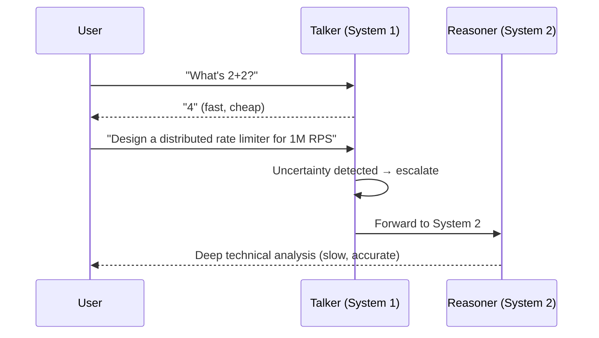

# Talker-Reasoner Pattern

Dual-process architecture: fast cheap System 1 (Talker) handles simple queries; slow expensive System 2 (Reasoner) handles complex ones. Uncertainty triggers automatic escalation.

Based on Google DeepMind's 2024 paper and Kahneman's "Thinking, Fast and Slow."

**Best for:** Conversational agents, customer-facing chatbots, high-volume Q&A with mixed complexity.  
**LLM calls:** 1 (talker only) or 2 (talker + reasoner). ~70% of queries stay at talker.

---

## Sequence Diagram



---

## Use Case 1 — Cost-Efficient Conversational Agent (Haiku + Sonnet)

```python
import asyncio
from pyagent_patterns.base import Agent
from pyagent_patterns.advanced import TalkerReasoner
from pyagent_providers import AnthropicLLM

pattern = TalkerReasoner(
    talker=Agent(
        "talker",
        AnthropicLLM("claude-haiku-3-5-20241022"),
        system_prompt="You are a helpful assistant. For simple, factual questions: "
                      "answer directly and concisely. "
                      "For complex questions requiring deep reasoning, multi-step analysis, "
                      "or specialised expertise, respond ONLY with: "
                      "ESCALATE: <one-sentence reason why this needs deeper analysis>",
    ),
    reasoner=Agent(
        "reasoner",
        AnthropicLLM("claude-sonnet-4-20250514"),
        system_prompt="You are a senior technical expert. Provide thorough, accurate analysis. "
                      "Show your reasoning. Use concrete examples. "
                      "Your response will be the user's final answer.",
    ),
    escalation_signal="ESCALATE:",
)

queries = [
    "What is the capital of France?",
    "How do I reverse a string in Python?",
    "Design a fault-tolerant distributed rate limiter for 1 million RPS with sub-millisecond latency",
    "What are the trade-offs between B-tree and LSM-tree storage engines for a write-heavy workload?",
]

for query in queries:
    result = asyncio.run(pattern.run(query))
    system = result.metadata["system"]
    escalated = result.metadata["escalated"]
    print(f"[System {system}{'↑' if escalated else ''}] {query[:60]}")
    print(f"  Cost: ${result.cost_estimate:.5f}")
```

---

## Use Case 2 — GPT-4o-mini + GPT-4o Pairing (OpenAI)

```python
from pyagent_providers import OpenAILLM

cost_optimizer = TalkerReasoner(
    talker=Agent(
        "fast_agent",
        OpenAILLM("gpt-4o-mini"),
        system_prompt="Answer straightforward questions directly and concisely. "
                      "If a question requires: complex multi-step reasoning, "
                      "domain expertise, code generation over 20 lines, "
                      "or careful analysis of trade-offs, respond: "
                      "ESCALATE: <reason>",
    ),
    reasoner=Agent(
        "expert_agent",
        OpenAILLM("gpt-4o"),
        system_prompt="Provide comprehensive, expert-level analysis. "
                      "Think step by step. Show your work.",
    ),
    escalation_signal="ESCALATE:",
)

result = asyncio.run(cost_optimizer.run(
    "Compare PostgreSQL vs DynamoDB for a multi-tenant SaaS app "
    "with 10k tenants, 99.99% uptime requirement, and unpredictable traffic spikes."
))
print(result.output)
print(f"Escalated to expert: {result.metadata['escalated']}")
print(f"Cost: ${result.cost_estimate:.5f}")
```

---

## Use Case 3 — LiteLLM Mixed-Provider Routing

```python
from pyagent_providers import LiteLLM

mixed_provider = TalkerReasoner(
    talker=Agent(
        "gemini_fast",
        LiteLLM("gemini/gemini-2.5-flash"),
        system_prompt="Answer simple questions directly. "
                      "For questions requiring detailed reasoning or expertise, respond: ESCALATE: <reason>",
    ),
    reasoner=Agent(
        "claude_expert",
        LiteLLM("anthropic/claude-sonnet-4-20250514"),
        system_prompt="Provide expert-level, detailed analysis. Think carefully and show reasoning.",
    ),
    escalation_signal="ESCALATE:",
)
```

---

## Cost Profile

For a typical workload where ~70% of queries are simple:

| Strategy | Model | Avg cost/query |
|----------|-------|---------------|
| Always GPT-4o | gpt-4o | $0.00400 |
| Always Sonnet | claude-sonnet-4-20250514 | $0.00350 |
| Talker-Reasoner (Haiku + Sonnet) | 70% Haiku / 30% Sonnet | $0.00114 (~68% savings) |
| Talker-Reasoner (GPT-4o-mini + GPT-4o) | 70% mini / 30% GPT-4o | $0.00135 (~66% savings) |

---

## OTel Trace Output

```
# Simple query — talker only
Trace: pyagent.pattern.talker_reasoner (0.4s, $0.00003)
└── pyagent.agent.talker (0.4s, claude-haiku-3-5-20241022) → direct answer

# Complex query — escalated
Trace: pyagent.pattern.talker_reasoner (3.2s, $0.00280)
├── pyagent.agent.talker (0.4s, claude-haiku-3-5-20241022) → ESCALATE
└── pyagent.agent.reasoner (2.8s, claude-sonnet-4-20250514) → deep analysis
```

---

## When to Use

| Condition | Recommendation |
|---|---|
| High query volume with mixed complexity | ✅ Use Talker-Reasoner |
| Cost is a primary constraint | ✅ Use Talker-Reasoner |
| All queries are uniformly complex | ❌ Use strong model directly |
| Routing should be by topic, not complexity | ❌ Use Supervisor |
| Multiple escalation tiers needed | ❌ Chain TalkerReasoner patterns |

---

## See Also

- [Supervisor](../orchestration/supervisor.md) — route by topic rather than complexity
- [Evaluator-Optimizer](../resolution/evaluator-optimizer.md) — scored quality gate for the reasoner's output
- [Routing Guide](../../../guides/router.md) — difficulty scoring and cost-based routing

---

<!-- pattern-mesh:start -->

## Explore all design patterns

**Orchestration:** [Supervisor](../orchestration/supervisor.md) · [Pipeline](../orchestration/pipeline.md) · [Fan-Out / Fan-In](../orchestration/fan-out-fan-in.md) · [Hierarchical](../orchestration/hierarchical.md) · [Orchestrator-Workers](../orchestration/orchestrator-workers.md)  
**Resolution:** [Self-Reflection](../resolution/self-reflection.md) · [Cross-Reflection](../resolution/cross-reflection.md) · [Debate](../resolution/debate.md) · [Voting](../resolution/voting.md) · [Evaluator-Optimizer](../resolution/evaluator-optimizer.md)  
**Structural:** [Role-Based](../structural/role-based.md) · [Layered](../structural/layered.md) · [Topology](../structural/topology.md) · [Blackboard](../structural/blackboard.md)  
**Iterative & Advanced:** [ReAct](../advanced/react.md) · **Talker-Reasoner** · [Swarm](../advanced/swarm.md) · [Human-in-the-Loop](../advanced/human-in-the-loop.md)  

[Browse the full pattern catalog →](../index.md)

<!-- pattern-mesh:end -->
