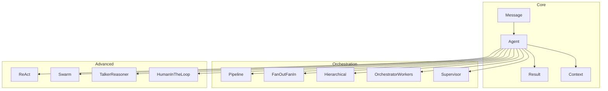
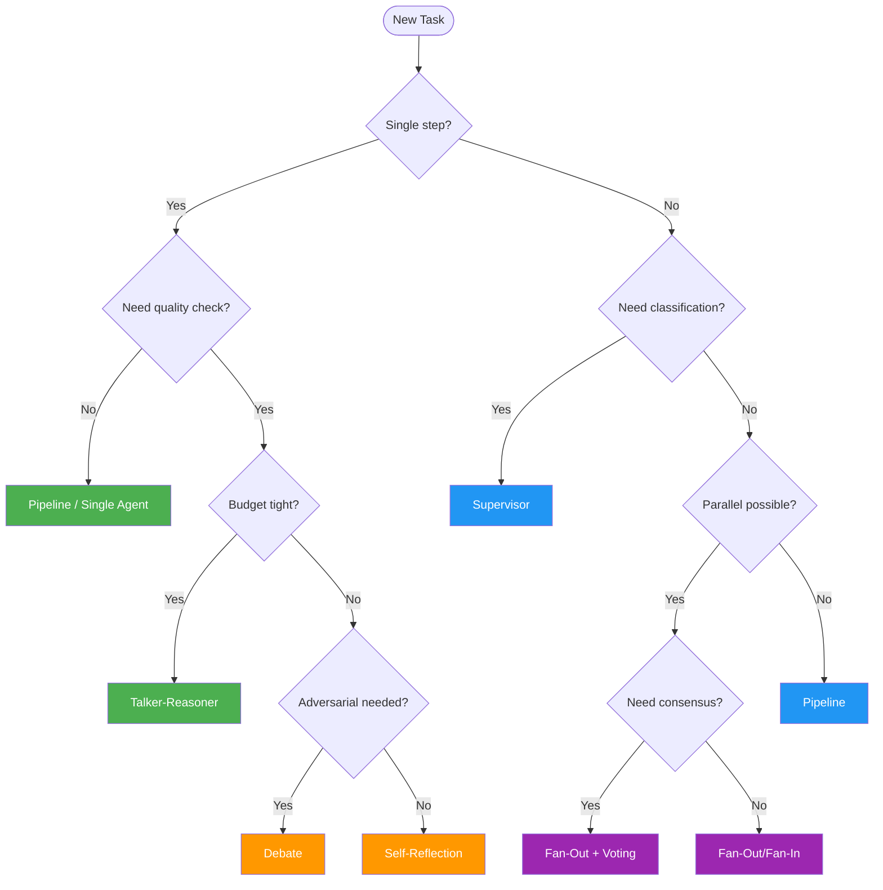

# pyagent-patterns

**Core agent abstractions and multi-agent orchestration patterns** — the foundation every other package builds on. Provides `Agent`, `Message`, `Pattern`, and 18 production-ready orchestration patterns.

```bash
pip install pyagent-patterns
```

---

## Architecture



---

## Core Abstractions

### Message

Immutable, typed message between agents.

```python
from pyagent_patterns.base import Message

user_msg   = Message.user("Summarise this earnings call")
sys_msg    = Message.system("You are a financial analyst.")
asst_msg   = Message.assistant("Revenue grew 15% YoY...", name="analyst")
```

### Agent

The single unit of work — one LLM, one system prompt.

```python
from pyagent_patterns.base import Agent
from pyagent_providers import AnthropicLLM

agent = Agent(
    name="analyst",
    llm=AnthropicLLM("claude-sonnet-4-20250514"),
    system_prompt="You are a financial analyst. Be concise.",
)

import asyncio
result = asyncio.run(agent.run("What is 2+2?"))
print(result.output)
```

### MockLLM

Deterministic LLM for tests — no API calls, no cost.

```python
from pyagent_patterns.base import Agent, MockLLM

llm = MockLLM(responses=["Bull case: strong FCF", "Bear case: high leverage"])
agent = Agent("mock_agent", llm)
```

### Context

Structured context injected into an agent's conversation.

```python
from pyagent_patterns.base import Agent, Context

ctx = Context(
    data={"portfolio": "NVDA 10%, MSFT 8%, AAPL 7%"},
    max_tokens=500,
)
result = asyncio.run(agent.run("What is my largest position?", context=ctx))
```

---

## Orchestration Patterns

### Pipeline

Sequential chain — each stage's output feeds the next.

```
Input → Stage 1 → Stage 2 → Stage 3 → Output
LLM calls: N (one per stage)
```

```python
import asyncio
from pyagent_patterns.orchestration import Pipeline
from pyagent_patterns.base import Agent
from pyagent_providers import AnthropicLLM, OpenAILLM

pipeline = Pipeline(stages=[
    Agent("extractor", AnthropicLLM("claude-haiku-3-5-20241022"),
          system_prompt="Extract all facts and figures from the text."),
    Agent("analyst",   OpenAILLM("gpt-4o-mini"),
          system_prompt="Analyse the extracted data. Identify key trends."),
    Agent("writer",    AnthropicLLM("claude-sonnet-4-20250514"),
          system_prompt="Write a concise 3-paragraph investment brief."),
])

result = asyncio.run(pipeline.run(open("earnings.txt").read()))
print(result.output)
```

### FanOutFanIn

Parallel agents, single aggregator — fastest for independent sub-tasks.

```
              ┌→ Agent 1 ─┐
Input ────────┼→ Agent 2 ─┼→ Aggregator → Output
              └→ Agent 3 ─┘
LLM calls: N agents (parallel) + 1 aggregator
Wall-clock: max(agent latencies) + aggregator
```

```python
import asyncio
from pyagent_patterns.orchestration import FanOutFanIn
from pyagent_patterns.base import Agent
from pyagent_providers import GeminiLLM, AnthropicLLM

fanout = FanOutFanIn(
    agents=[
        Agent("bull",  GeminiLLM("gemini-2.5-flash"), system_prompt="Strongest bullish case."),
        Agent("bear",  GeminiLLM("gemini-2.5-flash"), system_prompt="Strongest bearish case."),
        Agent("macro", GeminiLLM("gemini-2.5-flash"), system_prompt="Macro risk factors."),
    ],
    aggregator=Agent(
        "synthesis",
        AnthropicLLM("claude-sonnet-4-20250514"),
        system_prompt="Synthesise all perspectives into a balanced investment memo.",
    ),
)

result = asyncio.run(fanout.run("Nvidia at $3.2T market cap — buy or pass?"))
```

### OrchestratorWorkers

Dynamic task decomposition — orchestrator breaks the task, workers execute.

```python
from pyagent_patterns.orchestration import OrchestratorWorkers
from pyagent_patterns.base import Agent
from pyagent_providers import AnthropicLLM, OpenAILLM

workflow = OrchestratorWorkers(
    orchestrator=Agent(
        "planner",
        AnthropicLLM("claude-sonnet-4-20250514"),
        system_prompt="Break the task into subtasks. Return JSON list of task strings.",
    ),
    workers=[
        Agent("researcher", OpenAILLM("gpt-4o"), system_prompt="Research the given topic."),
        Agent("coder",      OpenAILLM("gpt-4o"), system_prompt="Write the code for the task."),
        Agent("reviewer",   OpenAILLM("gpt-4o"), system_prompt="Review and improve the output."),
    ],
)

result = asyncio.run(workflow.run("Build a Python CLI that queries the GitHub API"))
```

### Hierarchical

Multi-level hierarchy — manager delegates to sub-managers, who delegate to workers.

```python
from pyagent_patterns.orchestration import Hierarchical

hierarchy = Hierarchical(
    manager=cto_agent,
    sub_managers=[backend_lead_agent, frontend_lead_agent],
    workers=[api_agent, db_agent, ui_agent, test_agent],
)
```

### Supervisor

Evaluation loop — supervisor critiques and re-runs workers until quality passes.

```python
from pyagent_patterns.orchestration import Supervisor

loop = Supervisor(
    supervisor=Agent(
        "critic",
        AnthropicLLM("claude-sonnet-4-20250514"),
        system_prompt="Score the output 1-10. If < 8, explain what to improve.",
    ),
    worker=Agent("writer", OpenAILLM("gpt-4o"),
                 system_prompt="Write a high-quality technical blog post."),
    max_iterations=3,
    quality_threshold=8,
)

result = asyncio.run(loop.run("Write about async Python patterns"))
```

---

## Advanced Patterns

### ReAct

Reasoning + Acting loop — agent decides to use tools, then reasons about results.

```python
from pyagent_patterns.advanced import ReAct

react = ReAct(
    agent=Agent("assistant", AnthropicLLM("claude-sonnet-4-20250514")),
    tools={"search": search_fn, "calculator": calc_fn, "code": exec_fn},
    max_steps=10,
)

result = asyncio.run(react.run("What was Nvidia's revenue growth rate last quarter?"))
```

### Swarm

Agents hand off to each other dynamically — each decides who handles next.

```python
from pyagent_patterns.advanced import Swarm

swarm = Swarm(agents={
    "triage":    triage_agent,
    "billing":   billing_agent,
    "technical": technical_agent,
    "escalation": escalation_agent,
})

result = asyncio.run(swarm.run("My payment failed but I was still charged twice"))
```

### TalkerReasoner

Dual-agent: fast Talker handles conversation, slow Reasoner handles hard problems.

```python
from pyagent_patterns.advanced import TalkerReasoner

dual = TalkerReasoner(
    talker=Agent("fast",   OpenAILLM("gpt-4o-mini"),
                 system_prompt="Handle simple queries quickly."),
    reasoner=Agent("slow", AnthropicLLM("claude-sonnet-4-20250514"),
                   system_prompt="Handle complex analysis and reasoning."),
    handoff_threshold=6,
)
```

### HumanInTheLoop

Pause for human approval before high-stakes actions.

```python
from pyagent_patterns.advanced import HumanInTheLoop

guarded = HumanInTheLoop(
    agent=Agent("executor", AnthropicLLM("claude-sonnet-4-20250514")),
    approval_fn=lambda action: input(f"Approve '{action}'? (y/n): ") == "y",
    high_risk_keywords=["delete", "deploy", "transfer", "publish"],
)
```

---

## Structural Patterns

```python
# Role-based: agents have explicit roles enforced at runtime
from pyagent_patterns.structural import RoleBased

# Blackboard: agents read/write a shared knowledge store
from pyagent_patterns.structural import Blackboard

# Layered: presentation → logic → data layer separation
from pyagent_patterns.structural import Layered

# Topology: define arbitrary agent graphs as adjacency maps
from pyagent_patterns.structural import Topology
```

---

## Hooks Integration

Every `Agent` supports four hooks for attaching pyagent's infrastructure services.

```python
from pyagent_patterns.base import Agent
from pyagent_providers import AnthropicLLM
from pyagent_compress import MessageCompressor
from pyagent_context import ContextLedger
from pyagent_trace.events import TraceEventBus
from pyagent_trace.cost import CostTracker

agent = (
    Agent("analyst", AnthropicLLM("claude-sonnet-4-20250514"))
    .set_compressor(MessageCompressor(target_ratio=0.5))
    .set_context(ContextLedger())
    .set_trace_bus(TraceEventBus())
    .set_cost_tracker(CostTracker())
)
```

→ See the full [Hooks Guide](../../guides/hooks.md) for all four hook types.

---

## Pattern Selection Guide

Use this decision tree to choose the right pattern for your task.



### All 18 Patterns at a Glance

| # | Pattern | Tier | LLM Calls | Best For |
|---|---------|------|-----------|----------|
| 1 | Supervisor | Orchestration | 2-3 | Task routing, customer support |
| 2 | Pipeline | Orchestration | N stages | Sequential processing, ETL |
| 3 | Fan-Out/Fan-In | Orchestration | N+1 | Parallel analysis, research |
| 4 | Hierarchical | Orchestration | 3+ levels | Enterprise workflows |
| 5 | Orchestrator-Workers | Orchestration | 1+N+1 | Dynamic task decomposition |
| 6 | Self-Reflection | Resolution | 2-6 | Code gen, writing |
| 7 | Cross-Reflection | Resolution | 3+ | Peer review, editing |
| 8 | Debate | Resolution | D×R+1 | Controversial decisions |
| 9 | Voting | Resolution | N | Consensus, fault tolerance |
| 10 | Evaluator-Optimizer | Resolution | 2-4/round | Criteria-driven quality |
| 11 | Role-Based | Structural | N×rounds | Team simulation |
| 12 | Layered | Structural | sum(layers) | Multi-level analysis |
| 13 | Topology | Structural | varies | Communication structure |
| 14 | Blackboard | Structural | N×rounds | Shared state coordination |
| 15 | Talker-Reasoner | Advanced | 1-2 | Cost-optimized chat |
| 16 | Swarm | Advanced | N×rounds | Emergent behavior |
| 17 | Human-in-the-Loop | Advanced | 1+ | Safety-critical tasks |
| 18 | ReAct | Advanced | 1-N steps | Tool-using agents |

---

## See Also

- [Router Package](../router.md) — automatic model selection per agent call
- [Compress Package](../compress.md) — token budget enforcement across pipelines
- [Guides](../../guides/composition.md) — deep-dive integration guides
- [API Reference](../../api/patterns.md)
