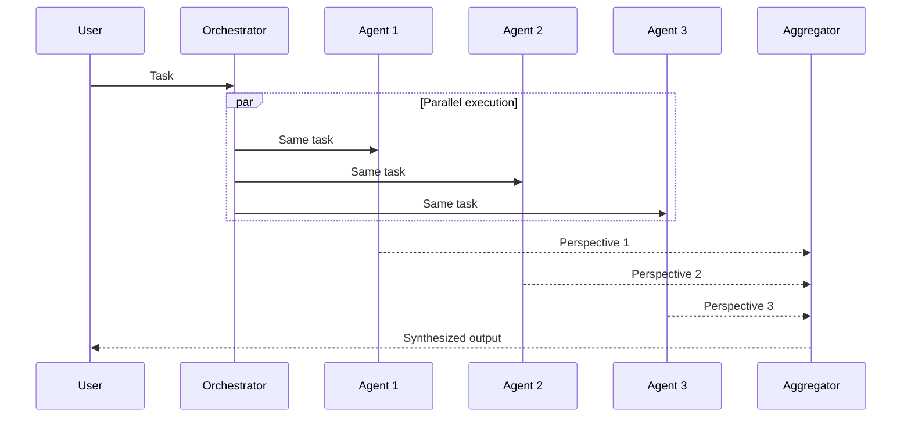

# Fan-Out / Fan-In Pattern

Broadcast the same task to N agents in parallel; a dedicated aggregator synthesizes all results.

**Best for:** Multi-perspective analysis, parallel research, ensemble fact-checking.  
**LLM calls:** N parallel + 1 aggregator. Wall-clock time: max(agent latencies) + aggregator.

---

## Sequence Diagram



---

## Use Case 1 — Investment Analysis (Bull / Bear / Neutral)

```python
import asyncio
from pyagent_patterns.base import Agent
from pyagent_patterns.orchestration import FanOutFanIn
from pyagent_providers import GeminiLLM

analysis = FanOutFanIn(
    agents=[
        Agent(
            "bull",
            GeminiLLM("gemini-2.5-flash"),
            system_prompt="Argue the strongest possible bullish investment case. "
                          "Focus on: revenue growth trajectory, market share expansion, "
                          "competitive moats, and catalysts for multiple expansion. "
                          "Use specific data points and comparable valuations.",
        ),
        Agent(
            "bear",
            GeminiLLM("gemini-2.5-flash"),
            system_prompt="Argue the strongest possible bearish case. "
                          "Focus on: valuation vs peers, competitive threats, macro risks, "
                          "execution risks, and downside scenarios. "
                          "Use specific data and counter the bull case directly.",
        ),
        Agent(
            "neutral",
            GeminiLLM("gemini-2.5-flash"),
            system_prompt="Give a balanced, probability-weighted assessment. "
                          "Acknowledge both bull and bear cases explicitly. "
                          "Identify the 2-3 key swing factors. "
                          "End with a base case, bull case, and bear case price target.",
        ),
    ],
    aggregator=Agent(
        "analyst",
        GeminiLLM("gemini-2.5-pro"),
        system_prompt="Synthesize all three perspectives into a structured investment memo: "
                      "1) Executive Summary (2 sentences), "
                      "2) Bull Case (key points), "
                      "3) Bear Case (key points), "
                      "4) Key Risks & Swing Factors, "
                      "5) Verdict with conviction level (High/Medium/Low).",
    ),
)

result = asyncio.run(analysis.run(
    "Investment thesis for Nvidia at current valuation — $3.2T market cap, "
    "P/E 45x forward, data center revenue growing 150% YoY"
))
print(result.output)
print(f"Parallel agents: {result.metadata['parallel_agents']}")
print(f"Duration: {result.duration_seconds:.1f}s, Cost: ${result.cost_estimate:.4f}")
```

### Stream individual agent results as they complete

```python
async def stream_analysis():
    async for chunk in analysis.stream(
        "Investment thesis for Nvidia at $3.2T market cap"
    ):
        print(chunk, end="", flush=True)

asyncio.run(stream_analysis())
```

---

## Use Case 2 — Multi-Provider Fact Checking

Different providers catch different error types — use all three together.

```python
from pyagent_providers import OpenAILLM, AnthropicLLM

fact_checker = FanOutFanIn(
    agents=[
        Agent(
            "openai_checker",
            OpenAILLM("gpt-4o"),
            system_prompt="Check factual accuracy. List every claim and mark each: "
                          "VERIFIED (with source), DISPUTED (with counter-evidence), "
                          "or UNVERIFIABLE. Be specific about what you can and cannot verify.",
        ),
        Agent(
            "anthropic_checker",
            AnthropicLLM("claude-sonnet-4-20250514"),
            system_prompt="Check logical consistency and internal contradictions. "
                          "Does the argument hold together? Are there gaps or non-sequiturs? "
                          "List any logical fallacies or unsupported leaps.",
        ),
        Agent(
            "gemini_checker",
            GeminiLLM("gemini-2.5-pro"),
            system_prompt="Check for statistical and numerical accuracy. "
                          "Are the numbers plausible? Do percentages add up? "
                          "Are comparisons fair? Flag any misleading use of statistics.",
        ),
    ],
    aggregator=Agent(
        "verdict",
        AnthropicLLM("claude-sonnet-4-20250514"),
        system_prompt="Combine all checker reports into a single fact-check verdict. "
                      "Give an overall reliability score (0-10). "
                      "List the top 3 concerns and which claims are safe to trust.",
    ),
)

result = asyncio.run(fact_checker.run(open("article_to_check.txt").read()))
print(result.output)
```

---

## Use Case 3 — Parallel Code Review (LangChain)

```python
from langchain_openai import ChatOpenAI
from langchain_anthropic import ChatAnthropic
from pyagent_providers import LangChainLLM

code_review = FanOutFanIn(
    agents=[
        Agent(
            "security_reviewer",
            LangChainLLM(ChatOpenAI(model="gpt-4o")),
            system_prompt="Review for security vulnerabilities: injection, auth bypass, "
                          "data exposure, insecure dependencies. Be exhaustive.",
        ),
        Agent(
            "performance_reviewer",
            LangChainLLM(ChatAnthropic(model="claude-sonnet-4-20250514")),
            system_prompt="Review for performance issues: N+1 queries, memory leaks, "
                          "unnecessary allocations, blocking I/O in async contexts.",
        ),
        Agent(
            "correctness_reviewer",
            LangChainLLM(ChatOpenAI(model="gpt-4o")),
            system_prompt="Review for logic errors, edge cases, off-by-one errors, "
                          "race conditions, and missing error handling.",
        ),
    ],
    aggregator=Agent(
        "lead_reviewer",
        LangChainLLM(ChatAnthropic(model="claude-sonnet-4-20250514")),
        system_prompt="Combine all reviews into a structured PR feedback comment. "
                      "Categorize findings as: BLOCKER, WARNING, SUGGESTION. "
                      "List blockers first. Be specific with line references.",
    ),
)

result = asyncio.run(code_review.run(open("pr_diff.py").read()))
print(f"Review complete. Cost: ${result.cost_estimate:.4f}")
```

---

## OTel Trace Output

```
Trace: pyagent.pattern.fan_out_fan_in (2.8s, $0.018)
├── [parallel]
│   ├── pyagent.agent.bull (2.1s, gemini-2.5-flash)
│   ├── pyagent.agent.bear (2.4s, gemini-2.5-flash)
│   └── pyagent.agent.neutral (2.8s, gemini-2.5-flash)
└── pyagent.agent.analyst (1.6s, gemini-2.5-pro)
```

---

## When to Use

| Condition | Recommendation |
|---|---|
| Multiple independent perspectives improve quality | ✅ Use Fan-Out/Fan-In |
| Wall-clock latency matters (parallel is fast) | ✅ Use Fan-Out/Fan-In |
| Analyses depend on each other | ❌ Use Pipeline |
| Agents need fixed hierarchy | ❌ Use Hierarchical |
| Agents should influence each other iteratively | ❌ Use Swarm |

---

<!-- gen:cookbooks:start (generated by scripts/gen_docs.py from docs/cookbook/ — do not edit by hand) -->
## Cookbook recipes

Complete, runnable examples that use the **Fan-Out / Fan-In** pattern:

| Recipe | Domain | What it does | Complexity |
|--------|--------|--------------|------------|
| [Campaign Planner](../../../cookbook/marketing-content/campaign-planner.md) | Marketing & Content | Parallel channel ideas aggregated into one campaign plan | Beginner |
| [CV Screener](../../../cookbook/hr-recruiting/cv-screener.md) | HR & Recruiting | Parallel reviewers score a CV; aggregate into one verdict | Intermediate |
| [Research Assistant](../../../cookbook/research-analysis/research-assistant.md) | Research & Analysis | Gather sources, debate, synthesize, and cite | Advanced |
| [Trading Signal Desk](../../../cookbook/finance-trading/trading-signals.md) | Finance & Trading | Momentum, mean-reversion, and sentiment agents fan out then aggregate into a trade idea | Advanced |
<!-- gen:cookbooks:end -->

## See Also

- [Pipeline](pipeline.md) — sequential stages instead of parallel
- [Voting](../resolution/voting.md) — parallel agents that vote on a discrete answer
- [Debate](../resolution/debate.md) — agents argue against each other across rounds
- [Swarm](../advanced/swarm.md) — agents interact with neighbors across rounds

---

<!-- pattern-mesh:start -->

## Explore all design patterns

**Orchestration:** [Supervisor](../orchestration/supervisor.md) · [Pipeline](../orchestration/pipeline.md) · **Fan-Out / Fan-In** · [Hierarchical](../orchestration/hierarchical.md) · [Orchestrator-Workers](../orchestration/orchestrator-workers.md)  
**Resolution:** [Self-Reflection](../resolution/self-reflection.md) · [Cross-Reflection](../resolution/cross-reflection.md) · [Debate](../resolution/debate.md) · [Voting](../resolution/voting.md) · [Evaluator-Optimizer](../resolution/evaluator-optimizer.md)  
**Structural:** [Role-Based](../structural/role-based.md) · [Layered](../structural/layered.md) · [Topology](../structural/topology.md) · [Blackboard](../structural/blackboard.md)  
**Iterative & Advanced:** [ReAct](../advanced/react.md) · [Talker-Reasoner](../advanced/talker-reasoner.md) · [Swarm](../advanced/swarm.md) · [Human-in-the-Loop](../advanced/human-in-the-loop.md)  

[Browse the full pattern catalog →](../index.md)

<!-- pattern-mesh:end -->
