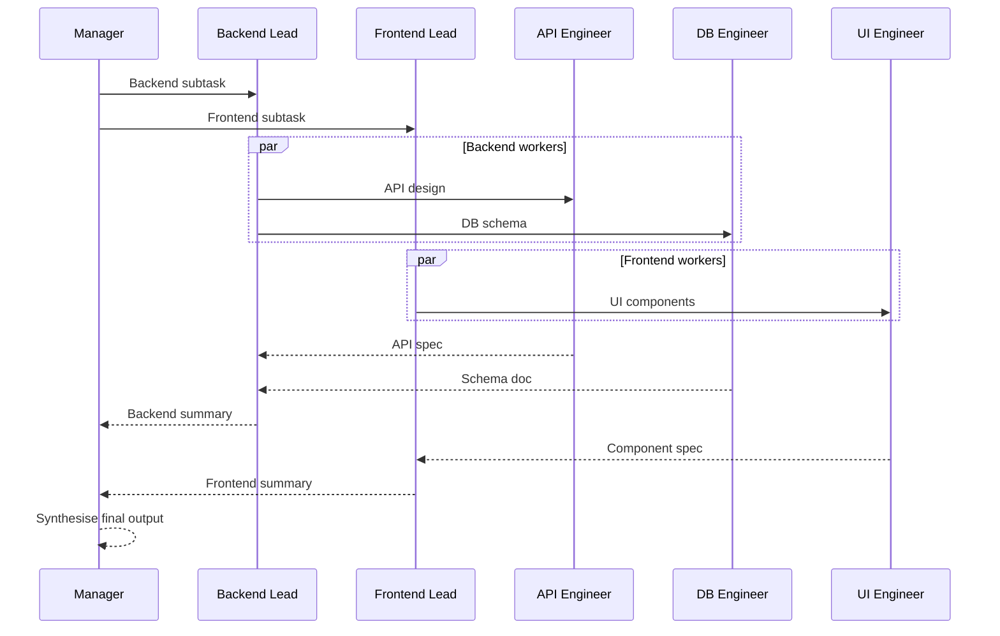

# Hierarchical Pattern

Manager → Team Leads → Workers. Multi-level delegation with parallel team execution and bottom-up synthesis.

**Best for:** Complex projects with defined sub-teams, enterprise workflows.  
**LLM calls:** 1 manager + T leads + W workers. Teams execute in parallel.

---

## Sequence Diagram



---

## Use Case 1 — Software System Design (Mixed Providers)

```python
import asyncio
from pyagent_patterns.base import Agent
from pyagent_patterns.orchestration import Hierarchical
from pyagent_patterns.orchestration.hierarchical import Team
from langchain_openai import ChatOpenAI
from langchain_anthropic import ChatAnthropic
from pyagent_providers import LangChainLLM, AnthropicLLM, OpenAILLM

hierarchical = Hierarchical(
    manager=Agent(
        "engineering_director",
        OpenAILLM("gpt-4o"),
        system_prompt="Decompose the initiative into team subtasks. "
                      "Assign clear ownership and success criteria to each team. "
                      "After receiving all team outputs, synthesise into a cohesive technical spec. "
                      "Call out integration points, shared contracts, and sequencing dependencies.",
    ),
    teams=[
        Team(
            name="Backend",
            lead=Agent(
                "backend_lead",
                OpenAILLM("gpt-4o-mini"),
                system_prompt="Lead the backend design. Coordinate worker outputs into a cohesive "
                              "backend architecture doc. Resolve conflicts between API and DB designs.",
            ),
            workers=[
                Agent(
                    "api_engineer",
                    AnthropicLLM("claude-haiku-3-5-20241022"),
                    system_prompt="Design REST API endpoints, request/response schemas, "
                                  "authentication strategy, and versioning approach.",
                ),
                Agent(
                    "db_engineer",
                    AnthropicLLM("claude-haiku-3-5-20241022"),
                    system_prompt="Design database schema, indexes, migration strategy, "
                                  "and query patterns for the most common access paths.",
                ),
                Agent(
                    "infra_engineer",
                    AnthropicLLM("claude-haiku-3-5-20241022"),
                    system_prompt="Design deployment architecture, auto-scaling strategy, "
                                  "observability stack, and disaster recovery approach.",
                ),
            ],
        ),
        Team(
            name="Frontend",
            lead=Agent(
                "frontend_lead",
                OpenAILLM("gpt-4o-mini"),
                system_prompt="Lead the frontend design. Coordinate worker outputs into a "
                              "cohesive frontend spec with clear component boundaries.",
            ),
            workers=[
                Agent(
                    "ui_engineer",
                    AnthropicLLM("claude-haiku-3-5-20241022"),
                    system_prompt="Design component architecture, state management approach, "
                                  "routing structure, and design system integration.",
                ),
                Agent(
                    "ux_researcher",
                    AnthropicLLM("claude-haiku-3-5-20241022"),
                    system_prompt="Define user flows, accessibility requirements (WCAG 2.1 AA), "
                                  "and success metrics for the key user journeys.",
                ),
            ],
        ),
    ],
)

result = asyncio.run(hierarchical.run(
    "Design a real-time collaborative document editor — "
    "targeting 100k concurrent users, sub-100ms sync latency"
))
print(result.output)
print(f"Teams: {result.metadata['teams']}, Workers: {result.metadata['total_workers']}")
print(f"Cost: ${result.cost_estimate:.4f}")
```

---

## Use Case 2 — Market Research Report (Gemini + Anthropic)

```python
from pyagent_providers import GeminiLLM

research = Hierarchical(
    manager=Agent(
        "research_director",
        AnthropicLLM("claude-sonnet-4-20250514"),
        system_prompt="Assign research domains to teams. After receiving all outputs, "
                      "synthesise into an executive market intelligence report with strategic recommendations.",
    ),
    teams=[
        Team(
            name="Competitive Intelligence",
            lead=Agent(
                "ci_lead", GeminiLLM("gemini-2.5-flash"),
                system_prompt="Synthesise competitive landscape findings into a structured summary.",
            ),
            workers=[
                Agent(
                    "direct_comp", GeminiLLM("gemini-2.5-flash"),
                    system_prompt="Analyse direct competitors: features, pricing, positioning, weaknesses.",
                ),
                Agent(
                    "indirect_comp", GeminiLLM("gemini-2.5-flash"),
                    system_prompt="Analyse indirect competitors and substitute products.",
                ),
            ],
        ),
        Team(
            name="Market Sizing",
            lead=Agent(
                "market_lead", GeminiLLM("gemini-2.5-flash"),
                system_prompt="Synthesise market size and trend analyses.",
            ),
            workers=[
                Agent(
                    "tam_analyst", GeminiLLM("gemini-2.5-flash"),
                    system_prompt="Estimate TAM, SAM, SOM with methodology and data sources.",
                ),
                Agent(
                    "trend_analyst", GeminiLLM("gemini-2.5-flash"),
                    system_prompt="Identify macro and micro trends shaping the market over 3-5 years.",
                ),
            ],
        ),
    ],
)

result = asyncio.run(research.run("Enterprise AI developer tooling market analysis, 2025"))
print(result.output)
```

---

## OTel Trace Output

```
Trace: pyagent.pattern.hierarchical (6.2s, $0.031)
├── pyagent.agent.engineering_director — planning (1.1s, gpt-4o)
├── [parallel teams]
│   ├── Team: Backend
│   │   ├── pyagent.agent.backend_lead (0.9s, gpt-4o-mini)
│   │   ├── [parallel workers]
│   │   │   ├── pyagent.agent.api_engineer (0.8s)
│   │   │   ├── pyagent.agent.db_engineer (0.7s)
│   │   │   └── pyagent.agent.infra_engineer (0.9s)
│   └── Team: Frontend
│       ├── pyagent.agent.frontend_lead (0.8s, gpt-4o-mini)
│       └── [parallel workers] ...
└── pyagent.agent.engineering_director — synthesis (1.2s, gpt-4o)
```

---

## When to Use

| Condition | Recommendation |
|---|---|
| Work decomposes into distinct teams | ✅ Use Hierarchical |
| Teams need coordination but can work in parallel | ✅ Use Hierarchical |
| Task is flat and simple | ❌ Use Pipeline or Fan-Out/Fan-In |
| Subtasks aren't known upfront | ❌ Use Orchestrator-Workers |
| Cost is a tight constraint | ❌ Many LLM calls — consider Pipeline |

---

## See Also

- [Orchestrator-Workers](orchestrator-workers.md) — dynamic team assignment at runtime
- [Fan-Out / Fan-In](fan-out-fan-in.md) — flat parallel execution without hierarchy
- [Role-Based](../structural/role-based.md) — fixed roles collaborating in shared rounds

---

<!-- pattern-mesh:start -->

## Explore all design patterns

**Orchestration:** [Supervisor](../orchestration/supervisor.md) · [Pipeline](../orchestration/pipeline.md) · [Fan-Out / Fan-In](../orchestration/fan-out-fan-in.md) · **Hierarchical** · [Orchestrator-Workers](../orchestration/orchestrator-workers.md)  
**Resolution:** [Self-Reflection](../resolution/self-reflection.md) · [Cross-Reflection](../resolution/cross-reflection.md) · [Debate](../resolution/debate.md) · [Voting](../resolution/voting.md) · [Evaluator-Optimizer](../resolution/evaluator-optimizer.md)  
**Structural:** [Role-Based](../structural/role-based.md) · [Layered](../structural/layered.md) · [Topology](../structural/topology.md) · [Blackboard](../structural/blackboard.md)  
**Iterative & Advanced:** [ReAct](../advanced/react.md) · [Talker-Reasoner](../advanced/talker-reasoner.md) · [Swarm](../advanced/swarm.md) · [Human-in-the-Loop](../advanced/human-in-the-loop.md)  

[Browse the full pattern catalog →](../index.md)

<!-- pattern-mesh:end -->
