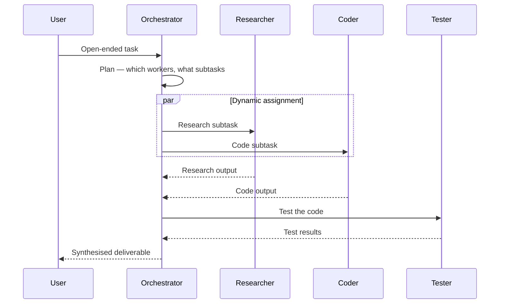

# Orchestrator-Workers Pattern

Orchestrator plans dynamically at runtime and assigns subtasks to the right workers for this specific goal.

**Best for:** Open-ended goals where subtasks aren't known upfront.  
**LLM calls:** 1 planning + N workers (dynamic) + 1 synthesis.

---

## Sequence Diagram



---

## Use Case 1 — Software Feature Build

```python
import asyncio
from pyagent_patterns.base import Agent
from pyagent_patterns.orchestration import OrchestratorWorkers
from pyagent_providers import OpenAILLM

orchestrator_workers = OrchestratorWorkers(
    orchestrator=Agent(
        "planner",
        OpenAILLM("gpt-4o"),
        system_prompt="You have a pool of specialist workers. Plan the work by deciding which workers "
                      "are needed and what to assign each. Only use workers that are genuinely needed. "
                      'Respond as JSON: {"assignments": [{"worker": "name", "subtask": "description"}]}. '
                      "After all workers complete, synthesise their output into a final deliverable.",
    ),
    workers=[
        Agent(
            "researcher", OpenAILLM("gpt-4o-mini"),
            system_prompt="Research topics thoroughly. Find recent, credible information "
                          "and summarise key findings with citations.",
        ),
        Agent(
            "coder", OpenAILLM("gpt-4o-mini"),
            system_prompt="Write clean, idiomatic Python with type hints, docstrings, "
                          "and comprehensive error handling.",
        ),
        Agent(
            "tester", OpenAILLM("gpt-4o-mini"),
            system_prompt="Write comprehensive pytest test suites. Cover: happy path, "
                          "edge cases, error conditions, and boundary values.",
        ),
        Agent(
            "doc_writer", OpenAILLM("gpt-4o-mini"),
            system_prompt="Write clear technical documentation with usage examples, "
                          "parameter descriptions, and common gotchas.",
        ),
        Agent(
            "reviewer", OpenAILLM("gpt-4o"),
            system_prompt="Review code and documentation for correctness, completeness, "
                          "security issues, and adherence to best practices.",
        ),
    ],
)

result = asyncio.run(orchestrator_workers.run(
    "Build a production-ready async HTTP client with retry logic, circuit breaking, "
    "rate limiting, and full test coverage"
))
print(result.output)
print(f"Workers used: {result.metadata['workers_used']}")
print(f"Assignments: {result.metadata['assignments']}")
print(f"Cost: ${result.cost_estimate:.4f}")
```

---

## Use Case 2 — Data Analysis (Anthropic + Gemini)

```python
from pyagent_providers import AnthropicLLM, GeminiLLM

data_analyst = OrchestratorWorkers(
    orchestrator=Agent(
        "analysis_planner",
        AnthropicLLM("claude-sonnet-4-20250514"),
        system_prompt="You are a senior data scientist. Given a dataset description and analysis goal, "
                      "plan which analysis workers to deploy and what each should focus on. "
                      'Return JSON: {"assignments": [{"worker": "name", "subtask": "..."}]}. '
                      "Then synthesise all analyses into an executive insights report.",
    ),
    workers=[
        Agent(
            "statistician", GeminiLLM("gemini-2.5-flash"),
            system_prompt="Perform statistical analysis: distributions, correlations, outliers, "
                          "significance tests. Report p-values and confidence intervals.",
        ),
        Agent(
            "visualisation_planner", GeminiLLM("gemini-2.5-flash"),
            system_prompt="Recommend the most effective visualisations for this data. "
                          "Specify chart types, axes, and what insight each chart reveals.",
        ),
        Agent(
            "hypothesis_tester", GeminiLLM("gemini-2.5-flash"),
            system_prompt="Propose and evaluate 3 specific hypotheses about the data. "
                          "What would confirm or refute each one?",
        ),
        Agent(
            "storyteller", AnthropicLLM("claude-sonnet-4-20250514"),
            system_prompt="Translate statistical findings into a clear business narrative. "
                          "Lead with the most actionable insight. Avoid jargon.",
        ),
    ],
)

result = asyncio.run(data_analyst.run(
    "Dataset: 12 months of e-commerce transactions (500k rows). "
    "Goal: understand what drives repeat purchases and identify churn risk factors."
))
print(result.output)
```

---

## Use Case 3 — Content Strategy (LiteLLM)

```python
from pyagent_providers import LiteLLM

content_team = OrchestratorWorkers(
    orchestrator=Agent(
        "content_director",
        LiteLLM("gpt-4o"),
        system_prompt="Plan a content strategy by assigning workers to specific content needs. "
                      'Return {"assignments": [...]}. Synthesise into a complete 30-day content calendar.',
    ),
    workers=[
        Agent(
            "seo_specialist", LiteLLM("gpt-4o-mini"),
            system_prompt="Research keywords, search intent, and content gaps. "
                          "Identify high-opportunity topics with estimated search volumes.",
        ),
        Agent(
            "copywriter", LiteLLM("anthropic/claude-haiku-3.5"),
            system_prompt="Write compelling, conversion-focused copy. Match the brand's voice.",
        ),
        Agent(
            "social_media", LiteLLM("gemini/gemini-2.5-flash"),
            system_prompt="Adapt content for Twitter/X, LinkedIn, and Instagram. "
                          "Tailor tone and format for each platform's norms.",
        ),
        Agent(
            "editor", LiteLLM("anthropic/claude-sonnet-4-20250514"),
            system_prompt="Edit for clarity, consistency, and brand alignment. "
                          "Check facts and ensure all claims are supportable.",
        ),
    ],
)

result = asyncio.run(content_team.run(
    "Create a one-month content strategy for a B2B SaaS company launching a new AI feature"
))
```

---

## OTel Trace Output

```
Trace: pyagent.pattern.orchestrator_workers (8.4s, $0.028)
├── pyagent.agent.planner — planning (1.3s, gpt-4o)
│   └── assignments: [researcher, coder, tester, reviewer]
├── [parallel workers]
│   ├── pyagent.agent.researcher (2.1s, gpt-4o-mini)
│   ├── pyagent.agent.coder (3.4s, gpt-4o-mini)
│   └── pyagent.agent.tester (2.8s, gpt-4o-mini)
├── pyagent.agent.reviewer (1.9s, gpt-4o)
└── pyagent.agent.planner — synthesis (1.1s, gpt-4o)
```

---

## When to Use

| Condition | Recommendation |
|---|---|
| Subtasks aren't known until you analyse the goal | ✅ Use Orchestrator-Workers |
| Worker pool has meaningfully different specialisations | ✅ Use Orchestrator-Workers |
| Subtasks are always the same for this task type | ❌ Use Pipeline or Hierarchical |
| Workers need to communicate directly with each other | ❌ Use Blackboard or Swarm |

---

## See Also

- [Hierarchical](hierarchical.md) — fixed team structure decided at design time
- [Pipeline](pipeline.md) — fixed sequential stages, no dynamic planning
- [Blackboard](../structural/blackboard.md) — workers share a state store instead of routing through orchestrator

---

<!-- pattern-mesh:start -->

## Explore all design patterns

**Orchestration:** [Supervisor](../orchestration/supervisor.md) · [Pipeline](../orchestration/pipeline.md) · [Fan-Out / Fan-In](../orchestration/fan-out-fan-in.md) · [Hierarchical](../orchestration/hierarchical.md) · **Orchestrator-Workers**  
**Resolution:** [Self-Reflection](../resolution/self-reflection.md) · [Cross-Reflection](../resolution/cross-reflection.md) · [Debate](../resolution/debate.md) · [Voting](../resolution/voting.md) · [Evaluator-Optimizer](../resolution/evaluator-optimizer.md)  
**Structural:** [Role-Based](../structural/role-based.md) · [Layered](../structural/layered.md) · [Topology](../structural/topology.md) · [Blackboard](../structural/blackboard.md)  
**Iterative & Advanced:** [ReAct](../advanced/react.md) · [Talker-Reasoner](../advanced/talker-reasoner.md) · [Swarm](../advanced/swarm.md) · [Human-in-the-Loop](../advanced/human-in-the-loop.md)  

[Browse the full pattern catalog →](../index.md)

<!-- pattern-mesh:end -->
