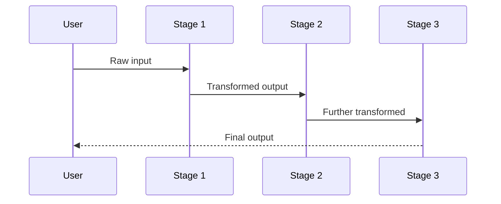

# Pipeline Pattern

Sequential stage chain — each agent's output becomes the next agent's input.

**Best for:** ETL, document processing, multi-step transformation.  
**LLM calls:** N (one per stage). Latency: sum of all stages.

---

## Sequence Diagram



---

## Use Case 1 — Earnings Report Processing

Route cheap extraction to Haiku, fact-checking to GPT-4o-mini, final brief to Sonnet.

```python
import asyncio
from pyagent_patterns.base import Agent
from pyagent_patterns.orchestration import Pipeline
from pyagent_providers import AnthropicLLM, OpenAILLM

pipeline = Pipeline(stages=[
    Agent(
        "extractor",
        AnthropicLLM("claude-haiku-3-5-20241022"),
        system_prompt="Extract every claim, figure, and named entity from the text. "
                      "Be exhaustive — list all revenue figures, percentages, and named companies.",
    ),
    Agent(
        "fact_checker",
        OpenAILLM("gpt-4o-mini"),
        system_prompt="Identify which extracted items are verifiable facts vs opinions or speculation. "
                      "Label each: FACT, OPINION, or UNVERIFIABLE.",
    ),
    Agent(
        "writer",
        AnthropicLLM("claude-sonnet-4-20250514"),
        system_prompt="Write a concise, structured brief for a portfolio manager. "
                      "Lead with the single most important fact. Use bullet points. Max 200 words.",
    ),
])

result = asyncio.run(pipeline.run(
    "Tesla Q3 2025 earnings: Revenue $25.2B (+8% YoY), auto gross margin 17.1%, "
    "energy storage deployments up 73% YoY, FSD miles driven passed 2B total. "
    "CEO commented margins will recover in Q4 as production ramps."
))
print(result.output)
print(f"Stages: {result.metadata['stages']}, Stage names: {result.metadata['stage_names']}")
print(f"Duration: {result.duration_seconds:.1f}s, Cost: ${result.cost_estimate:.4f}")
```

### Stream stage completions as they arrive

```python
async def stream_pipeline():
    async for chunk in pipeline.stream(
        "Tesla Q3 2025 earnings: Revenue $25.2B (+8% YoY)..."
    ):
        print(chunk, end="", flush=True)
    print()

asyncio.run(stream_pipeline())
```

---

## Use Case 2 — Legal Document Review

Mix Anthropic and Gemini across stages based on their different strengths.

```python
from pyagent_providers import GeminiLLM

legal_pipeline = Pipeline(stages=[
    Agent(
        "clause_extractor",
        GeminiLLM("gemini-2.5-flash"),
        system_prompt="Extract every contractual obligation, deadline, and liability clause. "
                      "Format as a numbered list. Include section references.",
    ),
    Agent(
        "risk_classifier",
        OpenAILLM("gpt-4o"),
        system_prompt="Classify each clause as HIGH / MEDIUM / LOW risk. "
                      "Flag anything that exposes the company to uncapped liability or IP loss. "
                      "Explain your risk rating in one sentence per clause.",
    ),
    Agent(
        "counsel_brief",
        AnthropicLLM("claude-sonnet-4-20250514"),
        system_prompt="Write an executive brief for in-house counsel. "
                      "Lead with the top 3 risks. Recommend negotiation priorities. "
                      "Keep it under 300 words.",
    ),
])

result = asyncio.run(legal_pipeline.run(open("contract.txt").read()))
print(result.output)
print(f"Stages: {result.metadata['stage_names']}")
```

---

## Use Case 3 — Multilingual Content Pipeline (LangChain)

```python
from langchain_anthropic import ChatAnthropic
from langchain_openai import ChatOpenAI
from pyagent_providers import LangChainLLM

multilingual = Pipeline(stages=[
    Agent(
        "simplifier",
        LangChainLLM(ChatAnthropic(model="claude-haiku-3-5-20241022")),
        system_prompt="Rewrite the text at a 6th-grade reading level. "
                      "Keep all key information but remove jargon.",
    ),
    Agent(
        "translator",
        LangChainLLM(ChatOpenAI(model="gpt-4o-mini")),
        system_prompt="Translate to Spanish (Latin American). Preserve formatting and tone.",
    ),
    Agent(
        "localizer",
        LangChainLLM(ChatAnthropic(model="claude-haiku-3-5-20241022")),
        system_prompt="Adapt cultural references and idioms for a Mexican audience. "
                      "Flag any phrases that don't translate well.",
    ),
])

result = asyncio.run(multilingual.run(open("product_manual.txt").read()))
print(f"Cost: ${result.cost_estimate:.4f}")
```

---

## OTel Trace Output

```
Trace: pyagent.pattern.pipeline (4.1s, $0.012)
├── pyagent.agent.extractor  (0.9s, claude-haiku-3-5-20241022)
├── pyagent.agent.fact_checker (1.8s, gpt-4o-mini)
└── pyagent.agent.writer (1.4s, claude-sonnet-4-20250514)
```

---

## When to Use

| Condition | Recommendation |
|---|---|
| Task has clear sequential stages | ✅ Use Pipeline |
| Each stage transforms output for the next | ✅ Use Pipeline |
| Stages could run independently | ❌ Use Fan-Out/Fan-In |
| You need quality feedback loops | ❌ Use Self-Reflection |
| A coordinator decides which stages to run | ❌ Use Orchestrator-Workers |

---

<!-- gen:cookbooks:start (generated by scripts/gen_docs.py from docs/cookbook/ — do not edit by hand) -->
## Cookbook recipes

Complete, runnable examples that use the **Pipeline** pattern:

| Recipe | Domain | What it does | Complexity |
|--------|--------|--------------|------------|
| [Alert Triage](../../../cookbook/security/log-triage.md) | Security & Threat Intel | Triage security alerts; escalate true positives to a human | Intermediate |
| [Clinical Summary](../../../cookbook/healthcare/clinical-summary.md) | Healthcare & Life Sciences | Summarize clinical notes, then self-critique for accuracy | Intermediate |
| [Incident Triage](../../../cookbook/devops-sre/incident-triage.md) | DevOps & SRE | Stage pipeline that triages incidents with human sign-off | Intermediate |
| [Lead Qualifier](../../../cookbook/sales-crm/lead-qualifier.md) | Sales & CRM | Score and route inbound leads to the right play | Intermediate |
| [Code Review](../../../cookbook/software-engineering/code-review.md) | Software Engineering | Iterative review + security scan with a human gate | Advanced |
| [Research Assistant](../../../cookbook/research-analysis/research-assistant.md) | Research & Analysis | Gather sources, debate, synthesize, and cite | Advanced |
<!-- gen:cookbooks:end -->

## See Also

- [Fan-Out / Fan-In](fan-out-fan-in.md) — same agents running in parallel instead of sequentially
- [Self-Reflection](../resolution/self-reflection.md) — add a critique-refine loop at any stage
- [Evaluator-Optimizer](../resolution/evaluator-optimizer.md) — scored quality gate between stages

---

<!-- pattern-mesh:start -->

## Explore all design patterns

**Orchestration:** [Supervisor](../orchestration/supervisor.md) · **Pipeline** · [Fan-Out / Fan-In](../orchestration/fan-out-fan-in.md) · [Hierarchical](../orchestration/hierarchical.md) · [Orchestrator-Workers](../orchestration/orchestrator-workers.md)  
**Resolution:** [Self-Reflection](../resolution/self-reflection.md) · [Cross-Reflection](../resolution/cross-reflection.md) · [Debate](../resolution/debate.md) · [Voting](../resolution/voting.md) · [Evaluator-Optimizer](../resolution/evaluator-optimizer.md)  
**Structural:** [Role-Based](../structural/role-based.md) · [Layered](../structural/layered.md) · [Topology](../structural/topology.md) · [Blackboard](../structural/blackboard.md)  
**Iterative & Advanced:** [ReAct](../advanced/react.md) · [Talker-Reasoner](../advanced/talker-reasoner.md) · [Swarm](../advanced/swarm.md) · [Human-in-the-Loop](../advanced/human-in-the-loop.md)  

[Browse the full pattern catalog →](../index.md)

<!-- pattern-mesh:end -->
