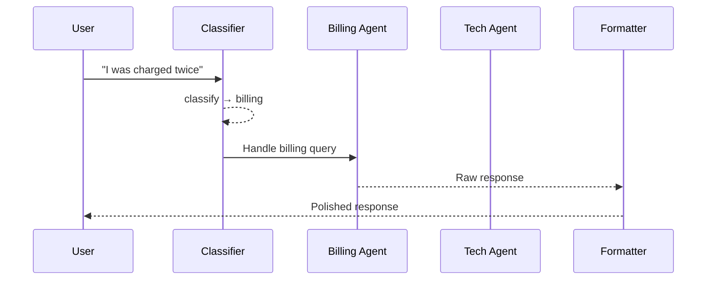

# Supervisor Pattern

Classify → route → specialist → optional formatter. A coordinator dispatches to the right expert.

**Best for:** Customer support bots, multi-domain Q&A, triage systems.  
**LLM calls:** 2–3 (classify + specialist + optional formatter).

---

## Sequence Diagram



---

## Use Case 1 — Customer Support Routing

Cheap Haiku classifies; stronger Sonnet/GPT-4o handles the specialist reply.

```python
import asyncio
from pyagent_patterns.base import Agent
from pyagent_patterns.orchestration import Supervisor
from pyagent_providers import AnthropicLLM, OpenAILLM

supervisor = Supervisor(
    classifier=Agent(
        "router",
        AnthropicLLM("claude-haiku-3-5-20241022"),
        system_prompt="Classify into exactly one of: billing, technical, returns, general. "
                      "Respond with ONLY the category name, nothing else.",
    ),
    routes={
        "billing": Agent(
            "billing_agent",
            AnthropicLLM("claude-sonnet-4-20250514"),
            system_prompt="Handle billing disputes, refunds, and subscription questions. "
                          "Always acknowledge frustration, confirm the charge details, "
                          "and offer concrete next steps with a timeline.",
        ),
        "technical": Agent(
            "technical_agent",
            OpenAILLM("gpt-4o"),
            system_prompt="Handle technical troubleshooting and API issues. "
                          "Provide numbered step-by-step debugging instructions. "
                          "Include relevant error codes and documentation links.",
        ),
        "returns": Agent(
            "returns_agent",
            AnthropicLLM("claude-sonnet-4-20250514"),
            system_prompt="Handle return requests. Explain the return policy clearly, "
                          "verify eligibility, and initiate the process where applicable.",
        ),
        "general": Agent(
            "general_agent",
            AnthropicLLM("claude-haiku-3-5-20241022"),
            system_prompt="Handle general inquiries warmly and helpfully. "
                          "If out of scope, offer to escalate to a human agent.",
        ),
    },
    formatter=Agent(
        "formatter",
        AnthropicLLM("claude-haiku-3-5-20241022"),
        system_prompt="Format the response professionally. Remove internal notes. "
                      "Keep under 200 words. Add a friendly closing line.",
    ),
    default_route="general",
)

result = asyncio.run(supervisor.run("I was charged twice for my Pro subscription this month"))
print(result.output)
print(f"Route: {result.metadata['route_key']}")
print(f"Classifier output: {result.metadata['classifier_output']}")
print(f"Cost: ${result.cost_estimate:.4f}")
```

---

## Use Case 2 — Multi-Domain Research Router (LiteLLM)

```python
from pyagent_providers import LiteLLM

research_supervisor = Supervisor(
    classifier=Agent(
        "topic_router",
        LiteLLM("gpt-4o-mini"),
        system_prompt="Classify the research question into one of: finance, science, law, history, general. "
                      "Respond with ONLY the category.",
    ),
    routes={
        "finance": Agent(
            "finance_expert",
            LiteLLM("anthropic/claude-sonnet-4-20250514"),
            system_prompt="You are a CFA-level financial analyst. Provide precise, data-driven analysis. "
                          "Cite specific metrics, ratios, and market data where relevant.",
        ),
        "science": Agent(
            "science_expert",
            LiteLLM("gemini/gemini-2.5-pro"),
            system_prompt="You are a PhD-level scientist. Explain complex concepts clearly. "
                          "Reference empirical evidence and recent research.",
        ),
        "law": Agent(
            "legal_expert",
            LiteLLM("anthropic/claude-sonnet-4-20250514"),
            system_prompt="You are a legal researcher. Provide thorough analysis with jurisdiction context. "
                          "Always note that this is research, not legal advice.",
        ),
        "general": Agent(
            "generalist",
            LiteLLM("gpt-4o-mini"),
            system_prompt="Provide a clear, well-researched answer. Cite sources where possible.",
        ),
    },
    default_route="general",
)

result = asyncio.run(research_supervisor.run(
    "What was the impact of the 2008 financial crisis on tier-1 bank capital requirements?"
))
print(f"Routed to: {result.metadata['route_key']}")
print(result.output)
```

---

## Use Case 3 — Language-Specific Code Review (LangChain)

```python
from langchain_openai import ChatOpenAI
from langchain_anthropic import ChatAnthropic
from pyagent_providers import LangChainLLM

code_supervisor = Supervisor(
    classifier=Agent(
        "language_detector",
        LangChainLLM(ChatOpenAI(model="gpt-4o-mini")),
        system_prompt="Detect the programming language of the code snippet. "
                      "Respond with ONLY: python, javascript, go, rust, or other.",
    ),
    routes={
        "python": Agent(
            "python_reviewer",
            LangChainLLM(ChatAnthropic(model="claude-sonnet-4-20250514")),
            system_prompt="Review Python code for PEP 8 compliance, type hints, error handling, "
                          "and performance. Suggest specific improvements with code examples.",
        ),
        "javascript": Agent(
            "js_reviewer",
            LangChainLLM(ChatOpenAI(model="gpt-4o")),
            system_prompt="Review JavaScript/TypeScript for security vulnerabilities, "
                          "async/await patterns, and modern ES2024+ usage.",
        ),
        "go": Agent(
            "go_reviewer",
            LangChainLLM(ChatOpenAI(model="gpt-4o")),
            system_prompt="Review Go code for idiomatic patterns, goroutine safety, "
                          "and proper error handling with wrapping.",
        ),
        "other": Agent(
            "general_reviewer",
            LangChainLLM(ChatOpenAI(model="gpt-4o-mini")),
            system_prompt="Review code for logic errors, security issues, and best practices.",
        ),
    },
    default_route="other",
)

result = asyncio.run(code_supervisor.run(open("pull_request.py").read()))
print(f"Detected language → route: {result.metadata['route_key']}")
```

---

## OTel Trace Output

```
Trace: pyagent.pattern.supervisor (1.4s, $0.005)
├── pyagent.agent.router (0.3s, claude-haiku-3-5-20241022)
│   └── route_decision: billing
├── pyagent.agent.billing_agent (0.9s, claude-sonnet-4-20250514)
└── pyagent.agent.formatter (0.2s, claude-haiku-3-5-20241022)
```

---

## When to Use

| Condition | Recommendation |
|---|---|
| Tasks fall into distinct categories | ✅ Use Supervisor |
| Specialists are meaningfully better than generalists | ✅ Use Supervisor |
| Tasks don't have clear categories | ❌ Use Orchestrator-Workers |
| All tasks need the same processing | ❌ Use Pipeline |
| You want adversarial quality checking | ❌ Use Debate |

---

<!-- gen:cookbooks:start (generated by scripts/gen_docs.py from docs/cookbook/ — do not edit by hand) -->
## Cookbook recipes

Complete, runnable examples that use the **Supervisor** pattern:

| Recipe | Domain | What it does | Complexity |
|--------|--------|--------------|------------|
| [Lead Qualifier](../../../cookbook/sales-crm/lead-qualifier.md) | Sales & CRM | Score and route inbound leads to the right play | Intermediate |
| [Portfolio Review](../../../cookbook/finance-trading/portfolio-review.md) | Finance & Trading | Analyst panel with an evaluator-optimizer quality gate | Intermediate |
| [Support Router](../../../cookbook/customer-support/support-router.md) | Customer Support | Classify tickets → route to specialists → escalate to a human | Advanced |
<!-- gen:cookbooks:end -->

## See Also

- [Orchestrator-Workers](orchestrator-workers.md) — dynamic routing where subtasks aren't known upfront
- [Talker-Reasoner](../advanced/talker-reasoner.md) — route by complexity rather than topic
- [Routing Guide](../../../guides/router.md) — combine Supervisor with cost-based model selection

---

<!-- pattern-mesh:start -->

## Explore all design patterns

**Orchestration:** **Supervisor** · [Pipeline](../orchestration/pipeline.md) · [Fan-Out / Fan-In](../orchestration/fan-out-fan-in.md) · [Hierarchical](../orchestration/hierarchical.md) · [Orchestrator-Workers](../orchestration/orchestrator-workers.md)  
**Resolution:** [Self-Reflection](../resolution/self-reflection.md) · [Cross-Reflection](../resolution/cross-reflection.md) · [Debate](../resolution/debate.md) · [Voting](../resolution/voting.md) · [Evaluator-Optimizer](../resolution/evaluator-optimizer.md)  
**Structural:** [Role-Based](../structural/role-based.md) · [Layered](../structural/layered.md) · [Topology](../structural/topology.md) · [Blackboard](../structural/blackboard.md)  
**Iterative & Advanced:** [ReAct](../advanced/react.md) · [Talker-Reasoner](../advanced/talker-reasoner.md) · [Swarm](../advanced/swarm.md) · [Human-in-the-Loop](../advanced/human-in-the-loop.md)  

[Browse the full pattern catalog →](../index.md)

<!-- pattern-mesh:end -->
