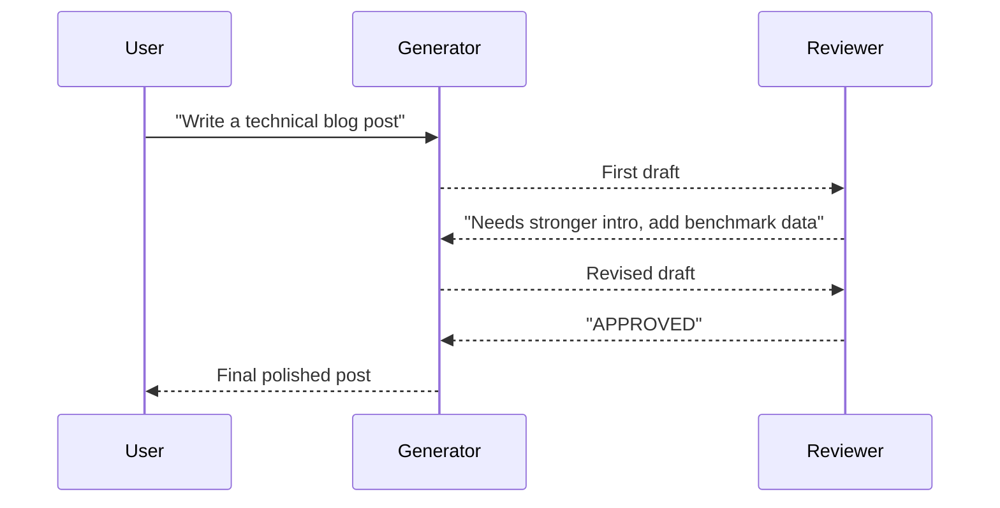

# Cross-Reflection Pattern

Generator produces output; a separate reviewer provides critique; generator revises. Repeat until APPROVED or max rounds.

**Best for:** High-stakes writing, code review with independent expert, adversarial quality gates.  
**LLM calls:** G + R per round (generator + reviewer). Different models → different blind spots.

---

## Sequence Diagram



---

## Use Case 1 — Technical Writing (OpenAI writes, Anthropic reviews)

Different provider perspectives catch different quality issues.

=== "Python"

    ```python
    import asyncio
    from pyagent_patterns.base import Agent
    from pyagent_patterns.resolution import CrossReflection
    from pyagent_providers import AnthropicLLM, OpenAILLM

    pattern = CrossReflection(
        generator=Agent(
            "writer",
            OpenAILLM("gpt-4o"),
            system_prompt="Write clear, technically accurate content for a developer audience. "
                          "Use concrete examples, avoid buzzwords, and support claims with data.",
        ),
        reviewer=Agent(
            "editor",
            AnthropicLLM("claude-sonnet-4-20250514"),
            system_prompt="You are a senior technical editor. Review the draft critically: "
                          "1) Is the opening compelling? "
                          "2) Are all technical claims accurate and supported? "
                          "3) Is the structure logical? "
                          "4) Are there unnecessary words or paragraphs? "
                          "If all pass, respond with exactly APPROVED. "
                          "Otherwise list specific, actionable improvements.",
        ),
        max_rounds=3,
    )

    result = asyncio.run(pattern.run(
        "Write a 500-word technical post: 'Why RAG systems fail at scale and how to fix them'"
    ))
    print(result.output)
    print(f"Rounds: {result.metadata['rounds']}, Early stop: {result.metadata['early_stop']}")
    print(f"Cost: ${result.cost_estimate:.4f}")
    ```

=== "Blueprint YAML"

    Declare the same generator/reviewer loop as a `pyagent-blueprint` manifest:

    ```yaml
    api_version: pyagent/v1
    metadata:
      name: technical-writing-review
      version: 1.0.0
      description: Writer drafts; a separate editor reviews and the writer revises until approved
    providers:
      primary:
        model: gpt-4o
      reviewer_model:
        model: claude-sonnet-4-20250514
    agents:
      writer:
        prompt: "Write clear, technically accurate content for a developer audience."
        provider: primary
      editor:
        prompt: "Review critically for accuracy and structure. Respond APPROVED when satisfied."
        provider: reviewer_model
    workflows:
      review:
        pattern: cross_reflection
        agents:
          generator: writer
          reviewer: editor
        config:
          max_rounds: 3
          stop_phrase: APPROVED
    ```

    ```bash
    pyagent-blueprint validate technical-writing-review.yaml
    pyagent-blueprint test technical-writing-review.yaml
    ```

---

## Use Case 2 — Code Security Review (Gemini writes, OpenAI reviews)

```python
from pyagent_providers import GeminiLLM

secure_coder = CrossReflection(
    generator=Agent(
        "developer",
        GeminiLLM("gemini-2.5-pro"),
        system_prompt="Write production-quality Python code. "
                      "Follow OWASP secure coding guidelines. "
                      "Use parameterized queries, validate inputs, never log secrets.",
    ),
    reviewer=Agent(
        "security_auditor",
        OpenAILLM("gpt-4o"),
        system_prompt="You are an application security engineer. Review the code for: "
                      "1) Injection vulnerabilities (SQL, command, LDAP), "
                      "2) Authentication and authorization flaws, "
                      "3) Sensitive data exposure, "
                      "4) Insecure cryptographic practices. "
                      "Be extremely precise — cite specific line numbers and CWE IDs. "
                      "Respond APPROVED only if zero high/critical issues remain.",
    ),
    max_rounds=4,
)

result = asyncio.run(secure_coder.run(
    "Write an authentication endpoint: POST /auth/login "
    "that accepts username+password, checks against a PostgreSQL users table, "
    "and returns a JWT token with 24h expiry."
))
print(result.output)
print(f"Security review rounds: {result.metadata['rounds']}")
```

---

## Use Case 3 — Business Proposal (LangChain: Anthropic writes, OpenAI reviews)

```python
from langchain_openai import ChatOpenAI
from langchain_anthropic import ChatAnthropic
from pyagent_providers import LangChainLLM

proposal_review = CrossReflection(
    generator=Agent(
        "strategist",
        LangChainLLM(ChatAnthropic(model="claude-sonnet-4-20250514")),
        system_prompt="Write compelling, evidence-based business proposals. "
                      "Structure: Executive Summary, Problem, Solution, ROI, Timeline, Ask.",
    ),
    reviewer=Agent(
        "cfo_reviewer",
        LangChainLLM(ChatOpenAI(model="gpt-4o")),
        system_prompt="You are a CFO reviewing a business proposal. Be rigorous: "
                      "1) Are ROI projections realistic and methodology sound? "
                      "2) Are risks identified and mitigated? "
                      "3) Is the ask clearly justified by the projected return? "
                      "4) What would you push back on in a board meeting? "
                      "Respond APPROVED only if you'd take this to the board as-is.",
    ),
    max_rounds=3,
)

result = asyncio.run(proposal_review.run(
    "Write a proposal for a $500k investment in ML infrastructure: "
    "GPU cluster, MLOps tooling, and 2 ML engineers — projected to reduce "
    "model serving costs by 60% and enable 3 new product features per quarter."
))
```

---

## OTel Trace Output

```
Trace: pyagent.pattern.cross_reflection (6.1s, $0.019)
├── Round 1
│   ├── pyagent.agent.writer — generate (2.1s, gpt-4o)
│   └── pyagent.agent.editor — review (1.4s, claude-sonnet-4-20250514) → REVISE
├── Round 2
│   ├── pyagent.agent.writer — generate (1.8s, gpt-4o)
│   └── pyagent.agent.editor — review (0.8s, claude-sonnet-4-20250514) → APPROVED
└── early_stop: true (round 2 of 3)
```

---

## When to Use

| Condition | Recommendation |
|---|---|
| External perspective adds more value than self-review | ✅ Use Cross-Reflection |
| Reviewer has genuinely different expertise | ✅ Use Cross-Reflection |
| Two independent provider perspectives reduce blind spots | ✅ Use Cross-Reflection |
| Speed matters more than quality | ❌ Single-shot call |
| You want a scored output quality gate | ❌ Use Evaluator-Optimizer |

---

<!-- gen:cookbooks:start (generated by scripts/gen_docs.py from docs/cookbook/ — do not edit by hand) -->
## Cookbook recipes

Complete, runnable examples that use the **Cross-Reflection** pattern:

| Recipe | Domain | What it does | Complexity |
|--------|--------|--------------|------------|
| [Contract Review](../../../cookbook/legal-compliance/contract-review.md) | Legal & Compliance | Draft + independent reviewer loop over contract clauses | Intermediate |
| [Code Review](../../../cookbook/software-engineering/code-review.md) | Software Engineering | Iterative review + security scan with a human gate | Advanced |
<!-- gen:cookbooks:end -->

## See Also

- [Self-Reflection](self-reflection.md) — same agent critiques its own output
- [Evaluator-Optimizer](evaluator-optimizer.md) — scored quality gate (7/10, 8/10...)
- [Debate](debate.md) — adversarial multi-round with a judge

---

<!-- pattern-mesh:start -->

## Explore all design patterns

**Orchestration:** [Supervisor](../orchestration/supervisor.md) · [Pipeline](../orchestration/pipeline.md) · [Fan-Out / Fan-In](../orchestration/fan-out-fan-in.md) · [Hierarchical](../orchestration/hierarchical.md) · [Orchestrator-Workers](../orchestration/orchestrator-workers.md)  
**Resolution:** [Self-Reflection](../resolution/self-reflection.md) · **Cross-Reflection** · [Debate](../resolution/debate.md) · [Voting](../resolution/voting.md) · [Evaluator-Optimizer](../resolution/evaluator-optimizer.md)  
**Structural:** [Role-Based](../structural/role-based.md) · [Layered](../structural/layered.md) · [Topology](../structural/topology.md) · [Blackboard](../structural/blackboard.md)  
**Iterative & Advanced:** [ReAct](../advanced/react.md) · [Talker-Reasoner](../advanced/talker-reasoner.md) · [Swarm](../advanced/swarm.md) · [Human-in-the-Loop](../advanced/human-in-the-loop.md)  

[Browse the full pattern catalog →](../index.md)

<!-- pattern-mesh:end -->
