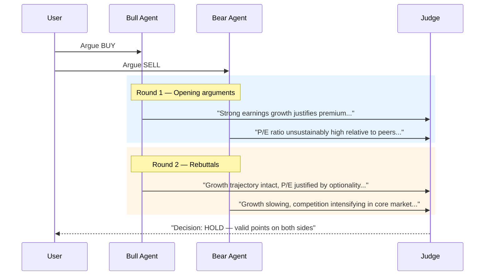

# Debate Pattern

Multiple agents argue assigned positions across rounds, then a judge renders a final decision.

**Best for:** High-stakes decisions, buy-vs-build, investment theses, strategy trade-offs.  
**LLM calls:** D × R (debaters × rounds) + 1 judge.

---

## Sequence Diagram



---

## Use Case 1 — Investment Decision (Gemini)

```python
import asyncio
from pyagent_patterns.base import Agent
from pyagent_patterns.resolution import Debate
from pyagent_providers import GeminiLLM, AnthropicLLM

debate = Debate(
    debaters=[
        Agent(
            "bull",
            GeminiLLM("gemini-2.5-pro"),
            system_prompt="You are a bullish investment analyst. Argue that this investment "
                          "should be made. Use specific financial metrics, growth rates, and "
                          "comparable valuations. Anticipate and pre-emptively rebut bear arguments. "
                          "Support every claim with data.",
        ),
        Agent(
            "bear",
            GeminiLLM("gemini-2.5-pro"),
            system_prompt="You are a bearish investment analyst. Argue that this investment "
                          "should NOT be made. Focus on: overvaluation, execution risk, "
                          "competitive threats, and downside scenarios. "
                          "Rebut the bull case with specific counter-evidence.",
        ),
    ],
    judge=Agent(
        "judge",
        AnthropicLLM("claude-sonnet-4-20250514"),
        system_prompt="You are a senior portfolio manager reviewing this debate. "
                      "Evaluate argument quality, use of evidence, and logical consistency. "
                      "Identify which side had the stronger case for each key point. "
                      "Render a final verdict: BUY / HOLD / SELL with conviction level. "
                      "Explain which arguments were decisive.",
    ),
    rounds=2,
    positions=["BUY", "SELL"],
)

result = asyncio.run(debate.run(
    "Should we invest in Nvidia at $3.2T market cap, 45x forward P/E, "
    "with data center revenue growing 150% YoY but competition from AMD and custom silicon?"
))
print(result.output)
print(f"Rounds: {result.metadata['rounds']}")
print(f"Arguments logged: {len(result.metadata['debate_log'])}")
print(f"Cost: ${result.cost_estimate:.4f}")
```

---

## Use Case 2 — Build vs Buy Decision (OpenAI + Anthropic)

```python
from pyagent_providers import OpenAILLM

build_buy = Debate(
    debaters=[
        Agent(
            "build_advocate",
            OpenAILLM("gpt-4o"),
            system_prompt="Argue that we should BUILD this capability in-house. "
                          "Address: control, customisation, long-term cost, IP ownership, "
                          "competitive differentiation, and team capability development.",
        ),
        Agent(
            "buy_advocate",
            OpenAILLM("gpt-4o"),
            system_prompt="Argue that we should BUY (use a vendor/SaaS). "
                          "Address: speed to market, TCO vs build cost, vendor expertise, "
                          "maintenance burden, and opportunity cost of engineering time.",
        ),
    ],
    judge=Agent(
        "decision_maker",
        AnthropicLLM("claude-sonnet-4-20250514"),
        system_prompt="You are a VP of Engineering making a final recommendation. "
                      "Evaluate both cases. Identify what information is missing. "
                      "Give a recommendation: BUILD / BUY / HYBRID, with a 3-bullet rationale.",
    ),
    rounds=2,
    positions=["BUILD", "BUY"],
)

result = asyncio.run(build_buy.run(
    "Should we build our own RAG pipeline or use a managed solution like Pinecone + LangChain? "
    "Team: 4 engineers. Timeline: 6 weeks to production. "
    "Scale: 10M documents, 50k queries/day."
))
print(result.output)
```

---

## Use Case 3 — Technical Architecture Debate (LiteLLM multi-provider)

```python
from pyagent_providers import LiteLLM

arch_debate = Debate(
    debaters=[
        Agent(
            "microservices_advocate",
            LiteLLM("gpt-4o"),
            system_prompt="Argue for a microservices architecture. Address scalability, "
                          "team autonomy, independent deployment, and fault isolation.",
        ),
        Agent(
            "monolith_advocate",
            LiteLLM("anthropic/claude-sonnet-4-20250514"),
            system_prompt="Argue for a modular monolith. Address simplicity, "
                          "developer experience, deployment complexity, and premature optimisation.",
        ),
    ],
    judge=Agent(
        "architect",
        LiteLLM("gemini/gemini-2.5-pro"),
        system_prompt="Evaluate the architecture debate. Consider the team size, scale, "
                      "and constraints. Give a specific recommendation with trade-offs.",
    ),
    rounds=2,
    positions=["MICROSERVICES", "MONOLITH"],
)

result = asyncio.run(arch_debate.run(
    "Architecture decision for a new B2B SaaS platform: 5-engineer team, "
    "18-month runway, targeting 1k enterprise customers at launch."
))
```

---

## OTel Trace Output

```
Trace: pyagent.pattern.debate (9.8s, $0.038)
├── Round 1
│   ├── pyagent.agent.bull (2.4s, gemini-2.5-pro)
│   └── pyagent.agent.bear (2.7s, gemini-2.5-pro)
├── Round 2
│   ├── pyagent.agent.bull (2.1s, gemini-2.5-pro)
│   └── pyagent.agent.bear (1.9s, gemini-2.5-pro)
└── pyagent.agent.judge (0.7s, claude-sonnet-4-20250514)
```

---

## When to Use

| Condition | Recommendation |
|---|---|
| Decision requires examining opposing viewpoints | ✅ Use Debate |
| Stakes are high — adversarial testing adds value | ✅ Use Debate |
| Answer is factual, not arguable | ❌ Single-shot call |
| Budget is tight | ❌ Many LLM calls — consider Cross-Reflection |
| You need nuanced open-ended output | ❌ Use Evaluator-Optimizer |

---

## See Also

- [Voting](voting.md) — parallel agents that vote independently rather than debate
- [Cross-Reflection](cross-reflection.md) — generate + review rather than argue + judge
- [Fan-Out / Fan-In](../orchestration/fan-out-fan-in.md) — parallel independent analysis without adversarial framing

---

<!-- pattern-mesh:start -->

## Explore all design patterns

**Orchestration:** [Supervisor](../orchestration/supervisor.md) · [Pipeline](../orchestration/pipeline.md) · [Fan-Out / Fan-In](../orchestration/fan-out-fan-in.md) · [Hierarchical](../orchestration/hierarchical.md) · [Orchestrator-Workers](../orchestration/orchestrator-workers.md)  
**Resolution:** [Self-Reflection](../resolution/self-reflection.md) · [Cross-Reflection](../resolution/cross-reflection.md) · **Debate** · [Voting](../resolution/voting.md) · [Evaluator-Optimizer](../resolution/evaluator-optimizer.md)  
**Structural:** [Role-Based](../structural/role-based.md) · [Layered](../structural/layered.md) · [Topology](../structural/topology.md) · [Blackboard](../structural/blackboard.md)  
**Iterative & Advanced:** [ReAct](../advanced/react.md) · [Talker-Reasoner](../advanced/talker-reasoner.md) · [Swarm](../advanced/swarm.md) · [Human-in-the-Loop](../advanced/human-in-the-loop.md)  

[Browse the full pattern catalog →](../index.md)

<!-- pattern-mesh:end -->
