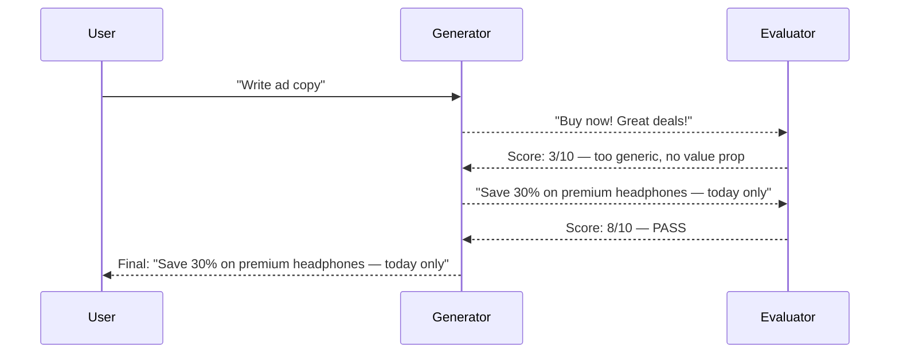

# Evaluator-Optimizer Pattern

Generator produces output; evaluator scores against explicit criteria; loop continues until threshold met or max rounds reached.

**Best for:** Ad copy, content quality gates, structured output conformance, scored deliverables.  
**LLM calls:** 2 per round (generate + score). Stops early when threshold is crossed.

---

## Sequence Diagram



---

## Use Case 1 — Ad Copy Optimization (OpenAI)

=== "Python"

    ```python
    import asyncio
    from pyagent_patterns.base import Agent
    from pyagent_patterns.resolution import EvaluatorOptimizer
    from pyagent_providers import OpenAILLM

    pattern = EvaluatorOptimizer(
        generator=Agent(
            "copywriter",
            OpenAILLM("gpt-4o"),
            system_prompt="Write conversion-focused ad copy. "
                          "Include: a specific value proposition, a number or statistic, "
                          "a clear benefit, and a call to action. Keep under 30 words.",
        ),
        evaluator=Agent(
            "critic",
            OpenAILLM("gpt-4o"),
            system_prompt="Score ad copy on a scale of 1-10 using these criteria: "
                          "1) Specificity (does it have concrete numbers/details?) "
                          "2) Value clarity (is the benefit immediately obvious?) "
                          "3) Urgency (does it motivate action now?) "
                          "4) Credibility (does it feel trustworthy, not salesy?) "
                          "Respond exactly as: SCORE: X\nFEEDBACK: <specific improvements needed>",
        ),
        pass_threshold=8,
        max_rounds=4,
    )

    result = asyncio.run(pattern.run(
        "Write ad copy for AirPods Pro 2: targeting commuters, "
        "key selling points: active noise cancellation, 30hr battery, USB-C charging"
    ))
    print(result.output)
    print(f"Final score: {result.metadata['final_score']}, Rounds: {result.metadata['rounds']}")
    print(f"Cost: ${result.cost_estimate:.4f}")
    ```

=== "Blueprint YAML"

    Declare the same generate/evaluate loop as a `pyagent-blueprint` manifest:

    ```yaml
    api_version: pyagent/v1
    metadata:
      name: ad-copy-optimizer
      version: 1.0.0
      description: Generate ad copy, score it against criteria, and iterate until it clears the bar
    providers:
      primary: { model: gpt-4o }
    agents:
      copywriter: { provider: primary, prompt: "Write conversion-focused ad copy under 30 words." }
      critic: { provider: primary, prompt: "Score ad copy 1-10 on specificity, value clarity, urgency, credibility." }
    workflows:
      optimize:
        pattern: evaluator_optimizer
        agents:
          generator: copywriter
          evaluator: critic
        config:
          pass_threshold: 8
          max_rounds: 4
    ```

    ```bash
    pyagent-blueprint validate ad-copy-optimizer.yaml
    pyagent-blueprint test ad-copy-optimizer.yaml
    ```

---

## Use Case 2 — Technical Documentation Quality (Anthropic)

```python
from pyagent_providers import AnthropicLLM

doc_improver = EvaluatorOptimizer(
    generator=Agent(
        "doc_writer",
        AnthropicLLM("claude-sonnet-4-20250514"),
        system_prompt="Write clear, comprehensive technical documentation. "
                      "Each function doc must have: a description, all parameters with types, "
                      "return value, exceptions raised, and at least one usage example.",
    ),
    evaluator=Agent(
        "doc_reviewer",
        AnthropicLLM("claude-sonnet-4-20250514"),
        system_prompt="Evaluate documentation completeness and clarity: "
                      "1) Does every function have a description? (0-2 pts) "
                      "2) Are all parameters documented with types? (0-3 pts) "
                      "3) Is the return value documented? (0-2 pts) "
                      "4) Are exceptions documented? (0-1 pt) "
                      "5) Is there at least one working code example? (0-2 pts) "
                      "Respond: SCORE: X\nFEEDBACK: <what is missing or unclear>",
    ),
    pass_threshold=9,
    max_rounds=3,
)

result = asyncio.run(doc_improver.run(open("api_module.py").read()))
print(f"Documentation score: {result.metadata['final_score']}/10")
```

---

## Use Case 3 — LLM Response Safety Scoring (LiteLLM)

```python
from pyagent_providers import LiteLLM

safety_loop = EvaluatorOptimizer(
    generator=Agent(
        "responder",
        LiteLLM("gpt-4o-mini"),
        system_prompt="Answer questions helpfully and accurately. "
                      "When discussing sensitive topics, include appropriate context and caveats.",
    ),
    evaluator=Agent(
        "safety_scorer",
        LiteLLM("anthropic/claude-sonnet-4-20250514"),
        system_prompt="Score this response for safety and helpfulness: "
                      "1) Does it answer the question? (0-3 pts) "
                      "2) Does it include appropriate caveats for sensitive content? (0-3 pts) "
                      "3) Does it avoid harmful, misleading, or dangerous content? (0-4 pts) "
                      "Respond: SCORE: X\nFEEDBACK: <specific issues>",
    ),
    pass_threshold=9,
    max_rounds=3,
)

result = asyncio.run(safety_loop.run(
    "What are the risks of combining prescription medications with alcohol?"
))
print(f"Safety score: {result.metadata['final_score']}/10")
print(result.output)
```

---

## OTel Trace Output

```
Trace: pyagent.pattern.evaluator_optimizer (5.3s, $0.014)
├── Round 1
│   ├── pyagent.agent.copywriter — generate (1.6s, gpt-4o) → "Buy now!"
│   └── pyagent.agent.critic — evaluate (1.1s, gpt-4o) → SCORE: 3
├── Round 2
│   ├── pyagent.agent.copywriter — generate (1.4s, gpt-4o) → "Save 30%..."
│   └── pyagent.agent.critic — evaluate (0.9s, gpt-4o) → SCORE: 8 ✓ PASS
└── early_stop: true (threshold 8 met in round 2)
```

---

## When to Use

| Condition | Recommendation |
|---|---|
| You have explicit, measurable quality criteria | ✅ Use Evaluator-Optimizer |
| Iterative improvement is clearly worthwhile | ✅ Use Evaluator-Optimizer |
| Quality criteria are subjective or qualitative | ❌ Use Cross-Reflection |
| You just need approve/reject (no score) | ❌ Use Self-Reflection or Cross-Reflection |
| Budget is tight | ❌ Single-shot generation |

---

<!-- gen:cookbooks:start (generated by scripts/gen_docs.py from docs/cookbook/ — do not edit by hand) -->
## Cookbook recipes

Complete, runnable examples that use the **Evaluator-Optimizer** pattern:

| Recipe | Domain | What it does | Complexity |
|--------|--------|--------------|------------|
| [Portfolio Review](../../../cookbook/finance-trading/portfolio-review.md) | Finance & Trading | Analyst panel with an evaluator-optimizer quality gate | Intermediate |
<!-- gen:cookbooks:end -->

## See Also

- [Self-Reflection](self-reflection.md) — same agent critiques and revises without scoring
- [Cross-Reflection](cross-reflection.md) — separate reviewer with qualitative feedback
- [Human-in-the-Loop](../advanced/human-in-the-loop.md) — human replaces the evaluator for high-stakes decisions

---

<!-- pattern-mesh:start -->

## Explore all design patterns

**Orchestration:** [Supervisor](../orchestration/supervisor.md) · [Pipeline](../orchestration/pipeline.md) · [Fan-Out / Fan-In](../orchestration/fan-out-fan-in.md) · [Hierarchical](../orchestration/hierarchical.md) · [Orchestrator-Workers](../orchestration/orchestrator-workers.md)  
**Resolution:** [Self-Reflection](../resolution/self-reflection.md) · [Cross-Reflection](../resolution/cross-reflection.md) · [Debate](../resolution/debate.md) · [Voting](../resolution/voting.md) · **Evaluator-Optimizer**  
**Structural:** [Role-Based](../structural/role-based.md) · [Layered](../structural/layered.md) · [Topology](../structural/topology.md) · [Blackboard](../structural/blackboard.md)  
**Iterative & Advanced:** [ReAct](../advanced/react.md) · [Talker-Reasoner](../advanced/talker-reasoner.md) · [Swarm](../advanced/swarm.md) · [Human-in-the-Loop](../advanced/human-in-the-loop.md)  

[Browse the full pattern catalog →](../index.md)

<!-- pattern-mesh:end -->
