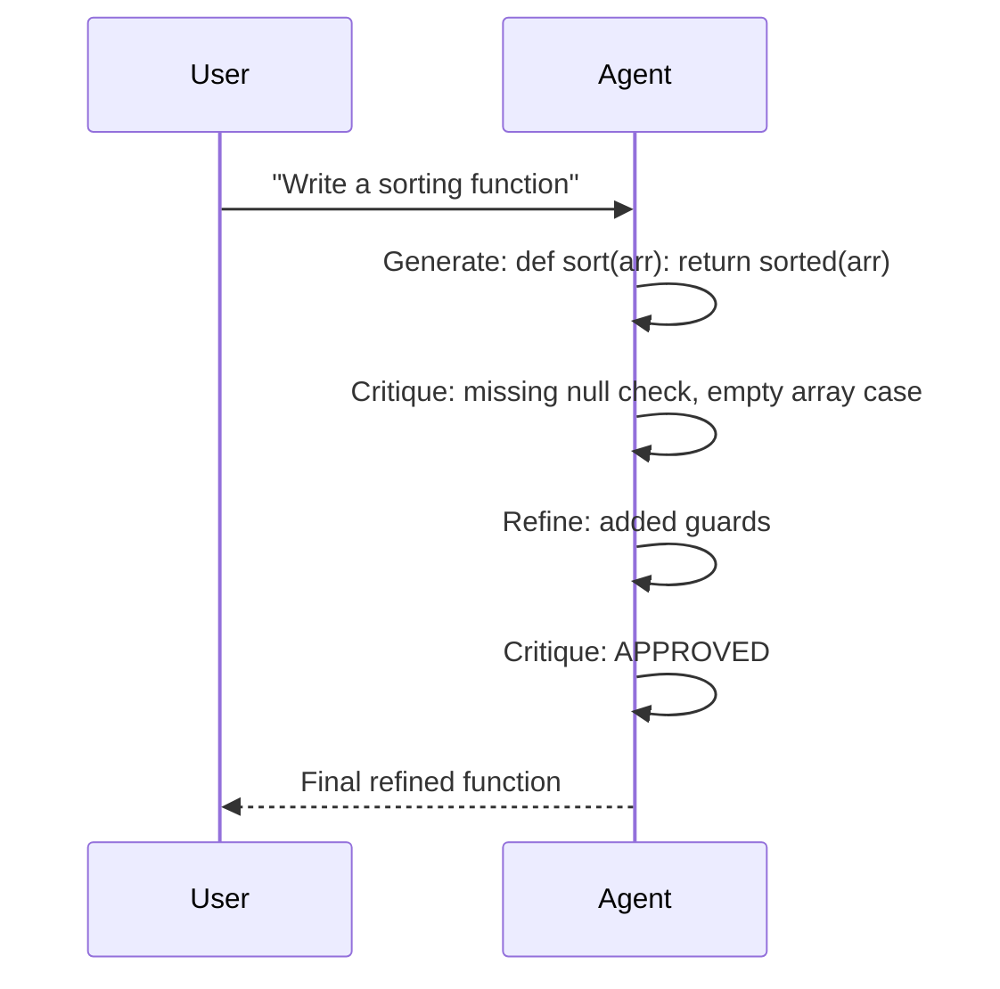

# Self-Reflection Pattern

An agent generates output, critiques its own work, and refines iteratively until approved or max rounds reached.

**Best for:** Code generation, essay writing, structured output quality improvement.  
**LLM calls:** 2–2R (generate + critique per round). Stops early on APPROVED.

---

## Sequence Diagram



---

## Use Case 1 — Code Generation with Self-Review

```python
import asyncio
from pyagent_patterns.base import Agent
from pyagent_patterns.resolution import SelfReflection
from pyagent_providers import OpenAILLM

pattern = SelfReflection(
    agent=Agent(
        "coder",
        OpenAILLM("gpt-4o-mini"),
        system_prompt="Write clean, idiomatic Python with type hints and docstrings.",
    ),
    critic_prompt="Review the code you just wrote. Check for: "
                  "1) Missing edge cases (null, empty, negative inputs), "
                  "2) Missing error handling, "
                  "3) Type hint completeness, "
                  "4) Potential off-by-one errors. "
                  "If all issues are resolved, respond exactly with APPROVED. "
                  "Otherwise list specific problems to fix.",
    max_rounds=3,
)

result = asyncio.run(pattern.run(
    "Write a robust function that merges two sorted lists into a single sorted list. "
    "Handle all edge cases."
))
print(result.output)
print(f"Rounds: {result.metadata['rounds']}, Early stop: {result.metadata['early_stop']}")
print(f"Cost: ${result.cost_estimate:.4f}")
```

---

## Use Case 2 — Writing Quality Loop (Anthropic)

Use Sonnet to draft and self-critique against journalism standards.

```python
from pyagent_providers import AnthropicLLM

writer = SelfReflection(
    agent=Agent(
        "journalist",
        AnthropicLLM("claude-sonnet-4-20250514"),
        system_prompt="Write clear, engaging technical journalism for a developer audience. "
                      "Use the inverted pyramid — most important facts first. "
                      "Avoid jargon. Every paragraph should add new information.",
    ),
    critic_prompt="Critique the article you just wrote: "
                  "1) Does the lead bury the lede? "
                  "2) Are there unsupported claims that need evidence? "
                  "3) Is any paragraph redundant? "
                  "4) Would a non-expert understand this? "
                  "If all four criteria are satisfied, respond with APPROVED. "
                  "Otherwise list specific revisions.",
    max_rounds=4,
)

result = asyncio.run(writer.run(
    "Write a 400-word article explaining why LLM agents fail in production "
    "and what engineering teams should do differently."
))
print(result.output)
print(f"Revision rounds: {result.metadata['rounds']}")
```

---

## Use Case 3 — Structured Output Validation (LiteLLM)

```python
from pyagent_providers import LiteLLM

schema_validator = SelfReflection(
    agent=Agent(
        "schema_builder",
        LiteLLM("gpt-4o"),
        system_prompt="Generate Pydantic v2 data models from natural language descriptions. "
                      "Include field validators, proper types, and docstrings.",
    ),
    critic_prompt="Review the Pydantic schema: "
                  "1) Are all required fields present? "
                  "2) Are validators correct (e.g., regex patterns valid)? "
                  "3) Are field types the most specific possible? "
                  "4) Does the model correctly reflect the described domain? "
                  "Respond APPROVED if all pass, or list specific fixes needed.",
    max_rounds=3,
)

result = asyncio.run(schema_validator.run(
    "Create a Pydantic model for a financial transaction: "
    "amount in USD (positive), currency code (ISO 4217), timestamp, "
    "merchant name, and optional category from: food, transport, utilities, other."
))
print(result.output)
```

---

## OTel Trace Output

```
Trace: pyagent.pattern.self_reflection (4.2s, $0.009)
├── Round 1
│   ├── pyagent.agent.coder — generate (1.4s, gpt-4o-mini)
│   └── pyagent.agent.coder — critique (1.1s, gpt-4o-mini) → REVISE
├── Round 2
│   ├── pyagent.agent.coder — generate (1.3s, gpt-4o-mini)
│   └── pyagent.agent.coder — critique (0.4s, gpt-4o-mini) → APPROVED
└── early_stop: true (round 2 of 3)
```

---

## When to Use

| Condition | Recommendation |
|---|---|
| A single agent can meaningfully self-critique | ✅ Use Self-Reflection |
| Task has clear quality criteria | ✅ Use Self-Reflection |
| External perspective adds more value than self-review | ❌ Use Cross-Reflection |
| You need a scored quality threshold | ❌ Use Evaluator-Optimizer |
| Speed is more important than quality | ❌ Single-shot call |

---

## See Also

- [Cross-Reflection](cross-reflection.md) — a separate reviewer model critiques the output
- [Evaluator-Optimizer](evaluator-optimizer.md) — scored quality gate, optimise until threshold
- [Debate](debate.md) — adversarial refinement with a judge

---

<!-- pattern-mesh:start -->

## Explore all design patterns

**Orchestration:** [Supervisor](../orchestration/supervisor.md) · [Pipeline](../orchestration/pipeline.md) · [Fan-Out / Fan-In](../orchestration/fan-out-fan-in.md) · [Hierarchical](../orchestration/hierarchical.md) · [Orchestrator-Workers](../orchestration/orchestrator-workers.md)  
**Resolution:** **Self-Reflection** · [Cross-Reflection](../resolution/cross-reflection.md) · [Debate](../resolution/debate.md) · [Voting](../resolution/voting.md) · [Evaluator-Optimizer](../resolution/evaluator-optimizer.md)  
**Structural:** [Role-Based](../structural/role-based.md) · [Layered](../structural/layered.md) · [Topology](../structural/topology.md) · [Blackboard](../structural/blackboard.md)  
**Iterative & Advanced:** [ReAct](../advanced/react.md) · [Talker-Reasoner](../advanced/talker-reasoner.md) · [Swarm](../advanced/swarm.md) · [Human-in-the-Loop](../advanced/human-in-the-loop.md)  

[Browse the full pattern catalog →](../index.md)

<!-- pattern-mesh:end -->
