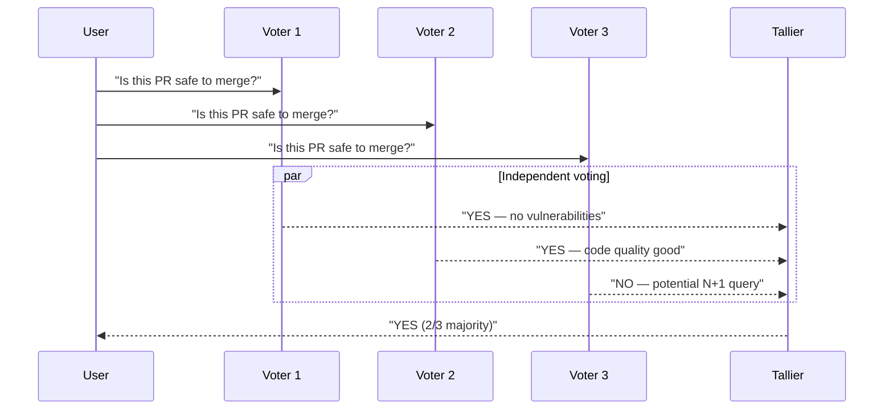

# Voting Pattern

N agents vote independently on the same question; majority (or weighted) vote wins.

**Best for:** Fault-tolerant decisions, ensemble reliability, reducing single-model bias.  
**LLM calls:** N (parallel voters). Majority/weighted tally requires no extra LLM call.

---

## Sequence Diagram



---

## Use Case 1 — Multi-Provider Ensemble (OpenAI + Anthropic + Gemini)

Three independent providers reduce the chance of systematic errors from any single model.

```python
import asyncio
from pyagent_patterns.base import Agent
from pyagent_patterns.resolution import Voting
from pyagent_providers import OpenAILLM, AnthropicLLM, GeminiLLM

pattern = Voting(
    voters=[
        Agent(
            "openai_voter",
            OpenAILLM("gpt-4o"),
            system_prompt="Evaluate the content moderation request. "
                          "Respond with exactly YES (safe to publish) or NO (violates policy). "
                          "On the second line, give a one-sentence reason.",
        ),
        Agent(
            "anthropic_voter",
            AnthropicLLM("claude-sonnet-4-20250514"),
            system_prompt="Evaluate the content moderation request. "
                          "Respond with exactly YES (safe to publish) or NO (violates policy). "
                          "On the second line, give a one-sentence reason.",
        ),
        Agent(
            "gemini_voter",
            GeminiLLM("gemini-2.5-pro"),
            system_prompt="Evaluate the content moderation request. "
                          "Respond with exactly YES (safe to publish) or NO (violates policy). "
                          "On the second line, give a one-sentence reason.",
        ),
    ],
    strategy="majority",
)

result = asyncio.run(pattern.run(
    "User-submitted product review: "
    "'This product is absolute garbage. The CEO should be fired. "
    "Returning it immediately and never buying from this brand again.'"
))
print(f"Decision: {result.metadata['winner']} (Tally: {result.metadata['tally']})")
print(result.output)
print(f"Cost: ${result.cost_estimate:.4f}")
```

---

## Use Case 2 — PR Safety Gate (Weighted Voting)

Give higher weight to the security reviewer.

```python
pattern = Voting(
    voters=[
        Agent(
            "security_reviewer",
            OpenAILLM("gpt-4o"),
            system_prompt="Review this code change for security vulnerabilities. "
                          "Respond YES (safe to merge) or NO (has security issues). "
                          "Explain your reasoning briefly.",
        ),
        Agent(
            "style_reviewer",
            AnthropicLLM("claude-haiku-3-5-20241022"),
            system_prompt="Review this code change for style and conventions. "
                          "Respond YES (acceptable) or NO (style violations). "
                          "List any violations.",
        ),
        Agent(
            "performance_reviewer",
            GeminiLLM("gemini-2.5-flash"),
            system_prompt="Review this code change for performance issues. "
                          "Respond YES (no performance concerns) or NO (has performance issues). "
                          "Explain your reasoning.",
        ),
    ],
    strategy="weighted",
    weights={"security_reviewer": 3, "style_reviewer": 1, "performance_reviewer": 2},
)

result = asyncio.run(pattern.run(open("pr_diff.py").read()))
print(f"Weighted decision: {result.metadata['winner']}")
print(f"Weighted tally: {result.metadata['weighted_tally']}")
```

---

## Use Case 3 — Classification Ensemble (LiteLLM)

Reduce classification error rate by using five independent voters.

```python
from pyagent_providers import LiteLLM

classifier_ensemble = Voting(
    voters=[
        Agent(f"voter_{i}", LiteLLM("gpt-4o-mini"),
              system_prompt="Classify customer support ticket as: billing, technical, returns, or general. "
                            "Respond with ONLY the category name.")
        for i in range(5)
    ],
    strategy="majority",
)

tickets = [
    "I was charged twice this month",
    "My API key stopped working",
    "I want to return a defective product",
]
for ticket in tickets:
    result = asyncio.run(classifier_ensemble.run(ticket))
    print(f"[{result.metadata['winner']}] {ticket}")
    print(f"  Tally: {result.metadata['tally']}")
```

---

## OTel Trace Output

```
Trace: pyagent.pattern.voting (2.1s, $0.011)
├── [parallel voters]
│   ├── pyagent.agent.openai_voter (1.8s, gpt-4o) → YES
│   ├── pyagent.agent.anthropic_voter (2.1s, claude-sonnet-4-20250514) → YES
│   └── pyagent.agent.gemini_voter (1.6s, gemini-2.5-pro) → NO
└── tally: {"YES": 2, "NO": 1} → winner: YES
```

---

## When to Use

| Condition | Recommendation |
|---|---|
| Task has a discrete answer (yes/no, A/B/C) | ✅ Use Voting |
| Single model failure should not determine outcome | ✅ Use Voting |
| Task requires nuanced, open-ended output | ❌ Use Fan-Out/Fan-In |
| Agents should argue and debate | ❌ Use Debate |
| Quality improves through iteration | ❌ Use Self-Reflection |

---

<!-- gen:cookbooks:start (generated by scripts/gen_docs.py from docs/cookbook/ — do not edit by hand) -->
## Cookbook recipes

Complete, runnable examples that use the **Voting** pattern:

| Recipe | Domain | What it does | Complexity |
|--------|--------|--------------|------------|
| [Essay Grading by Consensus](../../../cookbook/education/essay-grader.md) | Education & Training | Independent graders score against a rubric; a majority vote sets the grade | Intermediate |
<!-- gen:cookbooks:end -->

## See Also

- [Debate](debate.md) — adversarial positions with a judge, not a tally
- [Fan-Out / Fan-In](../orchestration/fan-out-fan-in.md) — parallel agents that synthesize rather than vote
- [Supervisor](../orchestration/supervisor.md) — single classifier routes to a specialist

---

<!-- pattern-mesh:start -->

## Explore all design patterns

**Orchestration:** [Supervisor](../orchestration/supervisor.md) · [Pipeline](../orchestration/pipeline.md) · [Fan-Out / Fan-In](../orchestration/fan-out-fan-in.md) · [Hierarchical](../orchestration/hierarchical.md) · [Orchestrator-Workers](../orchestration/orchestrator-workers.md)  
**Resolution:** [Self-Reflection](../resolution/self-reflection.md) · [Cross-Reflection](../resolution/cross-reflection.md) · [Debate](../resolution/debate.md) · **Voting** · [Evaluator-Optimizer](../resolution/evaluator-optimizer.md)  
**Structural:** [Role-Based](../structural/role-based.md) · [Layered](../structural/layered.md) · [Topology](../structural/topology.md) · [Blackboard](../structural/blackboard.md)  
**Iterative & Advanced:** [ReAct](../advanced/react.md) · [Talker-Reasoner](../advanced/talker-reasoner.md) · [Swarm](../advanced/swarm.md) · [Human-in-the-Loop](../advanced/human-in-the-loop.md)  

[Browse the full pattern catalog →](../index.md)

<!-- pattern-mesh:end -->
