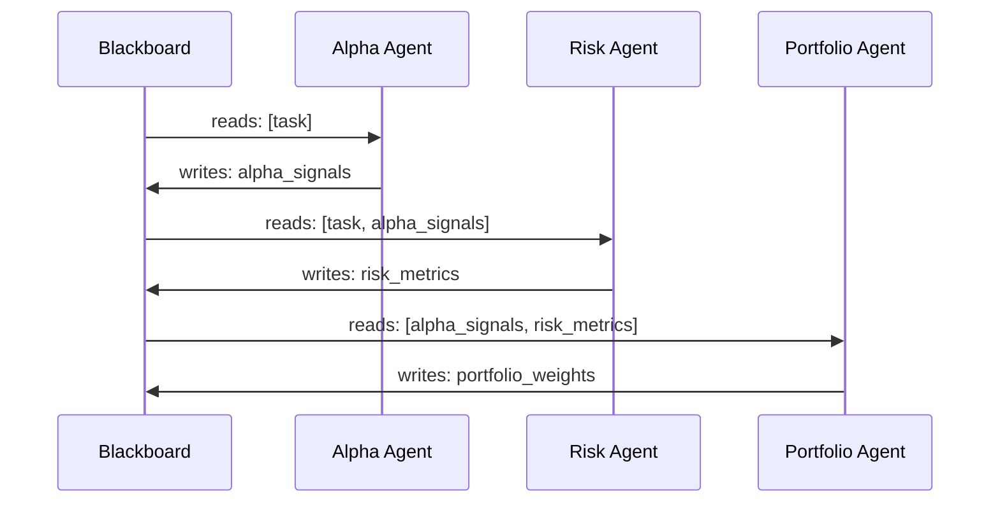

# Blackboard Pattern

Agents communicate indirectly via a shared, asynchronous state store. Each agent reads specific keys and writes its outputs back — no direct messaging.

**Best for:** Financial intelligence, data enrichment pipelines, multi-expert analysis where outputs feed each other.  
**LLM calls:** N agents × R rounds.

---

## Sequence Diagram



---

## Use Case 1 — Financial Portfolio Construction (OpenAI)

Agents chain through the blackboard — each builds on the previous agent's committed state.

```python
import asyncio
from pyagent_patterns.base import Agent
from pyagent_patterns.structural import Blackboard
from pyagent_patterns.structural.blackboard import BlackboardAgent
from pyagent_providers import OpenAILLM

pattern = Blackboard(
    agents=[
        BlackboardAgent(
            agent=Agent(
                "alpha_generator",
                OpenAILLM("gpt-4o"),
                system_prompt="Generate alpha signals for each asset in the watchlist. "
                              "For each asset: state direction (long/short/neutral), "
                              "conviction (high/medium/low), and 2-sentence rationale. "
                              "Format as structured data.",
            ),
            reads=["task"],
            writes=["alpha_signals"],
        ),
        BlackboardAgent(
            agent=Agent(
                "risk_manager",
                OpenAILLM("gpt-4o"),
                system_prompt="Given the alpha signals, assess portfolio-level risk: "
                              "calculate correlation exposure, sector concentration, "
                              "tail risk scenarios, and max position sizes. "
                              "Recommend position limits for each asset.",
            ),
            reads=["task", "alpha_signals"],
            writes=["risk_metrics"],
        ),
        BlackboardAgent(
            agent=Agent(
                "portfolio_optimizer",
                OpenAILLM("gpt-4o"),
                system_prompt="Given alpha signals AND risk constraints, "
                              "construct the optimal portfolio allocation. "
                              "Respect position limits. Maximise risk-adjusted return. "
                              "Output allocation as percentages summing to 100%.",
            ),
            reads=["alpha_signals", "risk_metrics"],
            writes=["portfolio_weights"],
        ),
        BlackboardAgent(
            agent=Agent(
                "order_generator",
                OpenAILLM("gpt-4o-mini"),
                system_prompt="Given the portfolio weights, "
                              "generate execution orders: asset, direction, size, "
                              "and suggested order type (market/limit). "
                              "Flag any large moves that need staged execution.",
            ),
            reads=["portfolio_weights", "risk_metrics"],
            writes=["trade_orders"],
        ),
    ],
    rounds=1,
)

result = asyncio.run(pattern.run(
    "Watchlist: NVDA, MSFT, AMZN, META, GOOGL. "
    "Portfolio size: $10M. Max single position: 25%. "
    "Optimise for risk-adjusted return over 3-month horizon."
))
print(result.output)
print("Final blackboard state:")
for key, value in result.metadata["final_state"].items():
    print(f"  [{key}]: {str(value)[:80]}...")
print(f"Cost: ${result.cost_estimate:.4f}")
```

---

## Use Case 2 — Competitive Intelligence Pipeline (Anthropic + Gemini)

Each specialist enriches the shared knowledge base before the synthesiser runs.

```python
from pyagent_providers import AnthropicLLM, GeminiLLM

intelligence = Blackboard(
    agents=[
        BlackboardAgent(
            agent=Agent(
                "product_analyst",
                GeminiLLM("gemini-2.5-flash"),
                system_prompt="Analyse the competitor's product: features, pricing, "
                              "UX, and technical capabilities. Extract structured data.",
            ),
            reads=["task"],
            writes=["product_analysis"],
        ),
        BlackboardAgent(
            agent=Agent(
                "market_analyst",
                GeminiLLM("gemini-2.5-flash"),
                system_prompt="Analyse market position: market share, customer segments, "
                              "GTM strategy, and partnerships.",
            ),
            reads=["task"],
            writes=["market_analysis"],
        ),
        BlackboardAgent(
            agent=Agent(
                "strategic_analyst",
                AnthropicLLM("claude-sonnet-4-20250514"),
                system_prompt="Given both product and market analyses, "
                              "identify competitive gaps we can exploit, "
                              "threats to our position, and strategic recommendations.",
            ),
            reads=["product_analysis", "market_analysis"],
            writes=["strategic_assessment"],
        ),
        BlackboardAgent(
            agent=Agent(
                "report_writer",
                AnthropicLLM("claude-sonnet-4-20250514"),
                system_prompt="Write an executive competitive intelligence report "
                              "from all available analyses. Include: "
                              "Executive Summary, Key Threats, Opportunities, Recommended Actions.",
            ),
            reads=["product_analysis", "market_analysis", "strategic_assessment"],
            writes=["final_report"],
        ),
    ],
    rounds=1,
)

result = asyncio.run(intelligence.run("Competitor analysis: Salesforce Einstein AI"))
print(result.metadata["final_state"]["final_report"])
```

---

## OTel Trace Output

```
Trace: pyagent.pattern.blackboard (6.8s, $0.022)
├── Round 1
│   ├── pyagent.agent.alpha_generator (2.1s, gpt-4o)
│   │   └── writes: alpha_signals
│   ├── pyagent.agent.risk_manager (1.9s, gpt-4o) [reads: alpha_signals]
│   │   └── writes: risk_metrics
│   ├── pyagent.agent.portfolio_optimizer (1.6s, gpt-4o) [reads: alpha_signals, risk_metrics]
│   │   └── writes: portfolio_weights
│   └── pyagent.agent.order_generator (1.2s, gpt-4o-mini) [reads: portfolio_weights, risk_metrics]
│       └── writes: trade_orders
└── final_state: {alpha_signals: ..., risk_metrics: ..., portfolio_weights: ..., trade_orders: ...}
```

---

## When to Use

| Condition | Recommendation |
|---|---|
| Agents need to share and build on each other's outputs | ✅ Use Blackboard |
| Output dependencies are complex (A→C, B→C, both→D) | ✅ Use Blackboard |
| A central coordinator routes all communication | ❌ Use Orchestrator-Workers |
| Sequential stages with no shared state | ❌ Use Pipeline |
| Agents communicate directly with neighbours | ❌ Use Swarm |

---

## See Also

- [Orchestrator-Workers](../orchestration/orchestrator-workers.md) — central coordinator, not shared state
- [Swarm](../advanced/swarm.md) — peer-to-peer agent communication
- [Layered](layered.md) — layered processing without persistent shared state
