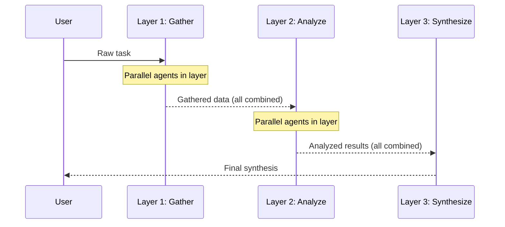

# Layered Cooperation

Agents are organized into abstraction layers. Each layer processes all outputs from the previous layer before passing results up.

**Best for:** Multi-stage analysis with increasing abstraction (gather → analyze → synthesize), data pipelines with heterogeneous parallel collectors.  
**LLM calls:** Sum of all agents across all layers.

---

## Sequence Diagram



---

## Use Case 1 — Business Intelligence Report (Gemini Flash → Pro)

Use Flash agents for fast parallel collection, Pro agents for deeper analysis, Sonnet for executive synthesis.

```python
import asyncio
from pyagent_patterns.base import Agent
from pyagent_patterns.structural import Layered
from pyagent_patterns.structural.layered import Layer
from pyagent_providers import GeminiLLM, AnthropicLLM

pattern = Layered(
    layers=[
        Layer(
            name="gather",
            agents=[
                Agent(
                    "financial_collector",
                    GeminiLLM("gemini-2.5-flash"),
                    system_prompt="Extract all financial metrics, KPIs, and quantitative data "
                                  "from the input. Format as a structured list.",
                ),
                Agent(
                    "qualitative_collector",
                    GeminiLLM("gemini-2.5-flash"),
                    system_prompt="Extract all qualitative signals: management tone, strategic language, "
                                  "risk language, and forward-looking statements.",
                ),
                Agent(
                    "competitive_collector",
                    GeminiLLM("gemini-2.5-flash"),
                    system_prompt="Extract all references to competitors, market position, "
                                  "competitive advantages, and market share data.",
                ),
            ],
        ),
        Layer(
            name="analyze",
            agents=[
                Agent(
                    "trend_analyst",
                    GeminiLLM("gemini-2.5-pro"),
                    system_prompt="Given the collected data, identify the 3 most significant trends "
                                  "and their implications. Support with specific data points.",
                ),
                Agent(
                    "risk_analyst",
                    GeminiLLM("gemini-2.5-pro"),
                    system_prompt="Given the collected data, identify the top 3 risks "
                                  "and rate each: HIGH / MEDIUM / LOW with rationale.",
                ),
            ],
        ),
        Layer(
            name="synthesize",
            agents=[
                Agent(
                    "exec_writer",
                    AnthropicLLM("claude-sonnet-4-20250514"),
                    system_prompt="Synthesize all analyses into a crisp executive briefing: "
                                  "1) One-paragraph summary, "
                                  "2) Top 3 opportunities, "
                                  "3) Top 3 risks, "
                                  "4) Recommended actions. "
                                  "Keep the total under 400 words.",
                ),
            ],
        ),
    ],
)

result = asyncio.run(pattern.run(open("earnings_transcript.txt").read()))
print(result.output)
print(f"Layers: {result.metadata['layers']}, Total agents: {result.metadata['total_agents']}")
print(f"Cost: ${result.cost_estimate:.4f}")
```

---

## Use Case 2 — Code Repository Analysis (OpenAI)

```python
from pyagent_providers import OpenAILLM

repo_analyser = Layered(
    layers=[
        Layer(
            name="scan",
            agents=[
                Agent("dependency_scanner", OpenAILLM("gpt-4o-mini"),
                      system_prompt="List all dependencies, versions, and identify any that are "
                                    "outdated, deprecated, or have known CVEs."),
                Agent("pattern_scanner", OpenAILLM("gpt-4o-mini"),
                      system_prompt="Identify code patterns: what design patterns are used? "
                                    "What anti-patterns are present? What conventions are followed?"),
                Agent("test_scanner", OpenAILLM("gpt-4o-mini"),
                      system_prompt="Assess test coverage: what is tested, what is missing, "
                                    "and what is the overall testing strategy?"),
            ],
        ),
        Layer(
            name="evaluate",
            agents=[
                Agent("quality_evaluator", OpenAILLM("gpt-4o"),
                      system_prompt="Given the scan results, rate code quality (1-10) and "
                                    "identify the top 5 improvements with estimated effort."),
                Agent("risk_evaluator", OpenAILLM("gpt-4o"),
                      system_prompt="Given the scan results, identify the top 3 technical debt "
                                    "risks and their potential business impact."),
            ],
        ),
        Layer(
            name="report",
            agents=[
                Agent("report_writer", OpenAILLM("gpt-4o"),
                      system_prompt="Write a technical health report for engineering leadership. "
                                    "Include: quality score, top risks, and a prioritized action plan."),
            ],
        ),
    ],
)

result = asyncio.run(repo_analyser.run(open("repo_summary.txt").read()))
```

---

## OTel Trace Output

```
Trace: pyagent.pattern.layered (5.8s, $0.019)
├── Layer 1: gather [parallel]
│   ├── pyagent.agent.financial_collector (1.2s, gemini-2.5-flash)
│   ├── pyagent.agent.qualitative_collector (1.4s, gemini-2.5-flash)
│   └── pyagent.agent.competitive_collector (1.1s, gemini-2.5-flash)
├── Layer 2: analyze [parallel]
│   ├── pyagent.agent.trend_analyst (1.8s, gemini-2.5-pro)
│   └── pyagent.agent.risk_analyst (2.1s, gemini-2.5-pro)
└── Layer 3: synthesize
    └── pyagent.agent.exec_writer (1.4s, claude-sonnet-4-20250514)
```

---

## When to Use

| Condition | Recommendation |
|---|---|
| Task has naturally increasing levels of abstraction | ✅ Use Layered |
| Parallel collection → sequential analysis pattern | ✅ Use Layered |
| Stages are sequential without parallelism within layers | ❌ Use Pipeline |
| You need a fixed hierarchy with delegation | ❌ Use Hierarchical |

---

<!-- gen:cookbooks:start (generated by scripts/gen_docs.py from docs/cookbook/ — do not edit by hand) -->
## Cookbook recipes

Complete, runnable examples that use the **Layered** pattern:

| Recipe | Domain | What it does | Complexity |
|--------|--------|--------------|------------|
| [Property Valuation Stack](../../../cookbook/real-estate/property-valuation.md) | Real Estate & PropTech | Data → comparables → narrative layers produce a valuation report | Intermediate |
<!-- gen:cookbooks:end -->

## See Also

- [Pipeline](../orchestration/pipeline.md) — sequential single-agent stages
- [Hierarchical](../orchestration/hierarchical.md) — manager/lead/worker delegation
- [Fan-Out / Fan-In](../orchestration/fan-out-fan-in.md) — flat parallel execution with aggregator

---

<!-- pattern-mesh:start -->

## Explore all design patterns

**Orchestration:** [Supervisor](../orchestration/supervisor.md) · [Pipeline](../orchestration/pipeline.md) · [Fan-Out / Fan-In](../orchestration/fan-out-fan-in.md) · [Hierarchical](../orchestration/hierarchical.md) · [Orchestrator-Workers](../orchestration/orchestrator-workers.md)  
**Resolution:** [Self-Reflection](../resolution/self-reflection.md) · [Cross-Reflection](../resolution/cross-reflection.md) · [Debate](../resolution/debate.md) · [Voting](../resolution/voting.md) · [Evaluator-Optimizer](../resolution/evaluator-optimizer.md)  
**Structural:** [Role-Based](../structural/role-based.md) · **Layered** · [Topology](../structural/topology.md) · [Blackboard](../structural/blackboard.md)  
**Iterative & Advanced:** [ReAct](../advanced/react.md) · [Talker-Reasoner](../advanced/talker-reasoner.md) · [Swarm](../advanced/swarm.md) · [Human-in-the-Loop](../advanced/human-in-the-loop.md)  

[Browse the full pattern catalog →](../index.md)

<!-- pattern-mesh:end -->
