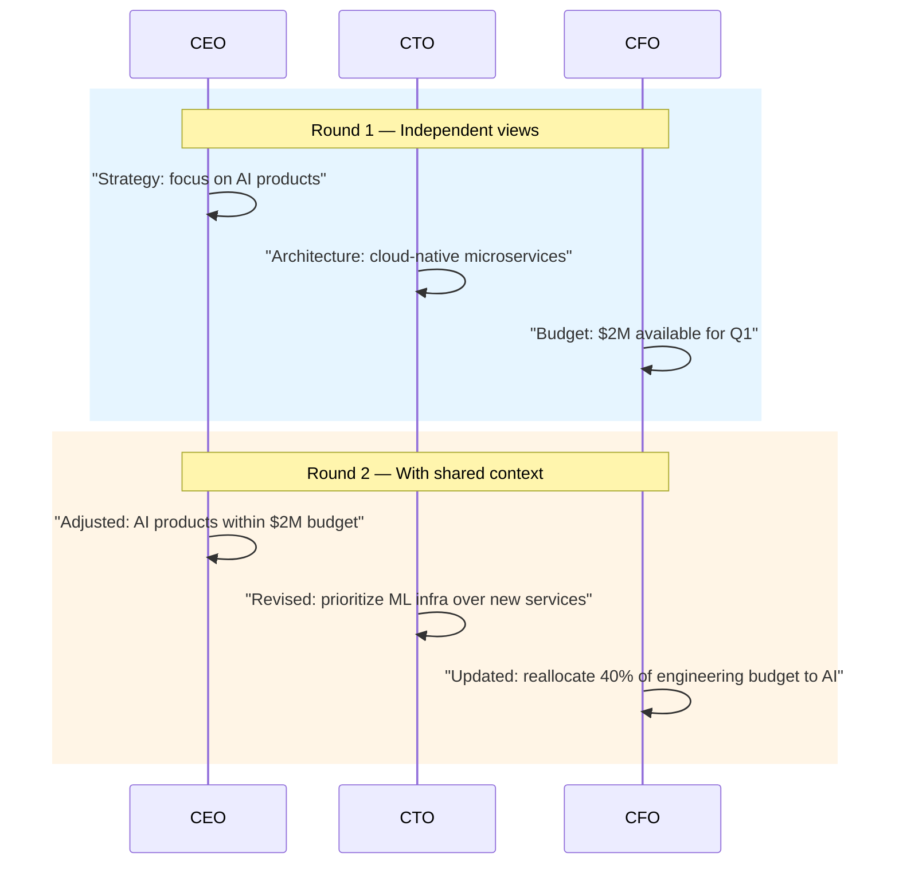

# Role-Based Cooperation

Agents with distinct, fixed roles collaborate in structured rounds. Each sees the others' outputs and refines its own contribution.

**Best for:** C-suite simulations, cross-functional team alignment, product design councils.  
**LLM calls:** N agents × R rounds.

---

## Sequence Diagram



---

## Use Case 1 — Product Strategy Council (Anthropic)

```python
import asyncio
from pyagent_patterns.base import Agent
from pyagent_patterns.structural import RoleBased
from pyagent_providers import AnthropicLLM

pattern = RoleBased(
    agents=[
        Agent(
            "CEO",
            AnthropicLLM("claude-sonnet-4-20250514"),
            system_prompt="You are the CEO. Think about: market positioning, competitive advantage, "
                          "customer value, and long-term strategic direction. "
                          "Be decisive. After reviewing other executives' input, "
                          "update your position if the evidence warrants it.",
        ),
        Agent(
            "CTO",
            AnthropicLLM("claude-sonnet-4-20250514"),
            system_prompt="You are the CTO. Think about: technical feasibility, build vs buy, "
                          "architecture trade-offs, engineering capacity, and technical debt. "
                          "Be honest about what is and isn't possible in the proposed timeline.",
        ),
        Agent(
            "CPO",
            AnthropicLLM("claude-sonnet-4-20250514"),
            system_prompt="You are the CPO. Think about: user needs, product-market fit, "
                          "feature prioritization, and the roadmap impact of each strategic choice. "
                          "Represent the voice of the customer.",
        ),
        Agent(
            "CFO",
            AnthropicLLM("claude-haiku-3-5-20241022"),
            system_prompt="You are the CFO. Think about: budget constraints, ROI, payback period, "
                          "financial risk, and capital allocation trade-offs. "
                          "Challenge assumptions about projected returns.",
        ),
    ],
    rounds=2,
    shared_context=True,
)

result = asyncio.run(pattern.run(
    "Should we pivot our B2B SaaS product to add an AI-native layer? "
    "Investment required: ~$3M over 12 months. "
    "Competitor just launched a similar feature. "
    "Current ARR: $8M, growth rate: 35% YoY."
))
print(result.output)
print(f"Roles: {result.metadata['roles']}, Rounds: {result.metadata['rounds']}")
print(f"Cost: ${result.cost_estimate:.4f}")
```

---

## Use Case 2 — Engineering Design Review (OpenAI + Anthropic)

```python
from pyagent_providers import OpenAILLM

design_review = RoleBased(
    agents=[
        Agent(
            "architect",
            OpenAILLM("gpt-4o"),
            system_prompt="You are the principal architect. Evaluate system design for: "
                          "scalability, maintainability, security, and alignment with architectural principles. "
                          "Propose specific changes with rationale.",
        ),
        Agent(
            "security_engineer",
            AnthropicLLM("claude-sonnet-4-20250514"),
            system_prompt="You are the security engineer. Review for: "
                          "threat model coverage, authentication/authorization design, "
                          "data protection, and compliance requirements (GDPR, SOC2). "
                          "Flag every security concern, even theoretical ones.",
        ),
        Agent(
            "staff_engineer",
            OpenAILLM("gpt-4o-mini"),
            system_prompt="You are a staff engineer responsible for implementation. "
                          "Evaluate: implementation complexity, team capability fit, "
                          "testing strategy, and operational concerns. "
                          "Flag anything that will be painful to maintain.",
        ),
    ],
    rounds=2,
    shared_context=True,
)

result = asyncio.run(design_review.run(open("system_design_doc.md").read()))
```

---

## Use Case 3 — Marketing Campaign Review (LiteLLM)

```python
from pyagent_providers import LiteLLM

campaign_team = RoleBased(
    agents=[
        Agent(
            "brand_strategist",
            LiteLLM("anthropic/claude-sonnet-4-20250514"),
            system_prompt="You are the brand strategist. Evaluate for brand alignment, "
                          "tone consistency, and positioning versus competitors.",
        ),
        Agent(
            "performance_marketer",
            LiteLLM("gpt-4o"),
            system_prompt="You are the performance marketer. Evaluate for conversion potential, "
                          "measurability, CAC efficiency, and channel fit.",
        ),
        Agent(
            "legal_reviewer",
            LiteLLM("anthropic/claude-haiku-3.5"),
            system_prompt="You are the legal reviewer. Check for: misleading claims, "
                          "required disclosures, trademark issues, and regulatory compliance.",
        ),
    ],
    rounds=2,
    shared_context=True,
)

result = asyncio.run(campaign_team.run(
    "Review this campaign concept: 'The AI that replaces your entire data team.'"
))
```

---

## OTel Trace Output

```
Trace: pyagent.pattern.role_based (8.4s, $0.024)
├── Round 1
│   ├── pyagent.agent.CEO (2.1s, claude-sonnet-4-20250514)
│   ├── pyagent.agent.CTO (1.9s, claude-sonnet-4-20250514)
│   ├── pyagent.agent.CPO (2.2s, claude-sonnet-4-20250514)
│   └── pyagent.agent.CFO (0.9s, claude-haiku-3-5-20241022)
└── Round 2 (with shared context)
    ├── pyagent.agent.CEO (1.8s)
    ├── pyagent.agent.CTO (1.6s)
    ├── pyagent.agent.CPO (1.7s)
    └── pyagent.agent.CFO (0.7s)
```

---

## When to Use

| Condition | Recommendation |
|---|---|
| Different stakeholder perspectives genuinely conflict | ✅ Use Role-Based |
| Roles must see and respond to each other's inputs | ✅ Use Role-Based |
| Roles can work entirely independently | ❌ Use Fan-Out/Fan-In |
| You want adversarial positions with a judge | ❌ Use Debate |
| Roles have a strict delegation hierarchy | ❌ Use Hierarchical |

---

<!-- gen:cookbooks:start (generated by scripts/gen_docs.py from docs/cookbook/ — do not edit by hand) -->
## Cookbook recipes

Complete, runnable examples that use the **Role-Based** pattern:

| Recipe | Domain | What it does | Complexity |
|--------|--------|--------------|------------|
| [Customer Onboarding Workflow](../../../cookbook/customer-support/onboarding.md) | Customer Support | Verification, setup, FAQ, and success roles onboard a new customer end to end | Intermediate |
| [Robo-Advisor Onboarding](../../../cookbook/finance-trading/robo-advisor.md) | Finance & Trading | Intake, risk, suitability, and planning roles rotate to build a client investment plan | Intermediate |
| [Writers' Room](../../../cookbook/media-entertainment/writers-room.md) | Media & Entertainment | Showrunner, writer, editor, and continuity roles collaborate on an episode outline | Intermediate |
| [Software Startup Simulation](../../../cookbook/software-engineering/startup-simulation.md) | Software Engineering | PM, Architect, Engineer, and QA role-play an idea into PRD, design, code, and tests | Advanced |
<!-- gen:cookbooks:end -->

## See Also

- [Debate](../resolution/debate.md) — two sides argue assigned positions rather than natural roles
- [Hierarchical](../orchestration/hierarchical.md) — structured delegation hierarchy
- [Swarm](../advanced/swarm.md) — roles emerge dynamically from neighbor interaction

---

<!-- pattern-mesh:start -->

## Explore all design patterns

**Orchestration:** [Supervisor](../orchestration/supervisor.md) · [Pipeline](../orchestration/pipeline.md) · [Fan-Out / Fan-In](../orchestration/fan-out-fan-in.md) · [Hierarchical](../orchestration/hierarchical.md) · [Orchestrator-Workers](../orchestration/orchestrator-workers.md)  
**Resolution:** [Self-Reflection](../resolution/self-reflection.md) · [Cross-Reflection](../resolution/cross-reflection.md) · [Debate](../resolution/debate.md) · [Voting](../resolution/voting.md) · [Evaluator-Optimizer](../resolution/evaluator-optimizer.md)  
**Structural:** **Role-Based** · [Layered](../structural/layered.md) · [Topology](../structural/topology.md) · [Blackboard](../structural/blackboard.md)  
**Iterative & Advanced:** [ReAct](../advanced/react.md) · [Talker-Reasoner](../advanced/talker-reasoner.md) · [Swarm](../advanced/swarm.md) · [Human-in-the-Loop](../advanced/human-in-the-loop.md)  

[Browse the full pattern catalog →](../index.md)

<!-- pattern-mesh:end -->
