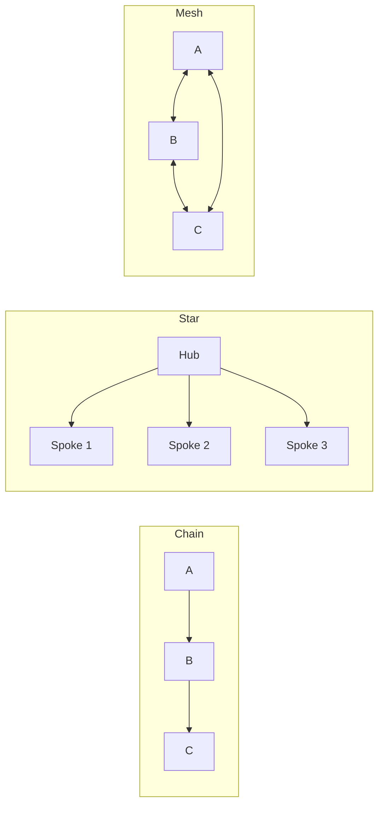

# Topology Pattern

Configure agent communication graphs explicitly: Chain, Star, or Mesh.

**Best for:** When the communication structure is the design — routing, hub-and-spoke, fully-connected peer networks.  
**LLM calls:** Varies by topology and size.

---

## Topology Types



---

## Use Case 1 — Code Review Chain (OpenAI + Anthropic)

Chain topology where each reviewer builds on the previous one's notes.

```python
import asyncio
from pyagent_patterns.base import Agent
from pyagent_patterns.structural import Topology, TopologyType
from pyagent_providers import OpenAILLM, AnthropicLLM

chain = Topology(
    agents=[
        Agent(
            "security_pass",
            OpenAILLM("gpt-4o"),
            system_prompt="Review this code for security vulnerabilities. "
                          "List any issues found, or confirm SECURITY PASS if none. "
                          "Pass your findings + the original code to the next reviewer.",
        ),
        Agent(
            "performance_pass",
            AnthropicLLM("claude-sonnet-4-20250514"),
            system_prompt="Review the code and security notes from the previous reviewer. "
                          "Add performance findings. List any N+1 queries, memory leaks, "
                          "or blocking operations. Pass all findings forward.",
        ),
        Agent(
            "style_pass",
            OpenAILLM("gpt-4o-mini"),
            system_prompt="Given the code and all previous review notes, "
                          "add style and convention findings. "
                          "Write a final consolidated PR review comment.",
        ),
    ],
    topology=TopologyType.CHAIN,
)

result = asyncio.run(chain.run(open("pull_request.py").read()))
print(result.output)
print(f"Topology: {result.metadata['topology']}, Nodes: {result.metadata['nodes']}")
print(f"Cost: ${result.cost_estimate:.4f}")
```

---

## Use Case 2 — Hub-and-Spoke Knowledge Base (Star topology)

Central hub coordinates domain-specialist spokes.

```python
from pyagent_providers import GeminiLLM

star = Topology(
    agents=[
        Agent(
            "research_hub",
            GeminiLLM("gemini-2.5-pro"),
            system_prompt="You are the central research coordinator. "
                          "Route sub-questions to the appropriate domain experts, "
                          "collect their responses, and synthesise a comprehensive answer.",
        ),
        Agent(
            "finance_spoke",
            GeminiLLM("gemini-2.5-flash"),
            system_prompt="You are a financial domain expert. "
                          "Answer financial and economic questions with precision. "
                          "Cite data where possible.",
        ),
        Agent(
            "tech_spoke",
            GeminiLLM("gemini-2.5-flash"),
            system_prompt="You are a technology domain expert. "
                          "Answer technical questions about software, AI, and systems.",
        ),
        Agent(
            "legal_spoke",
            GeminiLLM("gemini-2.5-flash"),
            system_prompt="You are a legal domain expert. "
                          "Answer questions about regulations, compliance, and legal frameworks. "
                          "Always note this is not legal advice.",
        ),
    ],
    topology=TopologyType.STAR,
    hub_index=0,
)

result = asyncio.run(star.run(
    "What are the regulatory implications and financial risks of a US fintech company "
    "adding cryptocurrency trading to its platform in 2025?"
))
print(result.output)
```

---

## Use Case 3 — Peer Mesh Brainstorming (LangChain)

All agents see all other agents' outputs — fully connected creative team.

```python
from langchain_openai import ChatOpenAI
from langchain_anthropic import ChatAnthropic
from pyagent_providers import LangChainLLM

mesh = Topology(
    agents=[
        Agent(
            "engineer",
            LangChainLLM(ChatOpenAI(model="gpt-4o-mini")),
            system_prompt="You are a senior engineer. Contribute technical feasibility analysis "
                          "and implementation ideas. Build on what your teammates said.",
        ),
        Agent(
            "designer",
            LangChainLLM(ChatAnthropic(model="claude-haiku-3-5-20241022")),
            system_prompt="You are a product designer. Contribute UX/design perspective. "
                          "Build on what your teammates said.",
        ),
        Agent(
            "marketer",
            LangChainLLM(ChatOpenAI(model="gpt-4o-mini")),
            system_prompt="You are a growth marketer. Contribute GTM strategy and positioning. "
                          "Build on what your teammates said.",
        ),
    ],
    topology=TopologyType.MESH,
    rounds=2,
)

result = asyncio.run(mesh.run(
    "Brainstorm how we should launch a new AI writing assistant targeting indie developers"
))
```

---

## OTel Trace Output

```
Trace: pyagent.pattern.topology.chain (4.1s, $0.013)
├── pyagent.agent.security_pass (1.8s, gpt-4o) → passed to next
├── pyagent.agent.performance_pass (1.4s, claude-sonnet-4-20250514) → passed to next
└── pyagent.agent.style_pass (0.9s, gpt-4o-mini) → final output
```

---

## When to Use

| Condition | Recommendation |
|---|---|
| Communication structure IS the design decision | ✅ Use Topology |
| Sequential enrichment (chain) | ✅ Topology/Chain |
| Central coordinator with domain experts (star) | ✅ Topology/Star |
| Fixed sequential stages, no enrichment context | ❌ Use Pipeline |
| Dynamic routing based on content classification | ❌ Use Supervisor |

---

## See Also

- [Pipeline](../orchestration/pipeline.md) — sequential chain without explicit topology API
- [Supervisor](../orchestration/supervisor.md) — star topology with content-based routing
- [Blackboard](blackboard.md) — agents communicate via shared state rather than direct message passing
