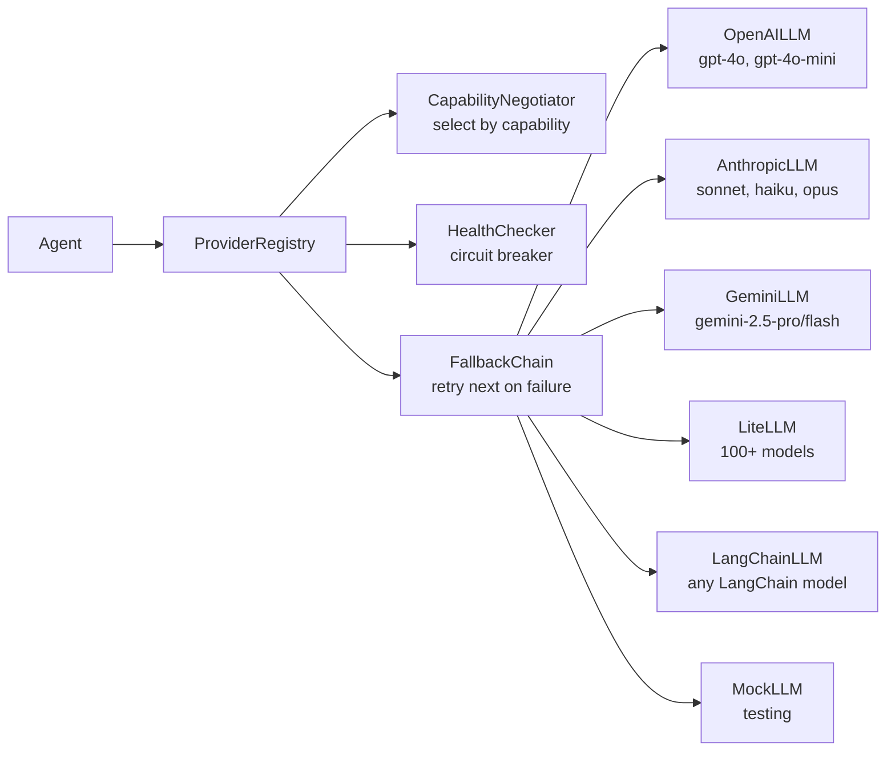

# pyagent-providers

**Multi-provider abstraction layer** — unified interface across OpenAI, Anthropic, Gemini, LangChain, and LiteLLM. Capability negotiation, health checks, fallback chains, and cost-optimized routing built in.

```bash
pip install pyagent-providers                  # Core (MockLLM only)
pip install pyagent-providers[openai]          # + OpenAI adapter
pip install pyagent-providers[anthropic]       # + Anthropic adapter
pip install pyagent-providers[gemini]          # + Google Gemini adapter
pip install pyagent-providers[litellm]         # + LiteLLM (100+ models via one interface)
pip install pyagent-providers[langchain]       # + LangChain adapter
pip install pyagent-providers[all]             # All adapters
```

---

## Architecture



---

## Quick Start — Direct Adapters

Use any provider directly — no registry required.

```python
import asyncio
from pyagent_patterns.base import Agent, Message
from pyagent_providers import AnthropicLLM, OpenAILLM, GeminiLLM

# Anthropic
agent_a = Agent("analyst", AnthropicLLM("claude-sonnet-4-20250514"),
                system_prompt="You are a financial analyst.")

# OpenAI
agent_b = Agent("researcher", OpenAILLM("gpt-4o-mini"),
                system_prompt="You are a research assistant.")

# Gemini
agent_c = Agent("fast_agent", GeminiLLM("gemini-2.5-flash"),
                system_prompt="Answer concisely.")

result = asyncio.run(agent_a.run("Analyze Tesla's Q3 2025 results"))
print(result.output)
print(f"Model: {result.metadata.get('model')}")
print(f"Tokens: {result.metadata.get('input_tokens')} in, {result.metadata.get('output_tokens')} out")
print(f"Cost: ${result.cost_estimate:.5f}")
```

---

## LiteLLM — 100+ Models via One Interface

LiteLLM lets you use any model from any provider with a single consistent API, including cost tracking and fallback.

```bash
pip install pyagent-providers[litellm]
```

```python
from pyagent_providers import LiteLLM
from pyagent_patterns.base import Agent
import asyncio

# OpenAI via LiteLLM
agent_openai   = Agent("a", LiteLLM("gpt-4o"), system_prompt="Analyze this.")

# Anthropic via LiteLLM
agent_anthropic = Agent("b", LiteLLM("anthropic/claude-sonnet-4-20250514"), system_prompt="Analyze this.")

# Gemini via LiteLLM
agent_gemini   = Agent("c", LiteLLM("gemini/gemini-2.5-pro"), system_prompt="Analyze this.")

# Mistral, Cohere, Together, Groq — same interface
agent_groq     = Agent("d", LiteLLM("groq/llama-3.1-70b-versatile"), system_prompt="Analyze this.")
agent_together = Agent("e", LiteLLM("together_ai/meta-llama/Llama-3-70b-chat-hf"), system_prompt="Analyze this.")

# Cost tracking built-in
result = asyncio.run(agent_anthropic.run("Summarize Q3 earnings"))
print(f"Cost: ${result.cost_estimate:.5f}")
```

---

## LangChain Adapter — Wrap Any LangChain Model

```bash
pip install pyagent-providers[langchain]
```

```python
from langchain_openai import ChatOpenAI
from langchain_anthropic import ChatAnthropic
from langchain_google_genai import ChatGoogleGenerativeAI
from pyagent_providers import LangChainLLM
from pyagent_patterns.base import Agent
import asyncio

# Wrap any LangChain chat model
agent_oai = Agent("writer",
                  LangChainLLM(ChatOpenAI(model="gpt-4o", temperature=0.7)),
                  system_prompt="Write clear technical content.")

agent_ant = Agent("reviewer",
                  LangChainLLM(ChatAnthropic(model="claude-sonnet-4-20250514", temperature=0)),
                  system_prompt="Review for accuracy and clarity.")

agent_gem = Agent("summarizer",
                  LangChainLLM(ChatGoogleGenerativeAI(model="gemini-2.5-flash")),
                  system_prompt="Summarize concisely.")

# LangChain streaming passes through
result = asyncio.run(agent_oai.run("Write a technical post about RAG"))
```

---

## ProviderRegistry — Centralized Provider Management

Register providers once; look them up by name throughout your codebase.

```python
from pyagent_providers import ProviderRegistry, AnthropicLLM, OpenAILLM, GeminiLLM

registry = ProviderRegistry()

# Register with alias names
registry.register("fast",    AnthropicLLM("claude-haiku-3-5-20241022"))
registry.register("balanced", OpenAILLM("gpt-4o-mini"))
registry.register("expert",   AnthropicLLM("claude-sonnet-4-20250514"))
registry.register("vision",   GeminiLLM("gemini-2.5-pro"))

# Retrieve anywhere in your app
from pyagent_patterns.base import Agent

extractor = Agent("extractor", registry.get("fast"),   system_prompt="Extract facts.")
analyst   = Agent("analyst",   registry.get("expert"), system_prompt="Analyze deeply.")
```

### Registry from Blueprint providers block

```python
from pyagent_blueprint import load_blueprint
from pyagent_providers import ProviderRegistry, AnthropicLLM, OpenAILLM

spec = load_blueprint("customer-support.yaml")
# spec.providers: {fast: {provider: anthropic, model: claude-haiku-...}, ...}

registry = ProviderRegistry.from_blueprint(spec, adapters={
    "anthropic": AnthropicLLM,
    "openai": OpenAILLM,
})
# All providers from the YAML are now wired and ready
```

---

## Capability Negotiation

Some patterns need specific capabilities — streaming, function calling, vision. Negotiate automatically.

```python
from pyagent_providers import ProviderRegistry, Capability

registry = ProviderRegistry()
registry.register("vision_capable", GeminiLLM("gemini-2.5-pro"),
                  capabilities=[Capability.VISION, Capability.STREAMING, Capability.FUNCTION_CALLING])
registry.register("text_only", AnthropicLLM("claude-haiku-3-5-20241022"),
                  capabilities=[Capability.STREAMING])

# Find all providers with streaming + function calling
matches = registry.find(capabilities=[Capability.STREAMING, Capability.FUNCTION_CALLING])
print(f"Capable providers: {[m.name for m in matches]}")
# → ["vision_capable"]

# Select best provider for a specific task
best = registry.select_for(task_type="image_analysis")
```

---

## Fallback Chains

Automatically fall back to the next provider if one fails — handle rate limits, outages, and quota exhaustion gracefully.

```python
from pyagent_providers import FallbackChain, AnthropicLLM, OpenAILLM, GeminiLLM

# Try in order: primary → secondary → emergency
chain = FallbackChain([
    AnthropicLLM("claude-sonnet-4-20250514"),   # primary
    OpenAILLM("gpt-4o"),                          # fallback if Anthropic is down
    GeminiLLM("gemini-2.5-pro"),                  # last resort
])

from pyagent_patterns.base import Agent
import asyncio

agent = Agent("resilient_agent", chain, system_prompt="Analyze this document.")
result = asyncio.run(agent.run("Analyze Tesla Q3 earnings"))
print(f"Provider used: {result.metadata.get('provider_used')}")
print(f"Fallback triggered: {result.metadata.get('fallback_triggered', False)}")
```

### Conditional fallback by error type

```python
from pyagent_providers import FallbackChain

chain = FallbackChain(
    providers=[primary, secondary, tertiary],
    fallback_on=["rate_limit_error", "service_unavailable", "timeout"],
    max_retries_per_provider=2,
    retry_delay_seconds=1.0,
)
```

---

## Health Checks

Monitor provider availability and latency in real time.

```python
from pyagent_providers import ProviderHealthChecker, AnthropicLLM, OpenAILLM, GeminiLLM
import asyncio

checker = ProviderHealthChecker()
checker.add("anthropic-haiku",  AnthropicLLM("claude-haiku-3-5-20241022"))
checker.add("openai-mini",      OpenAILLM("gpt-4o-mini"))
checker.add("gemini-flash",     GeminiLLM("gemini-2.5-flash"))

async def check_all():
    results = await checker.check_all()
    for name, status in results.items():
        icon = "✓" if status.healthy else "✗"
        print(f"{icon} {name}  latency: {status.latency_ms:.0f}ms  status: {status.status}")

asyncio.run(check_all())
# ✓ anthropic-haiku  latency: 340ms  status: healthy
# ✓ openai-mini      latency: 480ms  status: healthy
# ✓ gemini-flash     latency: 290ms  status: healthy
```

### Health-aware routing

```python
from pyagent_providers import HealthAwareRouter

router = HealthAwareRouter(
    providers={"fast": haiku_llm, "balanced": mini_llm, "expert": sonnet_llm},
    health_checker=checker,
)

# Route to fastest healthy provider for this task
llm = asyncio.run(router.select(preferred="expert", min_health_score=0.9))
```

---

## Streaming

All real providers support async streaming:

```python
from pyagent_providers import AnthropicLLM, OpenAILLM
from pyagent_patterns.base import Agent
from pyagent_patterns.orchestration import Pipeline
import asyncio

pipeline = Pipeline(stages=[
    Agent("analyst", AnthropicLLM("claude-sonnet-4-20250514"),
          system_prompt="Write a detailed analysis."),
])

async def stream():
    async for chunk in pipeline.stream("Analyze the impact of AI on software engineering"):
        print(chunk, end="", flush=True)
    print()

asyncio.run(stream())
```

---

## TracedProvider — Observability Without Code Changes

`TracedProvider` wraps any `ProviderProtocol` to emit trace events for every LLM call — without modifying agent code or the underlying provider.

```python
import asyncio
from pyagent_providers import AnthropicLLM
from pyagent_providers.traced import TracedProvider
from pyagent_trace.events import TraceEventBus
from pyagent_trace.exporters import ConsoleExporter, JsonlExporter

bus = TraceEventBus()
bus.subscribe(ConsoleExporter().export_event)
bus.subscribe(JsonlExporter("traces/run.jsonl").export_event)

# Wrap any existing provider — no changes to agent code
traced = TracedProvider(AnthropicLLM("claude-sonnet-4-20250514"), trace_bus=bus)

from pyagent_patterns.base import Agent
agent = Agent("analyst", llm=traced, system_prompt="Analyze this document.")

result = asyncio.run(agent.run("Tesla Q3 2025 earnings"))
# Bus receives: provider_call_start → provider_call_end (or provider_call_error)
# Console: [provider_call_start] agent=analyst model=claude-sonnet-4-20250514
#          [provider_call_end]   agent=analyst latency_ms=342 tokens=...
```

`TracedProvider` implements `ProviderProtocol` and works anywhere a provider is expected:

```python
# In a FallbackChain
from pyagent_providers import FallbackChain

chain = FallbackChain([
    TracedProvider(AnthropicLLM("claude-sonnet-4-20250514"), trace_bus=bus),
    TracedProvider(OpenAILLM("gpt-4o"), trace_bus=bus),
])

# In a ProviderRegistry
registry = ProviderRegistry()
registry.register("primary", TracedProvider(AnthropicLLM("claude-haiku-3-5-20241022"), trace_bus=bus))
```

→ See the full [Hooks Guide](../guides/hooks.md) for `agent.set_trace_bus()` and other hook types.

---

## Provider Comparison

| Provider | Best For | Relative Cost | Context Window |
|----------|----------|--------------|----------------|
| `AnthropicLLM("claude-haiku-3-5-20241022")` | Fast classification, routing | Low | 200k |
| `AnthropicLLM("claude-sonnet-4-20250514")` | Complex reasoning, writing | Medium | 200k |
| `OpenAILLM("gpt-4o-mini")` | Balanced tasks, JSON output | Low | 128k |
| `OpenAILLM("gpt-4o")` | Complex reasoning, vision | Medium-High | 128k |
| `GeminiLLM("gemini-2.5-flash")` | Very fast, large docs | Low | 1M |
| `GeminiLLM("gemini-2.5-pro")` | Deep reasoning | Medium | 1M |
| `LiteLLM("groq/llama-3.1-70b-versatile")` | Fast inference, low cost | Very Low | 128k |

---

## Environment Variables

```bash
# Set API keys — providers auto-discover from environment
export ANTHROPIC_API_KEY="sk-ant-..."
export OPENAI_API_KEY="sk-..."
export GOOGLE_API_KEY="..."

# LiteLLM also reads these automatically
# For other providers, see LiteLLM docs
```

---

## See Also

- [Blueprint Package](blueprint/index.md) — declare providers in YAML `providers:` block
- [Studio Package](studio/index.md) — `/providers` health dashboard in web UI
- [Routing Guide](../guides/router.md) — difficulty-based model routing with pyagent-router
- [API Reference](../api/providers.md)

---

<!-- cookbook-backlinks:start -->

## Cookbook examples

Complete, runnable recipes that use this package — [browse the Cookbook](../cookbook/index.md):

- [Multi-agent portfolio review](../cookbook/finance-trading/portfolio-review.md)
- [Multi-agent customer support router](../cookbook/customer-support/support-router.md)

[Browse the full Cookbook →](../cookbook/index.md)

<!-- cookbook-backlinks:end -->
