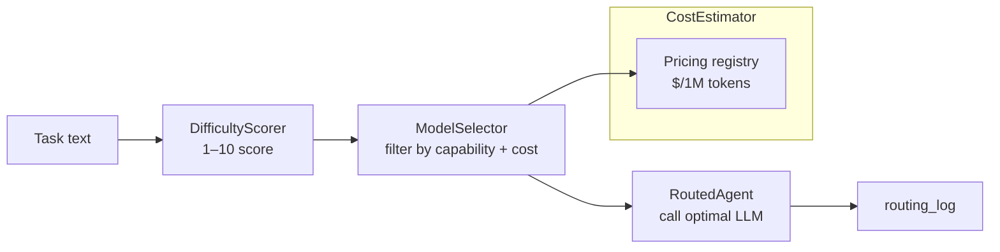

# pyagent-router

**Automatic model routing based on task difficulty and cost** — score each task 1-10, pick the cheapest model that can handle it, and route calls transparently without changing your agent code.

```bash
pip install pyagent-router
```

---

## Why Routing Matters

Running every task through `gpt-4o` or `claude-sonnet` is the easiest default — and the most expensive one. Most tasks in a real workflow are easy.

```
"What is 2+2?"          → difficulty 1  → gpt-4.1-nano    ($0.000001)
"Summarise this email"  → difficulty 3  → gpt-4o-mini     ($0.000015)
"Design a distributed   → difficulty 8  → claude-sonnet   ($0.000180)
 consensus algorithm"
```

Routing the first two tasks to cheaper models saves 90–99% of cost on those calls. Over 10,000 calls per day that compounds fast.

---

## Architecture



---

## DifficultyScorer

Score any text 1-10 using heuristics — no LLM call required.

```python
from pyagent_router.scorer import DifficultyScorer

scorer = DifficultyScorer()

easy = scorer.score("What is the capital of France?")
print(easy.score)     # 2
print(easy.category)  # "easy"
print(easy.is_easy)   # True

hard = scorer.score(
    "Design a Byzantine fault-tolerant consensus protocol that "
    "achieves sub-second finality under 33% adversarial nodes. "
    "Prove safety and liveness properties formally."
)
print(hard.score)     # 9
print(hard.is_hard)   # True
print(hard.signals)   # {"length": 0.4, "complexity_keywords": 0.9, ...}
```

### Score ranges

| Range | Category | Examples |
|-------|----------|---------|
| 1–3 | easy | Factual lookups, simple arithmetic, translations |
| 4–6 | medium | Summaries, code explanations, comparisons |
| 7–10 | hard | System design, proofs, multi-step reasoning, synthesis |

---

## CostEstimator

Estimate cost before a call and compare across models.

```python
from pyagent_router.estimator import CostEstimator

estimator = CostEstimator()

# Estimate cost for a specific model
estimate = estimator.estimate("gpt-4o-mini", input_tokens=1_000, output_tokens=500)
print(f"${estimate.total_cost:.6f}")  # $0.000225

# Compare across models to find the cheapest fit
estimates = estimator.compare("Explain async/await in Python",
                               models=["gpt-4.1-nano", "gpt-4o-mini", "gpt-4o"])
for e in estimates:
    print(f"{e.model:20} ${e.total_cost:.6f}")
# gpt-4.1-nano         $0.000003
# gpt-4o-mini          $0.000023
# gpt-4o               $0.000187
```

---

## ModelSelector

Combines `DifficultyScorer` and `CostEstimator` — pick the cheapest model that meets difficulty and capability requirements.

```python
from pyagent_router.selector import ModelSelector, Capability

selector = ModelSelector()

# Auto-select based on difficulty
result = selector.select("What is 2+2?")
print(result.model)       # "gpt-4.1-nano"
print(result.difficulty)  # DifficultyScore(score=1, ...)
print(result.estimate)    # CostEstimate(total_cost=...)

# Require a specific capability
result = selector.select(
    "Write a Python function to implement Dijkstra's algorithm",
    required_capability=Capability.CODE,
)
print(result.model)  # "gpt-4o-mini" or better (has CODE capability)
```

### Capabilities

```python
from pyagent_router.selector import Capability

Capability.GENERAL    # default, all models
Capability.CODE       # code generation and review
Capability.MATH       # numerical and symbolic reasoning
Capability.REASONING  # multi-step logical reasoning
Capability.CREATIVE   # creative writing and ideation
Capability.VISION     # image understanding (multimodal)
```

### Custom model specs

```python
from pyagent_router.selector import ModelSelector, ModelSpec, Capability

selector = ModelSelector(specs=[
    ModelSpec("my-cheap-model",  min_difficulty=1, max_difficulty=4,
              capabilities={Capability.GENERAL}, max_context=32_000),
    ModelSpec("my-smart-model",  min_difficulty=3, max_difficulty=10,
              capabilities={Capability.GENERAL, Capability.CODE, Capability.REASONING},
              max_context=200_000),
])
```

---

## RouterMiddleware

Wrap any agent to route each call automatically — zero changes to the agent or the caller.

```python
import asyncio
from pyagent_patterns.base import Agent, Message
from pyagent_patterns.orchestration import Pipeline
from pyagent_providers import AnthropicLLM, OpenAILLM
from pyagent_router.middleware import RouterMiddleware
from pyagent_router.selector import Capability

# Build a model registry mapping name → LLM callable
model_registry = {
    "gpt-4.1-nano": OpenAILLM("gpt-4.1-nano"),
    "gpt-4o-mini":  OpenAILLM("gpt-4o-mini"),
    "gpt-4o":       OpenAILLM("gpt-4o"),
    "claude-sonnet-4-20250514": AnthropicLLM("claude-sonnet-4-20250514"),
}

middleware = RouterMiddleware(model_registry=model_registry)

# Wrap individual agents
agent = Agent("analyst", OpenAILLM("gpt-4o"),
              system_prompt="Analyse the given data.")
routed = middleware.wrap(agent)

result = asyncio.run(routed.run([Message.user("What is revenue growth?")]))
print(result.metadata["routed_model"])   # "gpt-4o-mini" (easy task)
print(routed.routing_log[-1])            # SelectionResult(model=..., difficulty=...)
```

### Require a capability per agent

```python
# Wrap agents with different capability requirements
code_agent = middleware.wrap(
    Agent("coder", OpenAILLM("gpt-4o"), system_prompt="Write production Python code."),
    required_capability=Capability.CODE,
)
vision_agent = middleware.wrap(
    Agent("vision", OpenAILLM("gpt-4o"), system_prompt="Describe this image."),
    required_capability=Capability.VISION,
)
```

### Wrap a full pipeline

```python
pipeline = Pipeline(stages=[
    middleware.wrap(extractor_agent),
    middleware.wrap(analyst_agent),
    middleware.wrap(writer_agent),
])

result = asyncio.run(pipeline.run(document))
```

---

## Routing Log

Every routed call is recorded — useful for cost analysis and debugging.

```python
routed = middleware.wrap(agent)

# Run several tasks
for task in tasks:
    await routed.run([Message.user(task)])

# Inspect routing decisions
for entry in routed.routing_log:
    print(f"{entry.model:25} difficulty={entry.difficulty.score} "
          f"cost=${entry.estimate.total_cost:.6f}")

# Aggregate cost savings
actual_cost    = sum(e.estimate.total_cost for e in routed.routing_log)
premium_cost   = sum(
    CostEstimator().estimate("gpt-4o", e.estimate.input_tokens,
                              e.estimate.output_tokens).total_cost
    for e in routed.routing_log
)
print(f"Saved: ${premium_cost - actual_cost:.4f} "
      f"({(1 - actual_cost/premium_cost):.0%} reduction)")
```

---

## Integration with ProviderRouter

`pyagent-router` handles model selection (which model to use). `pyagent-providers`' `ProviderRouter` handles provider selection (which API endpoint to use). They compose naturally:

```python
from pyagent_router.middleware import RouterMiddleware
from pyagent_providers.router import ProviderRouter, RoutingStrategy
from pyagent_providers.registry import ProviderRegistry

# 1. Route to the right provider (lowest cost, best health)
provider_router = ProviderRouter(registry, strategy=RoutingStrategy.COST_FIRST)

# 2. Route to the right model (based on task difficulty)
model_middleware = RouterMiddleware(model_registry=model_registry)

agent = model_middleware.wrap(
    Agent("analyst", llm_from_provider(provider_router))
)
```

---

## See Also

- [Patterns Package](patterns.md) — `Agent`, `Pipeline`, `FanOutFanIn` and all orchestration patterns
- [Providers Package](providers.md) — `ProviderRouter` for provider-level routing and fallback
- [API Reference](../api/router.md)
