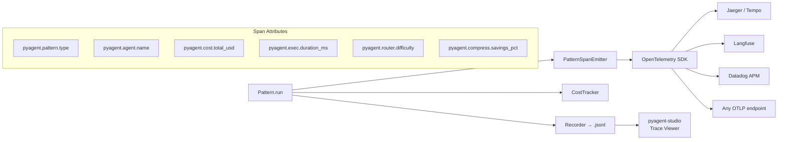

# pyagent-trace

**Pattern-aware OpenTelemetry instrumentation** — every agent call, pattern execution, and LLM invocation emits structured spans. Feeds cost tracking, record/replay debugging, and the Studio dashboard.

```bash
pip install pyagent-trace
pip install pyagent-trace[langfuse]   # + Langfuse exporter
pip install pyagent-trace[datadog]    # + Datadog APM exporter
```

---

## Architecture



---

## TraceEventBus — Pub/Sub Event System

`TraceEventBus` is the lightweight event contract between trace producers (agents, patterns, providers) and consumers (exporters, Studio, custom callbacks). Producers emit `TraceEvent` objects; consumers subscribe to receive them.

```python
import time
from pyagent_trace.events import TraceEvent, TraceEventBus

bus = TraceEventBus()

# Subscribe a callback — receives every event
sub_id = bus.subscribe(lambda e: print(f"[{e.event_type}] {e.agent_name}"))

# Subscribe to specific event types only
bus.subscribe_filter(
    {"agent_start", "agent_end", "llm_call"},
    lambda e: print(f"Agent event: {e.payload}"),
)

# Emit an event
bus.emit(TraceEvent(
    timestamp=time.time(),
    event_type="agent_start",
    agent_name="analyst",
    pattern_type="pipeline",
    payload={"model": "claude-sonnet-4-20250514"},
))

bus.unsubscribe(sub_id)
```

### Built-in Exporters

Wire exporters to a bus — one bus can have multiple exporters simultaneously:

```python
from pyagent_trace.events import TraceEventBus
from pyagent_trace.exporters import ConsoleExporter, JsonlExporter
from pyagent_trace.exporters.langfuse import LangfuseExporter

bus = TraceEventBus()

# Development: print to stdout
bus.subscribe(ConsoleExporter().export_event)

# Persistence: write every event to JSONL (viewable in Studio)
bus.subscribe(JsonlExporter("traces/run_001.jsonl").export_event)

# Production: send to Langfuse for LLM observability
bus.subscribe(
    LangfuseExporter(
        public_key="pk-lf-...",
        secret_key="sk-lf-...",
        host="https://cloud.langfuse.com",   # or self-hosted
    ).export_event
)
```

### Agent Hook Integration

Attach a bus to any agent — it emits `agent_start`, `agent_end`, `compression`, and `cost_record` events automatically:

```python
from pyagent_patterns.base import Agent
from pyagent_providers import AnthropicLLM
from pyagent_trace import CostTracker

bus = TraceEventBus()
bus.subscribe(ConsoleExporter().export_event)

tracker = CostTracker(event_bus=bus)

agent = (
    Agent("analyst", AnthropicLLM("claude-sonnet-4-20250514"),
          system_prompt="Analyze the document.")
    .set_trace_bus(bus)          # emits agent_start / agent_end
    .set_cost_tracker(tracker)   # emits cost_record after each LLM call
)

result = asyncio.run(agent.run("Summarize Q3 earnings"))
# Console output:
# [agent_start] agent=analyst
# [cost_record] agent=analyst tokens=... cost=...
# [agent_end]   agent=analyst duration_ms=...
```

→ See the full [Hooks Guide](../guides/hooks.md) for all four hook types (trace, context, compress, cost).

---

## Quick Start — Decorator Tracing

The simplest integration: inherit from a traced variant of any pattern class.

```python
from pyagent_trace import traced_pattern, traced_agent
from pyagent_patterns.base import Agent
from pyagent_patterns.orchestration import Pipeline
from pyagent_providers import AnthropicLLM, OpenAILLM

# Every pipeline.run() automatically emits OTel spans
@traced_pattern
class TracedPipeline(Pipeline):
    pass

pipeline = TracedPipeline(stages=[
    traced_agent(Agent("extractor", AnthropicLLM("claude-haiku-3-5-20241022"),
                       system_prompt="Extract key facts.")),
    traced_agent(Agent("writer", OpenAILLM("gpt-4o-mini"),
                       system_prompt="Write a concise brief.")),
])

import asyncio
result = asyncio.run(pipeline.run("Tesla Q3 2025 earnings report..."))
# Spans emitted to configured OTel backend automatically
```

---

## OTel Backend Setup

### Jaeger (local development)

```python
from opentelemetry import trace
from opentelemetry.sdk.trace import TracerProvider
from opentelemetry.sdk.trace.export import BatchSpanProcessor
from opentelemetry.exporter.jaeger.thrift import JaegerExporter

provider = TracerProvider()
provider.add_span_processor(
    BatchSpanProcessor(JaegerExporter(agent_host_name="localhost", agent_port=6831))
)
trace.set_tracer_provider(provider)

# Now all traced_pattern / traced_agent calls export to Jaeger
# Visit http://localhost:16686 to explore traces
```

```bash
# Start Jaeger with Docker
docker run -d --name jaeger \
  -p 6831:6831/udp -p 16686:16686 \
  jaegertracing/all-in-one:latest
```

### Langfuse (production LLM observability)

```bash
pip install pyagent-trace[langfuse]
```

```python
from pyagent_trace.events import TraceEventBus
from pyagent_trace.exporters.langfuse import LangfuseExporter

bus = TraceEventBus()
bus.subscribe(
    LangfuseExporter(
        public_key="pk-lf-...",
        secret_key="sk-lf-...",
        host="https://cloud.langfuse.com",   # or self-hosted
    ).export_event
)

# Wire bus to agents or patterns, then run
# Every agent_start/end and llm_call event flows to Langfuse as a span/generation
result = asyncio.run(pipeline.run("Analyze this document"))
# Visit Langfuse dashboard to see full trace tree with token costs
```

### Grafana Tempo + Prometheus (infrastructure teams)

```python
from opentelemetry.exporter.otlp.proto.grpc.trace_exporter import OTLPSpanExporter
from opentelemetry.sdk.trace.export import BatchSpanProcessor

provider.add_span_processor(
    BatchSpanProcessor(OTLPSpanExporter(endpoint="http://tempo:4317"))
)
```

---

## PatternSpanEmitter — Manual Control

For full span control when decorators aren't enough.

```python
import asyncio
from pyagent_trace import PatternSpanEmitter
from pyagent_patterns.resolution import Debate
from pyagent_providers import GeminiLLM, AnthropicLLM
from pyagent_patterns.base import Agent

debate = Debate(
    debaters=[
        Agent("bull", GeminiLLM("gemini-2.5-flash"), system_prompt="Argue the bull case."),
        Agent("bear", GeminiLLM("gemini-2.5-flash"), system_prompt="Argue the bear case."),
    ],
    judge=Agent("judge", AnthropicLLM("claude-sonnet-4-20250514"),
                system_prompt="Render a final verdict."),
    rounds=2,
)

emitter = PatternSpanEmitter(service_name="investment-analysis")

async def run_traced():
    span = emitter.pattern_span("debate", attributes={"rounds": 2, "topic": "nvidia_investment"})
    try:
        result = await debate.run("Should we buy Nvidia at $3.2T market cap?")
        emitter.set_pattern_result(
            span,
            output_len=len(result.output),
            rounds=result.metadata.get("rounds", 2),
            cost_estimate=result.cost_estimate,
        )
        return result
    except Exception as exc:
        emitter.record_error(span, exc)
        raise
    finally:
        span.end()

result = asyncio.run(run_traced())
```

---

## CostTracker

Aggregate costs across an entire session — by pattern, by model, by agent.

```python
from pyagent_trace import CostTracker

tracker = CostTracker()

# Record after each agent call
tracker.record(
    pattern="debate",
    agent="bull",
    model="gemini-2.5-flash",
    input_tokens=450,
    output_tokens=380,
    cost_usd=0.00094,
)
tracker.record("debate", "bear", "gemini-2.5-flash", 450, 410, 0.00098)
tracker.record("debate", "judge", "claude-sonnet-4-20250514", 1200, 480, 0.00840)

# Summaries
print(f"Total session cost: ${tracker.total_cost:.4f}")
print(f"By pattern: {tracker.by_pattern()}")
# → {"debate": 0.01032}

print(f"By model: {tracker.by_model()}")
# → {"gemini-2.5-flash": 0.00192, "claude-sonnet-4-20250514": 0.00840}

print(f"By agent: {tracker.by_agent()}")
# → {"bull": 0.00094, "bear": 0.00098, "judge": 0.00840}

# Daily cost projection
print(f"If 500 runs/day: ${tracker.total_cost * 500:.2f}/day")
```

---

## Recorder — Record & Replay

Record every LLM call to a JSONL file. Replay for deterministic debugging, testing, and cost-free re-runs.

```python
from pyagent_trace.recorder import Recorder

# --- Recording ---
recorder = Recorder()
recorder.start(pattern_name="pipeline")

# Record each agent interaction manually, or wire into traced_agent automatically
recorder.record_llm_call(
    agent_name="extractor",
    messages=[{"role": "user", "content": "Tesla Q3 2025 earnings..."}],
    response="Revenue: $25.2B (+8% YoY), gross margin: 17.1%",
    model="claude-haiku-3-5-20241022",
    input_tokens=180,
    output_tokens=42,
    cost_usd=0.00006,
)
recorder.record_llm_call(
    agent_name="writer",
    messages=[{"role": "user", "content": "Revenue: $25.2B..."}],
    response="Tesla Q3: Revenue beat consensus by 2%...",
    model="gpt-4o-mini",
    input_tokens=60,
    output_tokens=85,
    cost_usd=0.00009,
)
recorder.end(final_output="Tesla Q3: Revenue beat consensus by 2%...")
recorder.save("traces/pipeline_run_001.jsonl")

print(f"Recorded {len(recorder.entries)} events")
print(f"Total cost: ${recorder.total_cost:.5f}")
```

```python
# --- Replay / Debug ---
entries = Recorder.load("traces/pipeline_run_001.jsonl")

for entry in entries:
    print(f"[{entry.event_type}] {entry.agent_name}: {entry.response[:80]}...")
    print(f"  tokens: {entry.input_tokens}+{entry.output_tokens}, cost: ${entry.cost_usd:.5f}")

# Replay without hitting LLM APIs (great for CI and testing)
from pyagent_trace.recorder import ReplayLLM

replay_llm = ReplayLLM.from_recording("traces/pipeline_run_001.jsonl", agent_name="extractor")
# replay_llm returns pre-recorded responses — zero API cost
```

---

## Integration with pyagent-studio

Recorded `.jsonl` files are loaded directly into Studio's trace viewer:

```bash
# Load a trace file in Studio
pyagent dashboard --trace traces/pipeline_run_001.jsonl
```

Or use the TraceService programmatically (same API Studio uses internally):

```python
from pyagent_studio.services.trace_service import TraceService

svc = TraceService()
spans = svc.load("traces/pipeline_run_001.jsonl")

print(f"Spans: {len(spans)}")
for span in spans:
    print(f"  [{span.event_type}] {span.agent_name}: {span.duration_ms:.0f}ms, {span.tokens} tokens")

# Query specific spans
llm_calls = svc.query(event_type="llm_call")
slow_spans = svc.query(min_duration_ms=2000)
```

---

## OTel Span Attributes Reference

All attributes use the `pyagent.*` namespace:

| Attribute | Type | Description |
|-----------|------|-------------|
| `pyagent.pattern.type` | string | Pattern name (e.g., `"debate"`) |
| `pyagent.pattern.rounds` | int | Rounds executed |
| `pyagent.agent.name` | string | Agent identifier |
| `pyagent.agent.model` | string | LLM model used |
| `pyagent.cost.input_tokens` | int | Input token count |
| `pyagent.cost.output_tokens` | int | Output token count |
| `pyagent.cost.total_usd` | float | Estimated cost in USD |
| `pyagent.exec.duration_ms` | float | Wall-clock time (ms) |
| `pyagent.router.difficulty` | int | Task difficulty score 1–10 |
| `pyagent.router.selected_model` | string | Model chosen by router |
| `pyagent.compress.savings_pct` | float | Compression savings ratio |
| `pyagent.early_stop` | bool | Whether pattern stopped early |

---

## Trace Output Example (Jaeger / Tempo)

```
Trace: investment-analysis / debate (9.8s total, $0.01032)
├── pyagent.agent.bull     2.4s  gemini-2.5-flash  450→380 tok  $0.00094
├── pyagent.agent.bear     2.7s  gemini-2.5-flash  450→410 tok  $0.00098
├── pyagent.agent.bull     2.1s  (round 2)          410→360 tok  $0.00086
├── pyagent.agent.bear     1.9s  (round 2)          410→380 tok  $0.00084  
└── pyagent.agent.judge    0.7s  claude-sonnet-4    1200→480 tok $0.00840
                                 ─────────────────────────────────────────
                                 Total: $0.01032, early_stop: false
```

---

## See Also

- [Studio Package](studio/index.md) — visual trace explorer, cost dashboards
- [Tracing Guide](../guides/tracing.md) — production setup for Langfuse, Datadog, Grafana
- [Compress Package](compress.md) — `pyagent.compress.savings_pct` OTel attribute
- [API Reference](../api/trace.md)

---

<!-- cookbook-backlinks:start -->

## Cookbook examples

Complete, runnable recipes that use this package — [browse the Cookbook](../cookbook/index.md):

- [Multi-agent incident triage pipeline](../cookbook/devops-sre/incident-triage.md)

[Browse the full Cookbook →](../cookbook/index.md)

<!-- cookbook-backlinks:end -->
