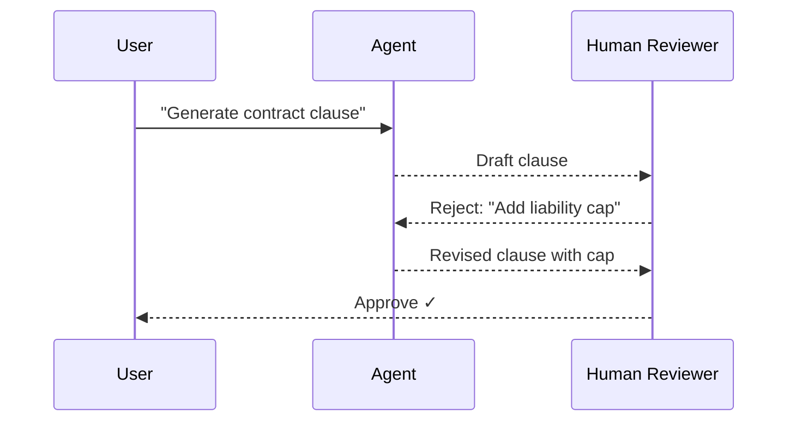

# Human-in-the-Loop Pattern

Agent processes task, human approval gate decides accept/reject/modify.

## Sequence Diagram



## Code Example

```python
import asyncio
from pyagent_patterns.base import Agent, MockLLM
from pyagent_patterns.advanced import HumanInTheLoop
from pyagent_patterns.advanced.human_in_the_loop import HumanDecision

def review(output, metadata):
    # In production: show UI, get human input
    if "liability" not in output.lower():
        return HumanDecision(approved=False, feedback="Must include liability cap")
    return HumanDecision(approved=True)

pattern = HumanInTheLoop(
    agent=Agent("legal", MockLLM(responses=[
        "Standard indemnification clause...",
        "Revised: includes liability cap of $1M...",
    ])),
    review_fn=review,
    max_revisions=3,
)

result = asyncio.run(pattern.run("Generate indemnification clause"))
print(f"Approved: {result.metadata['approved']}, Revisions: {result.metadata['revisions']}")
```
