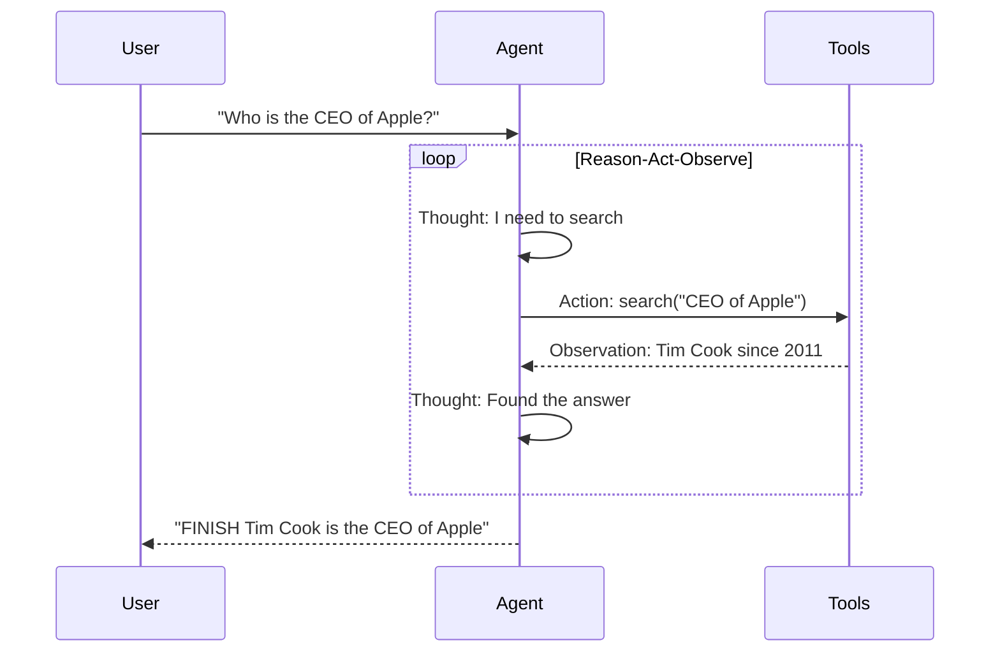

# ReAct Pattern

Iterative Reason → Act → Observe cycle with tool use.

## Sequence Diagram



## Code Example

```python
import asyncio
from pyagent_patterns.base import Agent, MockLLM
from pyagent_patterns.advanced import ReAct

def search(query: str) -> str:
    return f"Search result for '{query}': Tim Cook has been CEO since 2011"

def calculator(expr: str) -> str:
    return str(eval(expr))  # In production: use safe eval

pattern = ReAct(
    agent=Agent("researcher", MockLLM(responses=[
        "Thought: I need to look this up\nAction: search(CEO of Apple)",
        "Thought: Found it\nFINISH Tim Cook is the CEO of Apple since 2011",
    ])),
    tools={"search": search, "calculator": calculator},
    max_steps=5,
)

result = asyncio.run(pattern.run("Who is the CEO of Apple?"))
print(result.output)
print(f"Steps: {result.metadata['steps']}, Tools: {result.metadata['tools_used']}")
```
