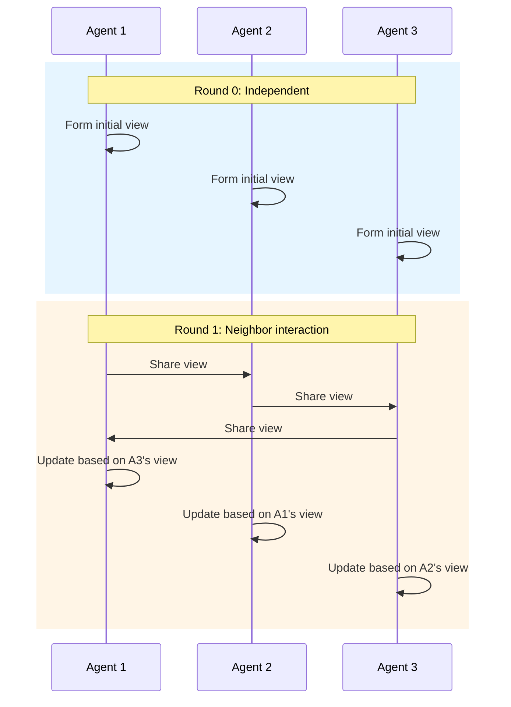

# Swarm Pattern

Decentralized: many agents with local rules, global behavior emerges.

## Sequence Diagram



## Code Example

```python
import asyncio
from pyagent_patterns.base import Agent, MockLLM
from pyagent_patterns.advanced import Swarm

pattern = Swarm(
    agents=[Agent(f"agent_{i}", MockLLM(responses=["My view on the topic"])) for i in range(5)],
    rounds=3,
    neighbor_count=2,
    aggregation="last",
)

result = asyncio.run(pattern.run("What is the most important AI trend?"))
print(f"Agents: {result.metadata['agents']}, Rounds: {result.metadata['rounds']}")
```
