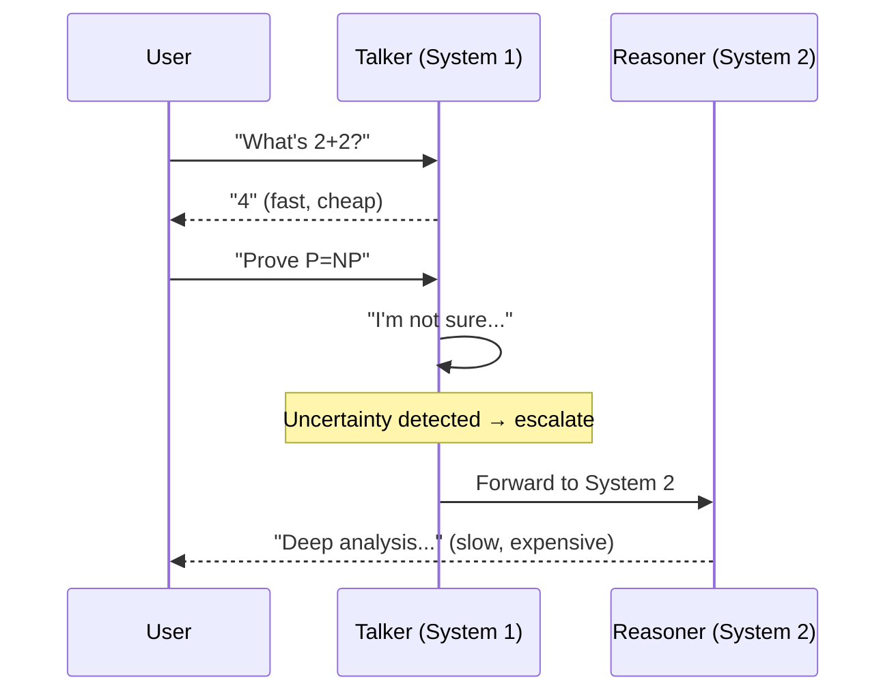

# Talker-Reasoner Pattern

Dual-process: fast cheap System 1 (talker) + slow expensive System 2 (reasoner).

Based on Google DeepMind's 2024 paper and Kahneman's "Thinking, Fast and Slow."

## Sequence Diagram



## Code Example

```python
import asyncio
from pyagent_patterns.base import Agent, MockLLM
from pyagent_patterns.advanced import TalkerReasoner

pattern = TalkerReasoner(
    talker=Agent("talker", MockLLM(responses=["4"]), description="Fast, cheap model"),
    reasoner=Agent("reasoner", MockLLM(responses=["Deep mathematical proof..."]), description="Slow, expensive model"),
)

result = asyncio.run(pattern.run("What is 2+2?"))
print(f"System: {result.metadata['system']}, Escalated: {result.metadata['escalated']}")
```

## Cost Savings

For a typical workload where 70% of queries are easy:

| Strategy | Avg cost/query |
|----------|---------------|
| Always use GPT-4o | $0.004 |
| Talker-Reasoner | $0.0016 (60% savings) |
