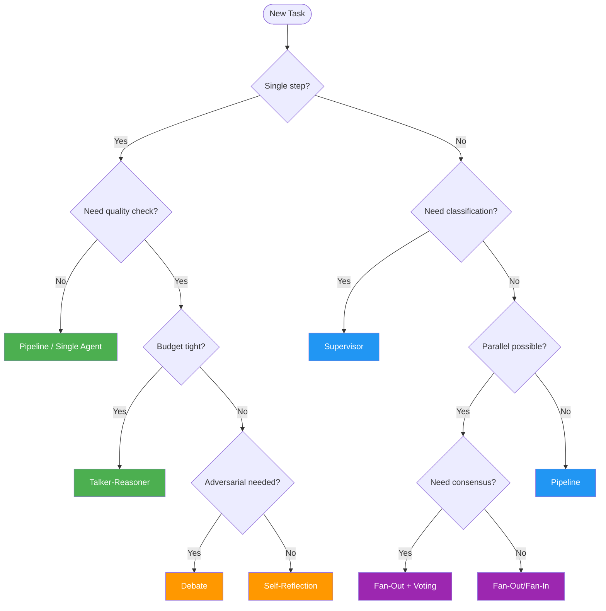

# Pattern Selection Guide

Use this decision tree to choose the right pattern for your task.

## All 18 Patterns at a Glance

| # | Pattern | Tier | LLM Calls | Best For |
|---|---------|------|-----------|----------|
| 1 | Supervisor | Orchestration | 2-3 | Task routing, customer support |
| 2 | Pipeline | Orchestration | N stages | Sequential processing, ETL |
| 3 | Fan-Out/Fan-In | Orchestration | N+1 | Parallel analysis, research |
| 4 | Hierarchical | Orchestration | 3+ levels | Enterprise workflows |
| 5 | Orchestrator-Workers | Orchestration | 1+N+1 | Dynamic task decomposition |
| 6 | Self-Reflection | Resolution | 2-6 | Code gen, writing |
| 7 | Cross-Reflection | Resolution | 3+ | Peer review, editing |
| 8 | Debate | Resolution | D×R+1 | Controversial decisions |
| 9 | Voting | Resolution | N | Consensus, fault tolerance |
| 10 | Evaluator-Optimizer | Resolution | 2-4/round | Criteria-driven quality |
| 11 | Role-Based | Structural | N×rounds | Team simulation |
| 12 | Layered | Structural | sum(layers) | Multi-level analysis |
| 13 | Topology | Structural | varies | Communication structure |
| 14 | Blackboard | Structural | N×rounds | Shared state coordination |
| 15 | Talker-Reasoner | Advanced | 1-2 | Cost-optimized chat |
| 16 | Swarm | Advanced | N×rounds | Emergent behavior |
| 17 | Human-in-the-Loop | Advanced | 1+ | Safety-critical tasks |
| 18 | ReAct | Advanced | 1-N steps | Tool-using agents |
