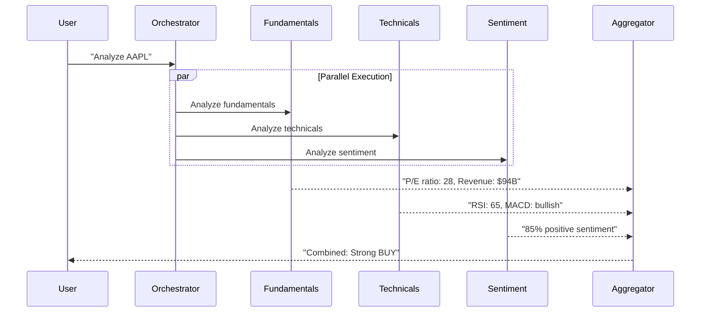

# Fan-Out / Fan-In Pattern

Broadcast task to N agents in parallel, then aggregate results.

## Sequence Diagram



## Code Example

```python
import asyncio
from pyagent_patterns.base import Agent, MockLLM
from pyagent_patterns.orchestration import FanOutFanIn

fanout = FanOutFanIn(
    agents=[
        Agent("fundamentals", MockLLM(responses=["P/E: 28, strong revenue growth"])),
        Agent("technicals", MockLLM(responses=["RSI oversold, MACD bullish crossover"])),
        Agent("sentiment", MockLLM(responses=["85% positive social sentiment"])),
    ],
    aggregator=Agent("aggregator", MockLLM(responses=["Combined analysis: Strong BUY signal"])),
)

result = asyncio.run(fanout.run("Analyze AAPL stock"))
print(result.output)
print(f"Agents used: {result.metadata['parallel_agents']}")
```

## When to Use

- ✅ **Use when:** Multiple independent analyses can run simultaneously
- ✅ **Use when:** Wall-clock latency matters (parallel = fast)
- ❌ **Avoid when:** Analyses depend on each other (use Pipeline)

## Cost-Effectiveness

| Metric | Value |
|--------|-------|
| LLM calls | N + 1 (agents + aggregator) |
| Latency | max(agent latencies) + aggregator |
| Cost | (N + 1) × single call cost |
| Quality gain | +20% (diverse perspectives) |
