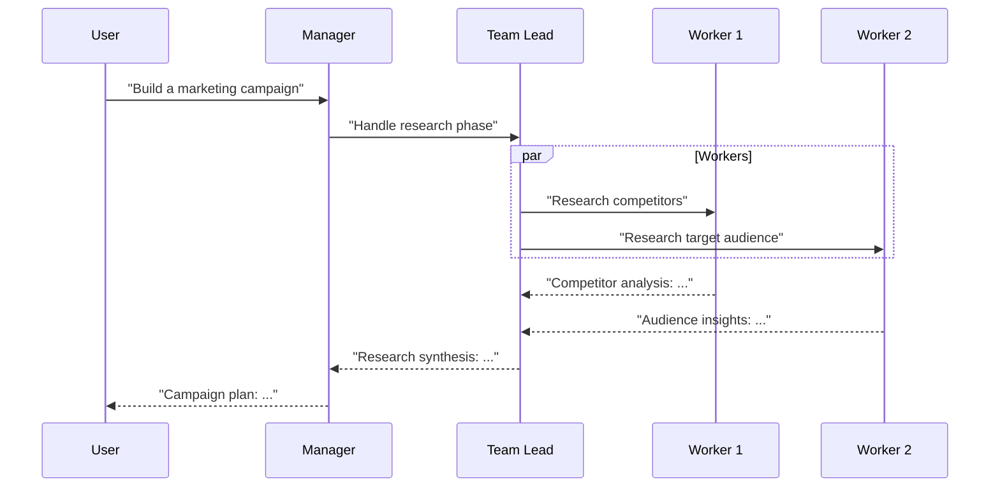

# Hierarchical Pattern

Manager delegates to team leads, who delegate to workers.

## Sequence Diagram



## Code Example

```python
import asyncio
from pyagent_patterns.base import Agent, MockLLM
from pyagent_patterns.orchestration import Hierarchical
from pyagent_patterns.orchestration.hierarchical import Team

llm = MockLLM(responses=[
    "Decomposed into 2 team tasks",
    "Competitor analysis complete",
    "Audience analysis complete",
    "Research synthesis: key findings",
    "Final campaign plan",
])

h = Hierarchical(
    manager=Agent("pm", llm),
    teams=[
        Team(
            name="Research",
            lead=Agent("research_lead", llm),
            workers=[Agent("competitor_analyst", llm), Agent("audience_analyst", llm)],
        )
    ],
)

result = asyncio.run(h.run("Build a marketing campaign for Q4"))
print(result.output)
```

## When to Use

- ✅ **Use when:** Task naturally decomposes into team-based work
- ✅ **Use when:** You need hierarchical accountability
- ❌ **Avoid when:** Task is simple (overkill)
- ❌ **Avoid when:** Budget is tight (many LLM calls)
