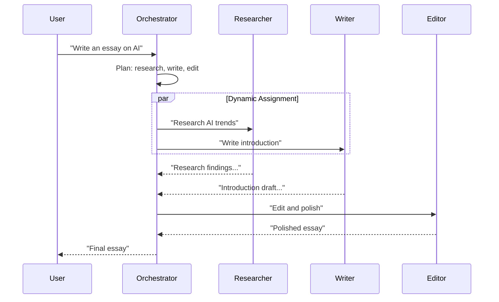

# Orchestrator-Workers Pattern

Central orchestrator dynamically plans subtasks, assigns them to workers, and synthesizes results.

## Sequence Diagram



## Code Example

```python
import asyncio
from pyagent_patterns.base import Agent, MockLLM
from pyagent_patterns.orchestration import OrchestratorWorkers

orch_llm = MockLLM(responses=[
    '{"assignments": [{"worker": "researcher", "subtask": "Research AI trends"}]}',
    "Final synthesis: AI essay based on research",
])
worker_llm = MockLLM(responses=["AI trends: transformers dominate NLP..."])

ow = OrchestratorWorkers(
    orchestrator=Agent("orchestrator", orch_llm),
    workers=[
        Agent("researcher", worker_llm, description="Finds and summarizes information"),
        Agent("writer", worker_llm, description="Writes prose and copy"),
    ],
)

result = asyncio.run(ow.run("Write a short essay on AI trends"))
print(result.output)
```

## When to Use

- ✅ **Use when:** Task requires dynamic decomposition (not known upfront)
- ✅ **Use when:** Worker pool has diverse capabilities
- ❌ **Avoid when:** Tasks always decompose the same way (use Pipeline)
