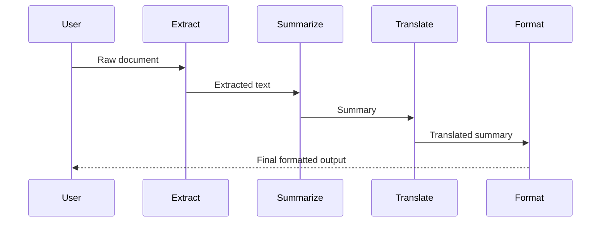

# Pipeline Pattern

Sequential stage chain where each stage's output feeds the next.

## Sequence Diagram



## Code Example

```python
import asyncio
from pyagent_patterns.base import Agent, MockLLM
from pyagent_patterns.orchestration import Pipeline

llm = MockLLM(responses=[
    "Key facts: revenue up 15%, profit margin 23%",
    "Summary: Strong Q3 with 15% revenue growth and 23% margins",
    "Resumen: Fuerte Q3 con 15% de crecimiento",
])

pipeline = Pipeline(stages=[
    Agent("extractor", llm, system_prompt="Extract key facts from the document"),
    Agent("summarizer", llm, system_prompt="Summarize the extracted facts"),
    Agent("translator", llm, system_prompt="Translate to Spanish"),
])

result = asyncio.run(pipeline.run("Q3 earnings report: ..."))
print(result.output)
print(f"Stages: {result.metadata['stages']}")
```

## OTel Trace Output

```
Trace: pyagent.pattern.pipeline (3.1s, $0.008)
├── pyagent.agent.extractor (0.8s)
├── pyagent.agent.summarizer (1.2s)
└── pyagent.agent.translator (1.1s)
```

## When to Use

- ✅ **Use when:** Task has clear sequential stages
- ✅ **Use when:** Each stage transforms the output for the next
- ❌ **Avoid when:** Stages could run in parallel (use Fan-Out instead)
- ❌ **Avoid when:** You need feedback loops (use Reflection instead)

## Cost-Effectiveness

| Metric | Value |
|--------|-------|
| LLM calls | N (one per stage) |
| Latency | N × single call |
| Cost | N × single call cost |
| Quality gain | +15% vs single prompt (structured decomposition) |
