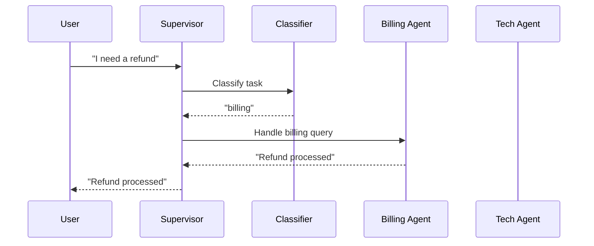

# Supervisor Pattern

Classify the incoming task, route to a specialist agent, and collect the response.

## Sequence Diagram



## Code Example

```python
import asyncio
from pyagent_patterns.base import Agent, MockLLM
from pyagent_patterns.orchestration import Supervisor

classifier_llm = MockLLM(responses=["billing"])
billing_llm = MockLLM(responses=["Your refund of $50 has been processed."])
tech_llm = MockLLM(responses=["Please restart your device."])

supervisor = Supervisor(
    classifier=Agent("classifier", classifier_llm),
    routes={
        "billing": Agent("billing", billing_llm),
        "tech": Agent("tech", tech_llm),
    },
)

result = asyncio.run(supervisor.run("I need a refund for my last order"))
print(result.output)
print(f"Route: {result.metadata['route_key']}")
```

## OTel Trace Output

```
Trace: pyagent.pattern.supervisor (1.2s, $0.004)
├── pyagent.agent.classifier (0.3s, gpt-4o-mini)
│   └── pyagent.router.difficulty: 2
├── route_decision: billing
├── pyagent.agent.billing (0.7s, gpt-4o)
└── pyagent.agent.formatter (0.2s, gpt-4o-mini)  [optional]
```

## When to Use

- ✅ **Use when:** Tasks fall into distinct categories with specialized handlers
- ✅ **Use when:** You want to route cheap tasks to cheap models
- ❌ **Avoid when:** Tasks don't have clear categories
- ❌ **Avoid when:** All tasks need the same processing

## Cost-Effectiveness

| Metric | Value |
|--------|-------|
| LLM calls | 2-3 |
| Avg latency | 1.2s |
| Avg cost | $0.004 |
| Quality (pass@1) | 87% |

## Research

- *Designing LLM-based MAS for SE* (arxiv:2511.08475) — Supervisor is used in 28.7% of studied systems
- Anthropic workflow patterns — "Orchestrator-workers" variant
