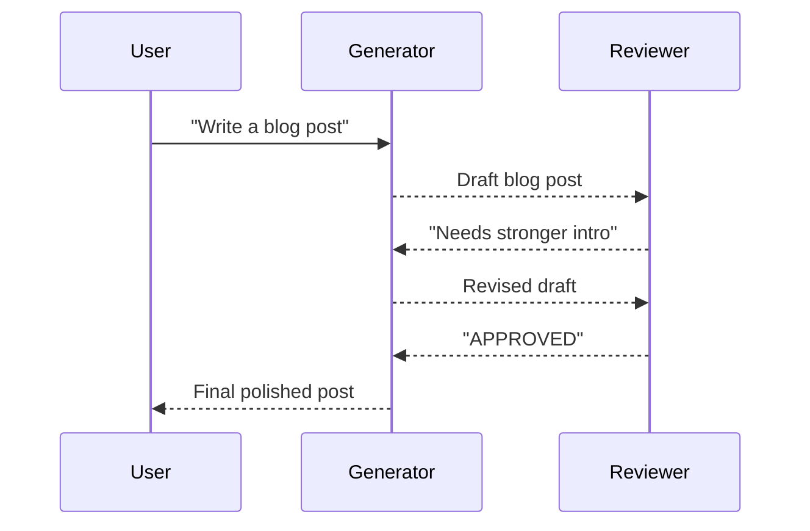

# Cross-Reflection Pattern

Generator produces output, a separate reviewer provides feedback for revision.

## Sequence Diagram



## Code Example

```python
import asyncio
from pyagent_patterns.base import Agent, MockLLM
from pyagent_patterns.resolution import CrossReflection

pattern = CrossReflection(
    generator=Agent("writer", MockLLM(responses=["Draft post...", "Revised with strong intro..."])),
    reviewer=Agent("editor", MockLLM(responses=["Needs stronger introduction", "APPROVED"])),
    max_rounds=3,
)

result = asyncio.run(pattern.run("Write a blog post about AI safety"))
print(f"Rounds: {result.metadata['rounds']}")
```

## When to Use

- ✅ **Use when:** External review perspective adds value
- ✅ **Use when:** Reviewer has different expertise than generator
- ❌ **Avoid when:** Speed matters more than quality
